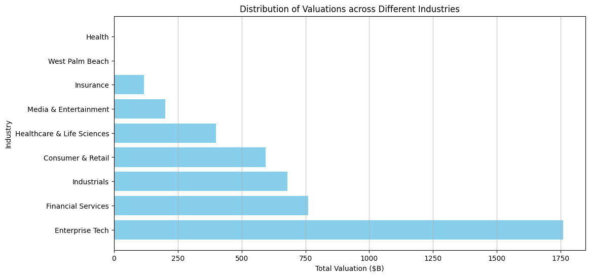
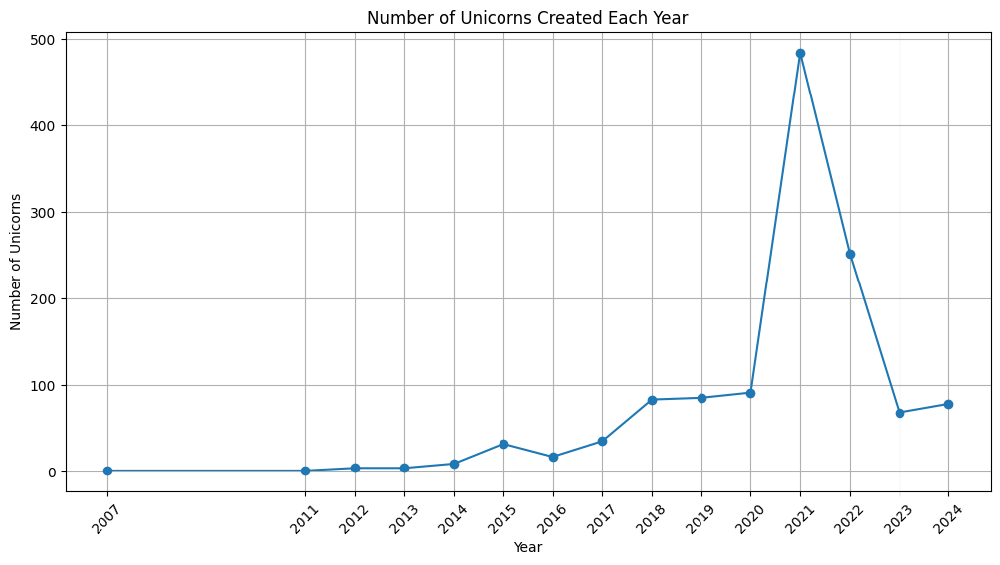
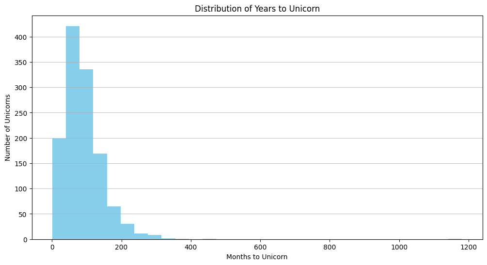

- [Setup](#org172dba2)
  - [Import Packages](#orgccae310)
- [Data Preparation](#org433ebd6)
  - [Load Data](#orge30b409)
  - [Data Cleaning](#org3b86658)
  - [Prepare data](#orgdb761fe)
  - [Preview data](#org013182e)
- [Descriptive Analysis](#orgf7e34a4)
  - [Distribution of Valuations across Different Industries](#orgb2bd5b6)
  - [Distribution of Valuations across Different Countries](#org18ec111)
- [Time-Based Analysis](#orgde015cf)
  - [Unicorn Growth Over Time](#orgb75122f)
  - [Years to Unicorn](#org4b4d20a)


<a id="org172dba2"></a>

# Setup


<a id="orgccae310"></a>

## Import Packages

```jupyter-python
import pandas as pd
import numpy as np
import matplotlib.pyplot as plt
from matplotlib.ticker import FuncFormatter
import seaborn as sns
import re
```


<a id="org433ebd6"></a>

# Data Preparation


<a id="orge30b409"></a>

## Load Data

```jupyter-python
pd.set_option('display.max_columns', 50, 'display.width', 200)
df = pd.read_csv('input/Unicorns_Completed.csv')
```


<a id="org3b86658"></a>

## Data Cleaning

```jupyter-python
def convert_years_months(s):
    m = re.match(r'(\d+)y?\s?(\d+)m?o?', s)
    return f'{m[1]}y{m[2]}m' if m else s

df['Years to Unicorn'] = df['Years to Unicorn'].apply(convert_years_months)
```


<a id="orgdb761fe"></a>

## Prepare data

```jupyter-python
df['Unicorn Date'] = pd.to_datetime(df['Unicorn Date'])
df['Valuation ($B)'] = pd.to_numeric(df['Valuation ($B)'])
```


<a id="org013182e"></a>

## Preview data

```jupyter-python
df.head()
```

<div>
<style scoped>
    .dataframe tbody tr th:only-of-type {
        vertical-align: middle;
    }

    .dataframe tbody tr th {
        vertical-align: top;
    }

    .dataframe thead th {
        text-align: right;
    }
</style>
<table border="1" class="dataframe">
  <thead>
    <tr style="text-align: right;">
      <th></th>
      <th>Company</th>
      <th>Valuation ($B)</th>
      <th>Total Equity Funding ($)</th>
      <th>Unicorn Date</th>
      <th>Date Founded</th>
      <th>Years to Unicorn</th>
      <th>Industry</th>
      <th>Country</th>
      <th>City</th>
      <th>Select Investors</th>
    </tr>
  </thead>
  <tbody>
    <tr>
      <th>0</th>
      <td>SpaceX</td>
      <td>350.0</td>
      <td>9000000000</td>
      <td>2012-12-01</td>
      <td>2002</td>
      <td>10y3m</td>
      <td>Enterprise Tech</td>
      <td>United States</td>
      <td>Hawthorne</td>
      <td>Opus Capital, RRE Ventures, Relay Ventures</td>
    </tr>
    <tr>
      <th>1</th>
      <td>ByteDance</td>
      <td>300.0</td>
      <td>8000000000</td>
      <td>2017-04-07</td>
      <td>2011</td>
      <td>6y3m</td>
      <td>Enterprise Tech</td>
      <td>China</td>
      <td>Beijing</td>
      <td>Breyer Capital, Parkway VC, TIME Ventures</td>
    </tr>
    <tr>
      <th>2</th>
      <td>OpenAI</td>
      <td>157.0</td>
      <td>18000000000</td>
      <td>2019-07-22</td>
      <td>2015</td>
      <td>4y6m</td>
      <td>Industrials</td>
      <td>United States</td>
      <td>San Francisco</td>
      <td>Dynamo VC, Susa Ventures, Founders Fund</td>
    </tr>
    <tr>
      <th>3</th>
      <td>Ant Group</td>
      <td>150.0</td>
      <td>19000000000</td>
      <td>2017-01-01</td>
      <td>2014</td>
      <td>3y</td>
      <td>Financial Services</td>
      <td>China</td>
      <td>Hangzhou</td>
      <td>Alibaba Group, CPP Investments, The Carlyle Group</td>
    </tr>
    <tr>
      <th>4</th>
      <td>Stripe</td>
      <td>70.0</td>
      <td>9000000000</td>
      <td>2014-01-23</td>
      <td>2009</td>
      <td>5y</td>
      <td>Consumer &amp; Retail</td>
      <td>United States</td>
      <td>San Francisco</td>
      <td>Sequoia Capital China, ZhenFund, K2 Ventures</td>
    </tr>
  </tbody>
</table>
</div>


<a id="orgf7e34a4"></a>

# Descriptive Analysis


<a id="orgb2bd5b6"></a>

## Distribution of Valuations across Different Industries

```jupyter-python
# Group by industry and sum valuations
industry_valuation_df = df.groupby('Industry')['Valuation ($B)'].sum().reset_index().sort_values('Valuation ($B)', ascending=False)
industry_valuation_df
```

<div>
<style scoped>
    .dataframe tbody tr th:only-of-type {
        vertical-align: middle;
    }

    .dataframe tbody tr th {
        vertical-align: top;
    }

    .dataframe thead th {
        text-align: right;
    }
</style>
<table border="1" class="dataframe">
  <thead>
    <tr style="text-align: right;">
      <th></th>
      <th>Industry</th>
      <th>Valuation ($B)</th>
    </tr>
  </thead>
  <tbody>
    <tr>
      <th>1</th>
      <td>Enterprise Tech</td>
      <td>1759.04</td>
    </tr>
    <tr>
      <th>2</th>
      <td>Financial Services</td>
      <td>760.16</td>
    </tr>
    <tr>
      <th>5</th>
      <td>Industrials</td>
      <td>678.55</td>
    </tr>
    <tr>
      <th>0</th>
      <td>Consumer &amp; Retail</td>
      <td>593.30</td>
    </tr>
    <tr>
      <th>4</th>
      <td>Healthcare &amp; Life Sciences</td>
      <td>398.45</td>
    </tr>
    <tr>
      <th>7</th>
      <td>Media &amp; Entertainment</td>
      <td>200.29</td>
    </tr>
    <tr>
      <th>6</th>
      <td>Insurance</td>
      <td>117.06</td>
    </tr>
    <tr>
      <th>8</th>
      <td>West Palm Beach</td>
      <td>3.00</td>
    </tr>
    <tr>
      <th>3</th>
      <td>Health</td>
      <td>1.50</td>
    </tr>
  </tbody>
</table>
</div>

```jupyter-python
plt.figure(figsize=(12, 6))
plt.barh(industry_valuation_df['Industry'], industry_valuation_df['Valuation ($B)'], color='skyblue')
plt.title('Distribution of Valuations across Different Industries')
plt.xlabel('Total Valuation ($B)')
plt.ylabel('Industry')
plt.grid(axis='x', alpha=0.75)
```




<a id="org18ec111"></a>

## Distribution of Valuations across Different Countries

```jupyter-python
# Group by Country and sum valuations
country_valuation_df = df.groupby('Country')['Valuation ($B)'].sum().reset_index().sort_values('Valuation ($B)', ascending=False).head(20)
country_valuation_df
```

<div>
<style scoped>
    .dataframe tbody tr th:only-of-type {
        vertical-align: middle;
    }

    .dataframe tbody tr th {
        vertical-align: top;
    }

    .dataframe thead th {
        text-align: right;
    }
</style>
<table border="1" class="dataframe">
  <thead>
    <tr style="text-align: right;">
      <th></th>
      <th>Country</th>
      <th>Valuation ($B)</th>
    </tr>
  </thead>
  <tbody>
    <tr>
      <th>53</th>
      <td>United States</td>
      <td>2564.14</td>
    </tr>
    <tr>
      <th>10</th>
      <td>China</td>
      <td>835.65</td>
    </tr>
    <tr>
      <th>52</th>
      <td>United Kingdom</td>
      <td>197.35</td>
    </tr>
    <tr>
      <th>24</th>
      <td>India</td>
      <td>172.07</td>
    </tr>
    <tr>
      <th>43</th>
      <td>Singapore</td>
      <td>92.06</td>
    </tr>
    <tr>
      <th>21</th>
      <td>Germany</td>
      <td>85.90</td>
    </tr>
    <tr>
      <th>20</th>
      <td>France</td>
      <td>70.86</td>
    </tr>
    <tr>
      <th>27</th>
      <td>Israel</td>
      <td>56.22</td>
    </tr>
    <tr>
      <th>6</th>
      <td>Canada</td>
      <td>56.00</td>
    </tr>
    <tr>
      <th>1</th>
      <td>Australia</td>
      <td>48.84</td>
    </tr>
    <tr>
      <th>5</th>
      <td>Brazil</td>
      <td>34.13</td>
    </tr>
    <tr>
      <th>45</th>
      <td>South Korea</td>
      <td>31.34</td>
    </tr>
    <tr>
      <th>47</th>
      <td>Sweden</td>
      <td>29.42</td>
    </tr>
    <tr>
      <th>36</th>
      <td>Netherlands</td>
      <td>24.46</td>
    </tr>
    <tr>
      <th>35</th>
      <td>Mexico</td>
      <td>18.70</td>
    </tr>
    <tr>
      <th>19</th>
      <td>Finland</td>
      <td>14.91</td>
    </tr>
    <tr>
      <th>3</th>
      <td>Belgium</td>
      <td>11.95</td>
    </tr>
    <tr>
      <th>42</th>
      <td>Seychelles</td>
      <td>11.80</td>
    </tr>
    <tr>
      <th>26</th>
      <td>Ireland</td>
      <td>11.05</td>
    </tr>
    <tr>
      <th>29</th>
      <td>Japan</td>
      <td>10.82</td>
    </tr>
  </tbody>
</table>
</div>

```jupyter-python
plt.figure(figsize=(12, 8))
plt.barh(country_valuation_df['Country'], country_valuation_df['Valuation ($B)'])
plt.title('Distribution of Valuations across Different Countries')
plt.xlabel('Total Valuation ($B)')
plt.ylabel('Countries')
plt.grid(axis='x', alpha=0.75)
```


<a id="orgde015cf"></a>

# Time-Based Analysis


<a id="orgb75122f"></a>

## Unicorn Growth Over Time

```jupyter-python
unicorn_count = df.groupby(df['Unicorn Date'].dt.year).size()
plt.figure(figsize=(12, 6))
plt.plot(unicorn_count.index, unicorn_count.values, marker='o')
plt.title('Number of Unicorns Created Each Year')
plt.xlabel('Year')
plt.ylabel('Number of Unicorns')
plt.xticks(unicorn_count.index, rotation=45)
plt.grid()
```




<a id="org4b4d20a"></a>

## Years to Unicorn

```jupyter-python
# Function to convert "Years to Unicorn" into total months
def convert_years_to_months(years_str):
    if 'y' in years_str and 'm' in years_str:
        years, months = years_str.split('y')
        months = months.replace('m', '').strip()
        return int(years.strip()) * 12 + int(months)
    elif 'y' in years_str:
        years = years_str.replace('y', '').strip()
        return int(years) * 12
    elif 'm' in years_str:
        months = years_str.replace('mo', '').replace('m', '').strip()
        return int(months)
    else:
        return None

df['Years to Unicorn (Months)'] = df['Years to Unicorn'].apply(convert_years_to_months)
```

```jupyter-python
plt.figure(figsize=(12, 6))
plt.hist(df['Years to Unicorn (Months)'].dropna(), bins=30, color='skyblue')
plt.title('Distribution of Years to Unicorn')
plt.xlabel('Months to Unicorn')
plt.ylabel('Number of Unicorns')
plt.grid(axis='y', alpha=0.75)
```


