- [Introduction](#org52093cf)
- [Setup](#orga1cfeb4)
  - [Import Packages](#org3ca5d89)
  - [Theming](#org5932e8a)
- [Data Preparation](#org9b6415c)
  - [Load Data](#orge03fd8e)
  - [Data Cleaning](#org2a7980f)
  - [Prepare Data](#orgb653d8f)
    - [Column Types](#org2163cc5)
    - [Merge datasets (Latest Valuations and Founders)](#org8b53887)
  - [Preview](#org3871271)
- [Descriptive Analysis](#org8881d78)
  - [Distribution](#org446c6fc)
    - [Valuations](#org388d5d6)
      - [Distribution of Valuations across Different Industries](#org4de18f6)
      - [Mean Distribution of Valuations across Different Industries](#org2c47f4f)
      - [Distribution of Valuations across Different Countries](#orgec90e93)
      - [Mean Distribution of Valuations across Different Countries](#orgc90bbc3)
      - [Distribution of Valuations by Number of Companies](#org426202d)
    - [Funding](#org41614bc)
      - [Distribution of Funding across Different Industries](#orgd450dd3)
      - [Mean Distribution of Funding across Different Industries](#orge88b3ad)
      - [Distribution of Funding across Different Countries](#org30ae66d)
      - [Mean Distribution of Funding across Different Countries](#orgcb52ae0)
      - [Distribution of Funding by Number of Companies](#org6752bb3)
- [Comparative Analysis](#org7d69ead)
  - [By Company](#orgd019a49)
    - [Top Companies by Valuation](#orgc8cd9bc)
    - [Companies Received Most Funding](#org2b8971e)
  - [By Country](#orgad32b10)
    - [Top Countries by Number of Companies](#orgdc1c4d8)
    - [Top Countries by Number of Companies across Different Industries](#orgf81b874)
    - [Top Countries by Company Valuations across Different Industries](#org93f1ecd)
- [Time-Based Analysis](#org8783cc9)
  - [Unicorn Growth Over Time](#org47f5a3b)
  - [Time to Unicorn](#org58bad77)
  - [Distribution of Valuations Over Time](#orgab76e30)
  - [Distribution of Funding Over Time](#org8ac7b79)
- [Correlation Analysis](#org62542e3)
  - [Relationship between Funding and Valuation](#org2e2821a)
- [Investor Analysis](#orga554cae)
  - [Top Investors](#org78e77e4)
- [Founder Analysis](#orgb3b678b)
  - [Top Founders](#orgc90e389)
- [Historical Analysis](#org080bf0d)
  - [Survival and Acquisition](#org9bc071b)
    - [Top Exited Unicorns as of March 2022](#orgdec48ab)
    - [Exit Reasons of Former Unicorns](#org6880287)
- [Funded by Y-Combinator](#org19b120c)
  - [How many YC companies are in unicorn status currently?](#org8191f10)
  - [Top Companies by Valuation](#orgd48b991)
  - [YC Batch Distribution](#org1d73d5b)
  - [Top Countires](#orgebc20e0)
  - [Top Industries](#org04e3bcf)
    - [Team Size Distribution across Different Industries](#orgd7e4e14)
- [Predictive Analysis](#org729281a)
- [Case Study](#org4a64a05)
  - [Scale AI](#org0a7ca19)
  - [FTX](#org6712b62)
  - [Lalamove](#orgdb8109a)
- [References](#orgb02b5b2)


<a id="org52093cf"></a>

# Introduction

-   **What is a Unicorn Startup?**
    
    In business, a unicorn is a startup company valued at over US$1 billion which is privately owned and not listed on a share market.


<a id="orga1cfeb4"></a>

# Setup


<a id="org3ca5d89"></a>

## Import Packages

```jupyter-python
import pandas as pd
import numpy as np
import matplotlib.pyplot as plt
from matplotlib.ticker import FuncFormatter
import seaborn as sns
import re
```


<a id="org5932e8a"></a>

## Theming

```jupyter-python
sns.set_theme(palette='husl')
```


<a id="org9b6415c"></a>

# Data Preparation


<a id="orge03fd8e"></a>

## Load Data

```jupyter-python
pd.set_option('display.max_columns', 50, 'display.width', 200)
df = pd.read_csv('input/datasets/Unicorns_Completed (2024).csv')
df_wiki = pd.read_csv('input/raw_data/list-of-unicorn-startups_20250619 (wikipedia).csv')
```


<a id="org2a7980f"></a>

## Data Cleaning

```jupyter-python
def convert_years_months(s):
    m = re.match(r'(\d+)y?\s?(\d+)m?o?', s)
    return f'{m[1]}y{m[2]}m' if m else s

df['Years to Unicorn'] = df['Years to Unicorn'].apply(convert_years_months)

def correct_industry_labels(s):
    if s == 'Health':
        return 'Healthcare & Life Sciences'
    if s == 'West Palm Beach':
        return 'Enterprise Tech'
    return s

df['Industry'] = df['Industry'].apply(correct_industry_labels)

def correct_company_names(s):
    if s == 'Scale':
        return 'Scale AI'
    return s

df['Company'] = df['Company'].apply(correct_company_names)
```


<a id="orgb653d8f"></a>

## Prepare Data


<a id="org2163cc5"></a>

### Column Types

```jupyter-python
df['Unicorn Date'] = pd.to_datetime(df['Unicorn Date'])
df['Valuation ($B)'] = pd.to_numeric(df['Valuation ($B)'])
df['Unicorn Year'] = df['Unicorn Date'].dt.year
df['Funding ($B)'] = df['Total Equity Funding ($)'] / 1e9
df['Funding ($M)'] = df['Total Equity Funding ($)'] / 1e6
df['Investors'] = df['Select Investors'].str.split(', ')
```


<a id="org8b53887"></a>

### Merge datasets (Latest Valuations and Founders)

```jupyter-python
df_wiki.rename(columns={'Valuation (US$ billions)': 'Latest Valuation ($B)'}, inplace=True)
df_wiki = df_wiki.drop_duplicates('Company')
df_wiki['Company'] = df_wiki['Company'].str.strip()
df_wiki['Founder(s)'] = df_wiki['Founder(s)'].str.replace(' and ', ', ').str.split(', ')
df = df.merge(df_wiki[['Company', 'Latest Valuation ($B)', 'Founder(s)']], on='Company', how='left')
df['Latest Valuation ($B)'] = pd.to_numeric(df['Latest Valuation ($B)'].fillna(value=df['Valuation ($B)']))
```


<a id="org3871271"></a>

## Preview

```jupyter-python
print(df.info())
print(df.describe())
print(df.head())
```

```
<class 'pandas.core.frame.DataFrame'>
RangeIndex: 1244 entries, 0 to 1243
Data columns (total 16 columns):
 #   Column                    Non-Null Count  Dtype
---  ------                    --------------  -----
 0   Company                   1244 non-null   object
 1   Valuation ($B)            1244 non-null   float64
 2   Total Equity Funding ($)  1244 non-null   int64
 3   Unicorn Date              1244 non-null   datetime64[ns]
 4   Date Founded              1244 non-null   int64
 5   Years to Unicorn          1244 non-null   object
 6   Industry                  1244 non-null   object
 7   Country                   1244 non-null   object
 8   City                      1244 non-null   object
 9   Select Investors          1244 non-null   object
 10  Unicorn Year              1244 non-null   int32
 11  Funding ($B)              1244 non-null   float64
 12  Funding ($M)              1244 non-null   float64
 13  Investors                 1244 non-null   object
 14  Latest Valuation ($B)     1244 non-null   float64
 15  Founder(s)                130 non-null    object
dtypes: datetime64[ns](1), float64(4), int32(1), int64(2), object(8)
memory usage: 150.8+ KB
None
       Valuation ($B)  Total Equity Funding ($)                   Unicorn Date  Date Founded  Unicorn Year  Funding ($B)  Funding ($M)  Latest Valuation ($B)
count     1244.000000              1.244000e+03                           1244   1244.000000   1244.000000   1244.000000   1244.000000            1244.000000
mean         3.626487              5.985096e+08  2021-02-10 22:05:24.115755776   2013.372990   2020.630225      0.598510    598.509647               3.751712
min          1.000000              0.000000e+00            2007-07-02 00:00:00   1919.000000   2007.000000      0.000000      0.000000               1.000000
25%          1.100000              2.170000e+08            2020-08-13 12:00:00   2011.000000   2020.000000      0.217000    217.000000               1.000000
50%          1.550000              3.525000e+08            2021-07-21 00:00:00   2014.000000   2021.000000      0.352500    352.500000               1.500000
75%          3.000000              6.090000e+08            2022-02-24 00:00:00   2017.000000   2022.000000      0.609000    609.000000               2.800000
max        350.000000              1.900000e+10            2024-12-24 00:00:00   2024.000000   2024.000000     19.000000  19000.000000             350.000000
std         15.016365              1.222045e+09                            NaN      5.515788      2.139147      1.222045   1222.044532              17.244263
     Company  Valuation ($B)  Total Equity Funding ($) Unicorn Date  Date Founded Years to Unicorn            Industry        Country           City  \
0     SpaceX           350.0                9000000000   2012-12-01          2002            10y3m     Enterprise Tech  United States      Hawthorne
1  ByteDance           300.0                8000000000   2017-04-07          2011             6y3m     Enterprise Tech          China        Beijing
2     OpenAI           157.0               18000000000   2019-07-22          2015             4y6m         Industrials  United States  San Francisco
3  Ant Group           150.0               19000000000   2017-01-01          2014              3y   Financial Services          China       Hangzhou
4     Stripe            70.0                9000000000   2014-01-23          2009               5y   Consumer & Retail  United States  San Francisco

                                    Select Investors  Unicorn Year  Funding ($B)  Funding ($M)                                          Investors  Latest Valuation ($B)  \
0         Opus Capital, RRE Ventures, Relay Ventures          2012           9.0        9000.0       [Opus Capital, RRE Ventures, Relay Ventures]                  350.0
1          Breyer Capital, Parkway VC, TIME Ventures          2017           8.0        8000.0        [Breyer Capital, Parkway VC, TIME Ventures]                  315.0
2            Dynamo VC, Susa Ventures, Founders Fund          2019          18.0       18000.0          [Dynamo VC, Susa Ventures, Founders Fund]                  300.0
3  Alibaba Group, CPP Investments, The Carlyle Group          2017          19.0       19000.0  [Alibaba Group, CPP Investments, The Carlyle G...                  150.0
4       Sequoia Capital China, ZhenFund, K2 Ventures          2014           9.0        9000.0     [Sequoia Capital China, ZhenFund, K2 Ventures]                   91.5

                                    Founder(s)
0                                  [Elon Musk]
1                   [Zhang Yiming, Liang Rubo]
2  [Sam Altman, Greg Brockman, Ilya Sutskever]
3                                          NaN
4                     [Patrick, John Collison]
```


<a id="org8881d78"></a>

# Descriptive Analysis


<a id="org446c6fc"></a>

## Distribution


<a id="org388d5d6"></a>

### Valuations


<a id="org4de18f6"></a>

#### Distribution of Valuations across Different Industries

```jupyter-python
industry_valuation_df = df.groupby('Industry')['Valuation ($B)'].sum().reset_index().sort_values('Valuation ($B)', ascending=False)
industry_valuation_df
```

<div>
<style scoped>
    .dataframe tbody tr th:only-of-type {
        vertical-align: middle;
    }

    .dataframe tbody tr th {
        vertical-align: top;
    }

    .dataframe thead th {
        text-align: right;
    }
</style>
<table border="1" class="dataframe">
  <thead>
    <tr style="text-align: right;">
      <th></th>
      <th>Industry</th>
      <th>Valuation ($B)</th>
    </tr>
  </thead>
  <tbody>
    <tr>
      <th>1</th>
      <td>Enterprise Tech</td>
      <td>1762.04</td>
    </tr>
    <tr>
      <th>2</th>
      <td>Financial Services</td>
      <td>760.16</td>
    </tr>
    <tr>
      <th>4</th>
      <td>Industrials</td>
      <td>678.55</td>
    </tr>
    <tr>
      <th>0</th>
      <td>Consumer &amp; Retail</td>
      <td>593.30</td>
    </tr>
    <tr>
      <th>3</th>
      <td>Healthcare &amp; Life Sciences</td>
      <td>399.95</td>
    </tr>
    <tr>
      <th>6</th>
      <td>Media &amp; Entertainment</td>
      <td>200.29</td>
    </tr>
    <tr>
      <th>5</th>
      <td>Insurance</td>
      <td>117.06</td>
    </tr>
  </tbody>
</table>
</div>

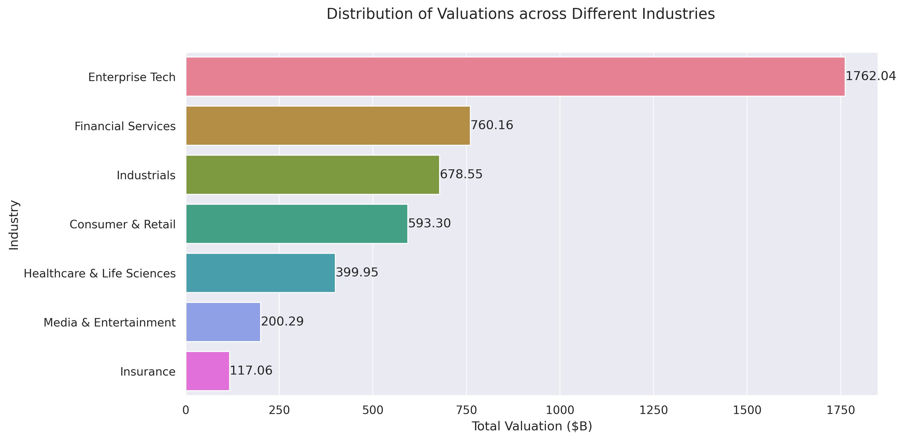


<a id="org2c47f4f"></a>

#### Mean Distribution of Valuations across Different Industries

```jupyter-python
fig, ax = plt.subplots(figsize=(12, 6), dpi=300)
sns.boxplot(df, y='Industry', x='Valuation ($B)', hue='Industry', showfliers=False)
plt.suptitle('Distribution of Valuations across Different Industries')
ax.set(xlabel='Total Valuation ($B)',
       ylabel='Industry')
plt.grid(axis='x', alpha=0.7)
plt.show()
```

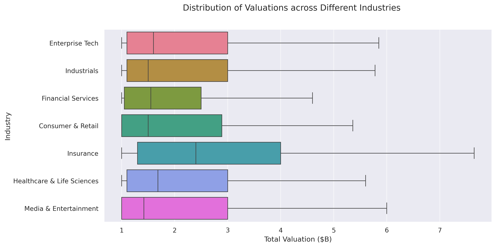

```jupyter-python
industry_valuation_df = df.groupby('Industry')['Valuation ($B)'].mean().reset_index().sort_values('Valuation ($B)', ascending=False)
industry_valuation_df
```

<div>
<style scoped>
    .dataframe tbody tr th:only-of-type {
        vertical-align: middle;
    }

    .dataframe tbody tr th {
        vertical-align: top;
    }

    .dataframe thead th {
        text-align: right;
    }
</style>
<table border="1" class="dataframe">
  <thead>
    <tr style="text-align: right;">
      <th></th>
      <th>Industry</th>
      <th>Valuation ($B)</th>
    </tr>
  </thead>
  <tbody>
    <tr>
      <th>5</th>
      <td>Insurance</td>
      <td>4.682400</td>
    </tr>
    <tr>
      <th>1</th>
      <td>Enterprise Tech</td>
      <td>4.350716</td>
    </tr>
    <tr>
      <th>4</th>
      <td>Industrials</td>
      <td>3.707923</td>
    </tr>
    <tr>
      <th>3</th>
      <td>Healthcare &amp; Life Sciences</td>
      <td>3.389407</td>
    </tr>
    <tr>
      <th>2</th>
      <td>Financial Services</td>
      <td>3.363540</td>
    </tr>
    <tr>
      <th>0</th>
      <td>Consumer &amp; Retail</td>
      <td>2.937129</td>
    </tr>
    <tr>
      <th>6</th>
      <td>Media &amp; Entertainment</td>
      <td>2.356353</td>
    </tr>
  </tbody>
</table>
</div>

```jupyter-python
plt.figure(figsize=(12, 6),dpi=300)
ax = sns.barplot(industry_valuation_df,
                 y='Industry',
                 x='Valuation ($B)',
                 hue='Industry')
for i in ax.containers:
    ax.bar_label(i, fmt='%.2f')
plt.title('Mean Distribution of Valuations across Different Industries')
plt.xlabel('Mean Valuation ($B)')
plt.ylabel('Industry')
plt.grid(axis='x', alpha=0.75)
```

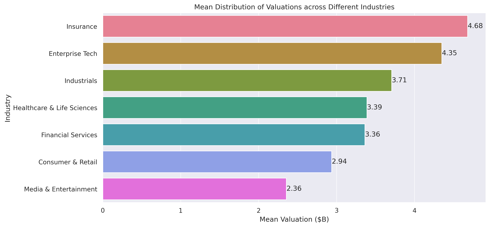


<a id="orgec90e93"></a>

#### Distribution of Valuations across Different Countries

```jupyter-python
country_valuation_df = df.groupby('Country')['Valuation ($B)'].sum().reset_index().sort_values('Valuation ($B)', ascending=False).head(20)
country_valuation_df
```

<div>
<style scoped>
    .dataframe tbody tr th:only-of-type {
        vertical-align: middle;
    }

    .dataframe tbody tr th {
        vertical-align: top;
    }

    .dataframe thead th {
        text-align: right;
    }
</style>
<table border="1" class="dataframe">
  <thead>
    <tr style="text-align: right;">
      <th></th>
      <th>Country</th>
      <th>Valuation ($B)</th>
    </tr>
  </thead>
  <tbody>
    <tr>
      <th>53</th>
      <td>United States</td>
      <td>2564.14</td>
    </tr>
    <tr>
      <th>10</th>
      <td>China</td>
      <td>835.65</td>
    </tr>
    <tr>
      <th>52</th>
      <td>United Kingdom</td>
      <td>197.35</td>
    </tr>
    <tr>
      <th>24</th>
      <td>India</td>
      <td>172.07</td>
    </tr>
    <tr>
      <th>43</th>
      <td>Singapore</td>
      <td>92.06</td>
    </tr>
    <tr>
      <th>21</th>
      <td>Germany</td>
      <td>85.90</td>
    </tr>
    <tr>
      <th>20</th>
      <td>France</td>
      <td>70.86</td>
    </tr>
    <tr>
      <th>27</th>
      <td>Israel</td>
      <td>56.22</td>
    </tr>
    <tr>
      <th>6</th>
      <td>Canada</td>
      <td>56.00</td>
    </tr>
    <tr>
      <th>1</th>
      <td>Australia</td>
      <td>48.84</td>
    </tr>
    <tr>
      <th>5</th>
      <td>Brazil</td>
      <td>34.13</td>
    </tr>
    <tr>
      <th>45</th>
      <td>South Korea</td>
      <td>31.34</td>
    </tr>
    <tr>
      <th>47</th>
      <td>Sweden</td>
      <td>29.42</td>
    </tr>
    <tr>
      <th>36</th>
      <td>Netherlands</td>
      <td>24.46</td>
    </tr>
    <tr>
      <th>35</th>
      <td>Mexico</td>
      <td>18.70</td>
    </tr>
    <tr>
      <th>19</th>
      <td>Finland</td>
      <td>14.91</td>
    </tr>
    <tr>
      <th>3</th>
      <td>Belgium</td>
      <td>11.95</td>
    </tr>
    <tr>
      <th>42</th>
      <td>Seychelles</td>
      <td>11.80</td>
    </tr>
    <tr>
      <th>26</th>
      <td>Ireland</td>
      <td>11.05</td>
    </tr>
    <tr>
      <th>29</th>
      <td>Japan</td>
      <td>10.82</td>
    </tr>
  </tbody>
</table>
</div>

```jupyter-python
plt.subplots(figsize=(12, 8), dpi=300)
ax = sns.barplot(country_valuation_df,
                 y='Country',
                 x='Valuation ($B)',
                 hue='Country')
for i in ax.containers:
    ax.bar_label(i, fmt='%.2f')
plt.suptitle('Distribution of Valuations across Different Countries')
plt.xlabel('Total Valuation ($B)')
plt.ylabel('Countries')
plt.grid(axis='x', alpha=0.75)
plt.xscale('log')
plt.show()
```


<a id="orgc90bbc3"></a>

#### Mean Distribution of Valuations across Different Countries

```jupyter-python
fig, ax = plt.subplots(figsize=(12, 8), dpi=300)
sns.boxplot(df[df['Country'].isin(country_valuation_df['Country'])],
            y='Country',
            x='Valuation ($B)',
            hue='Country',
            showfliers=False)
plt.suptitle('Distribution of Valuations across Different Countries')
ax.set(xlabel='Total Valuation ($B)',
       ylabel='Country')
plt.grid(axis='x', alpha=0.7)
plt.show()
```

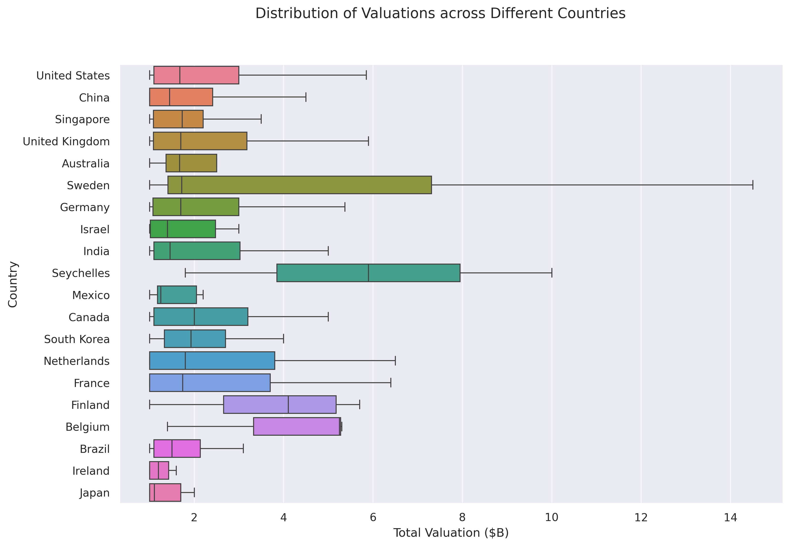

```jupyter-python
mean_country_valuation_df = df[df['Country'].isin(country_valuation_df['Country'])].groupby('Country')['Valuation ($B)'].mean().reset_index().sort_values('Valuation ($B)', ascending=False).head(20)
mean_country_valuation_df
```

<div>
<style scoped>
    .dataframe tbody tr th:only-of-type {
        vertical-align: middle;
    }

    .dataframe tbody tr th {
        vertical-align: top;
    }

    .dataframe thead th {
        text-align: right;
    }
</style>
<table border="1" class="dataframe">
  <thead>
    <tr style="text-align: right;">
      <th></th>
      <th>Country</th>
      <th>Valuation ($B)</th>
    </tr>
  </thead>
  <tbody>
    <tr>
      <th>14</th>
      <td>Seychelles</td>
      <td>5.900000</td>
    </tr>
    <tr>
      <th>15</th>
      <td>Singapore</td>
      <td>5.753750</td>
    </tr>
    <tr>
      <th>4</th>
      <td>China</td>
      <td>5.461765</td>
    </tr>
    <tr>
      <th>0</th>
      <td>Australia</td>
      <td>5.426667</td>
    </tr>
    <tr>
      <th>17</th>
      <td>Sweden</td>
      <td>4.903333</td>
    </tr>
    <tr>
      <th>1</th>
      <td>Belgium</td>
      <td>3.983333</td>
    </tr>
    <tr>
      <th>19</th>
      <td>United States</td>
      <td>3.748743</td>
    </tr>
    <tr>
      <th>5</th>
      <td>Finland</td>
      <td>3.727500</td>
    </tr>
    <tr>
      <th>18</th>
      <td>United Kingdom</td>
      <td>3.588182</td>
    </tr>
    <tr>
      <th>7</th>
      <td>Germany</td>
      <td>2.770968</td>
    </tr>
    <tr>
      <th>13</th>
      <td>Netherlands</td>
      <td>2.717778</td>
    </tr>
    <tr>
      <th>3</th>
      <td>Canada</td>
      <td>2.666667</td>
    </tr>
    <tr>
      <th>6</th>
      <td>France</td>
      <td>2.530714</td>
    </tr>
    <tr>
      <th>8</th>
      <td>India</td>
      <td>2.530441</td>
    </tr>
    <tr>
      <th>10</th>
      <td>Israel</td>
      <td>2.444348</td>
    </tr>
    <tr>
      <th>16</th>
      <td>South Korea</td>
      <td>2.410769</td>
    </tr>
    <tr>
      <th>12</th>
      <td>Mexico</td>
      <td>2.337500</td>
    </tr>
    <tr>
      <th>2</th>
      <td>Brazil</td>
      <td>1.896111</td>
    </tr>
    <tr>
      <th>9</th>
      <td>Ireland</td>
      <td>1.578571</td>
    </tr>
    <tr>
      <th>11</th>
      <td>Japan</td>
      <td>1.352500</td>
    </tr>
  </tbody>
</table>
</div>

```jupyter-python
plt.figure(figsize=(12, 8), dpi=300)
ax = sns.barplot(mean_country_valuation_df,
                 y='Country',
                 x='Valuation ($B)',
                 hue='Country')
for i in ax.containers:
    ax.bar_label(i, fmt='%.2f')
plt.suptitle('Mean Distribution of Valuations across Different Countries')
plt.xlabel('Mean Valuation ($B)')
plt.ylabel('Countries')
plt.grid(axis='x', alpha=0.75)
plt.show()
```

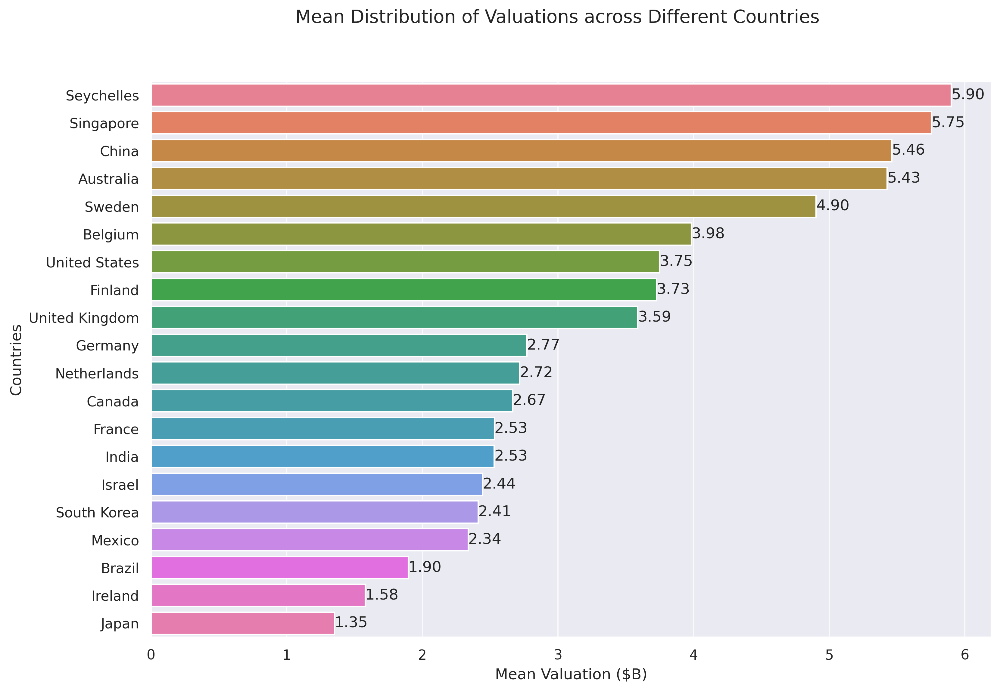


<a id="org426202d"></a>

#### Distribution of Valuations by Number of Companies

```jupyter-python
# Define the bins for valuation ranges
bins = [0, 1, 1.5, 2, 3, 4, 5, 6, 8, 10, 20, 30, 50, 100, 200, 300, 400]
labels =  [f'{a}-{b}' for a, b in zip(bins[:-1], bins[1:])]
cuts = pd.cut(df['Valuation ($B)'], bins=bins, labels=labels)

# Count the number of companies in each bin
valuation_distribution = cuts.value_counts().sort_index()

# Plot the Bar Chart
plt.figure(figsize=(12, 6), dpi=300)
ax = sns.barplot(x=valuation_distribution.index,
                 y=valuation_distribution.values, hue=valuation_distribution.values)
for i in ax.containers:
    ax.bar_label(i)
plt.suptitle('Distribution of Valuations by Number of Companies')
plt.xlabel('Valuation ($B)')
plt.ylabel('Number of Companies')
plt.xticks(rotation=45)
plt.grid(axis='y', alpha=0.75)
#plt.yscale('log')
plt.show()
```


<a id="org41614bc"></a>

### Funding


<a id="orgd450dd3"></a>

#### Distribution of Funding across Different Industries

```jupyter-python
industry_funding_df = df.groupby('Industry')['Funding ($B)'].sum().reset_index().sort_values('Funding ($B)', ascending=False)
industry_funding_df
```

<div>
<style scoped>
    .dataframe tbody tr th:only-of-type {
        vertical-align: middle;
    }

    .dataframe tbody tr th {
        vertical-align: top;
    }

    .dataframe thead th {
        text-align: right;
    }
</style>
<table border="1" class="dataframe">
  <thead>
    <tr style="text-align: right;">
      <th></th>
      <th>Industry</th>
      <th>Funding ($B)</th>
    </tr>
  </thead>
  <tbody>
    <tr>
      <th>1</th>
      <td>Enterprise Tech</td>
      <td>254.609</td>
    </tr>
    <tr>
      <th>2</th>
      <td>Financial Services</td>
      <td>128.215</td>
    </tr>
    <tr>
      <th>4</th>
      <td>Industrials</td>
      <td>122.847</td>
    </tr>
    <tr>
      <th>0</th>
      <td>Consumer &amp; Retail</td>
      <td>116.818</td>
    </tr>
    <tr>
      <th>3</th>
      <td>Healthcare &amp; Life Sciences</td>
      <td>59.958</td>
    </tr>
    <tr>
      <th>6</th>
      <td>Media &amp; Entertainment</td>
      <td>49.003</td>
    </tr>
    <tr>
      <th>5</th>
      <td>Insurance</td>
      <td>13.096</td>
    </tr>
  </tbody>
</table>
</div>

```jupyter-python
plt.figure(figsize=(12, 6), dpi=300)
ax = sns.barplot(industry_funding_df,
            y='Industry', x='Funding ($B)', hue='Industry')
for i in ax.containers:
    ax.bar_label(i, fmt='%.2f')
plt.suptitle('Distribution of Funding across Different Industries')
plt.xlabel('Total Funding ($B)')
plt.ylabel('Industry')
plt.grid(axis='x', alpha=0.75)
```

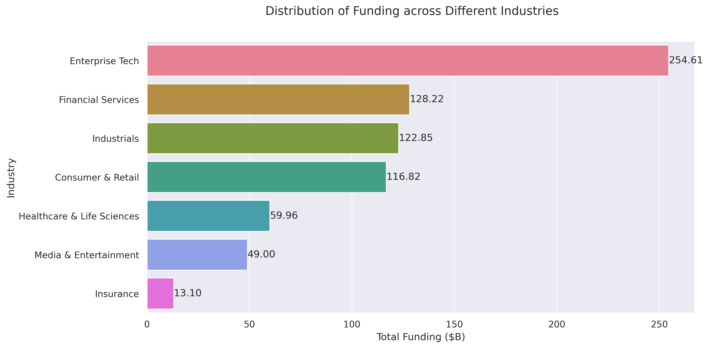


<a id="orge88b3ad"></a>

#### Mean Distribution of Funding across Different Industries

```jupyter-python
fig, ax = plt.subplots(figsize=(12, 6), dpi=300)
sns.boxplot(df, y='Industry', x='Funding ($M)', hue='Industry', showfliers=False)
plt.suptitle('Distribution of Funding across Different Industries')
ax.set(xlabel='Total Funding ($M)',
       ylabel='Industry')
plt.grid(axis='x', alpha=0.7)
plt.show()
```

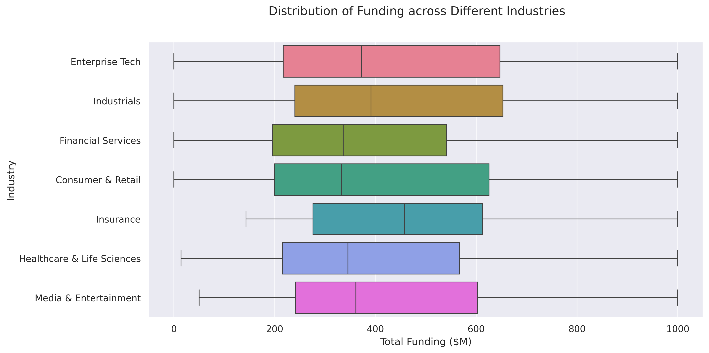

```jupyter-python
industry_funding_df = df.groupby('Industry')['Funding ($M)'].mean().reset_index().sort_values('Funding ($M)', ascending=False)
industry_funding_df
```

<div>
<style scoped>
    .dataframe tbody tr th:only-of-type {
        vertical-align: middle;
    }

    .dataframe tbody tr th {
        vertical-align: top;
    }

    .dataframe thead th {
        text-align: right;
    }
</style>
<table border="1" class="dataframe">
  <thead>
    <tr style="text-align: right;">
      <th></th>
      <th>Industry</th>
      <th>Funding ($M)</th>
    </tr>
  </thead>
  <tbody>
    <tr>
      <th>4</th>
      <td>Industrials</td>
      <td>671.295082</td>
    </tr>
    <tr>
      <th>1</th>
      <td>Enterprise Tech</td>
      <td>628.664198</td>
    </tr>
    <tr>
      <th>0</th>
      <td>Consumer &amp; Retail</td>
      <td>578.306933</td>
    </tr>
    <tr>
      <th>6</th>
      <td>Media &amp; Entertainment</td>
      <td>576.505882</td>
    </tr>
    <tr>
      <th>2</th>
      <td>Financial Services</td>
      <td>567.323009</td>
    </tr>
    <tr>
      <th>5</th>
      <td>Insurance</td>
      <td>523.840000</td>
    </tr>
    <tr>
      <th>3</th>
      <td>Healthcare &amp; Life Sciences</td>
      <td>508.118644</td>
    </tr>
  </tbody>
</table>
</div>

```jupyter-python
plt.figure(figsize=(12, 6), dpi=300)
ax = sns.barplot(industry_funding_df,
                 y='Industry',
                 x='Funding ($M)',
                 hue='Industry')
for i in ax.containers:
    ax.bar_label(i, fmt='%.2f')
plt.suptitle('Distribution of Funding across Different Industries')
plt.xlabel('Mean Funding ($M)')
plt.ylabel('Industry')
plt.grid(axis='x', alpha=0.75)
plt.show()
```

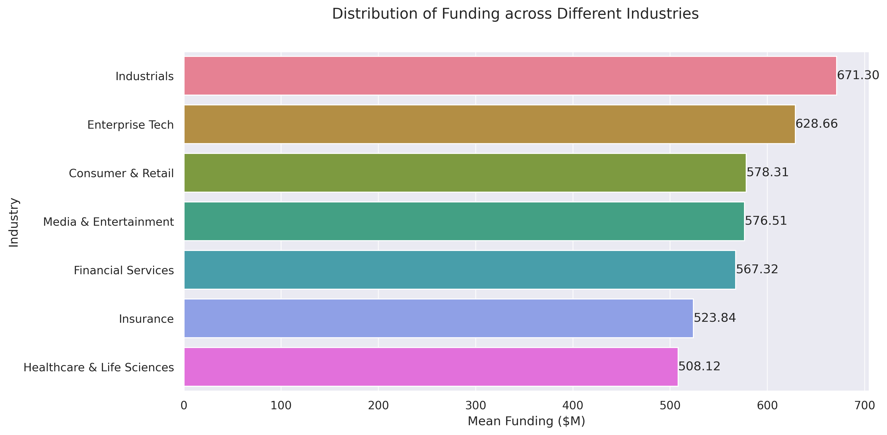


<a id="org30ae66d"></a>

#### Distribution of Funding across Different Countries

```jupyter-python
country_funding_df = df.groupby('Country')['Funding ($B)'].sum().reset_index().sort_values('Funding ($B)', ascending=False).head(20)
country_funding_df
```

<div>
<style scoped>
    .dataframe tbody tr th:only-of-type {
        vertical-align: middle;
    }

    .dataframe tbody tr th {
        vertical-align: top;
    }

    .dataframe thead th {
        text-align: right;
    }
</style>
<table border="1" class="dataframe">
  <thead>
    <tr style="text-align: right;">
      <th></th>
      <th>Country</th>
      <th>Funding ($B)</th>
    </tr>
  </thead>
  <tbody>
    <tr>
      <th>53</th>
      <td>United States</td>
      <td>402.858</td>
    </tr>
    <tr>
      <th>10</th>
      <td>China</td>
      <td>119.010</td>
    </tr>
    <tr>
      <th>24</th>
      <td>India</td>
      <td>44.207</td>
    </tr>
    <tr>
      <th>52</th>
      <td>United Kingdom</td>
      <td>34.566</td>
    </tr>
    <tr>
      <th>21</th>
      <td>Germany</td>
      <td>23.249</td>
    </tr>
    <tr>
      <th>20</th>
      <td>France</td>
      <td>15.458</td>
    </tr>
    <tr>
      <th>43</th>
      <td>Singapore</td>
      <td>11.893</td>
    </tr>
    <tr>
      <th>5</th>
      <td>Brazil</td>
      <td>10.591</td>
    </tr>
    <tr>
      <th>47</th>
      <td>Sweden</td>
      <td>10.433</td>
    </tr>
    <tr>
      <th>6</th>
      <td>Canada</td>
      <td>9.817</td>
    </tr>
    <tr>
      <th>27</th>
      <td>Israel</td>
      <td>8.695</td>
    </tr>
    <tr>
      <th>45</th>
      <td>South Korea</td>
      <td>4.607</td>
    </tr>
    <tr>
      <th>35</th>
      <td>Mexico</td>
      <td>4.268</td>
    </tr>
    <tr>
      <th>25</th>
      <td>Indonesia</td>
      <td>3.617</td>
    </tr>
    <tr>
      <th>1</th>
      <td>Australia</td>
      <td>3.475</td>
    </tr>
    <tr>
      <th>36</th>
      <td>Netherlands</td>
      <td>2.865</td>
    </tr>
    <tr>
      <th>11</th>
      <td>Colombia</td>
      <td>2.659</td>
    </tr>
    <tr>
      <th>23</th>
      <td>Hong Kong</td>
      <td>2.399</td>
    </tr>
    <tr>
      <th>29</th>
      <td>Japan</td>
      <td>2.347</td>
    </tr>
    <tr>
      <th>46</th>
      <td>Spain</td>
      <td>2.212</td>
    </tr>
  </tbody>
</table>
</div>

```jupyter-python
plt.figure(figsize=(12, 8), dpi=300)
ax = sns.barplot(country_funding_df, y='Country', x='Funding ($B)', hue='Country')
for i in ax.containers:
    ax.bar_label(i, fmt='%.2f')
plt.suptitle('Distribution of Funding across Different Countries')
plt.xlabel('Funding ($B)')
plt.ylabel('Countries')
plt.grid(axis='x', alpha=0.75)
plt.xscale('log')
plt.show()
```

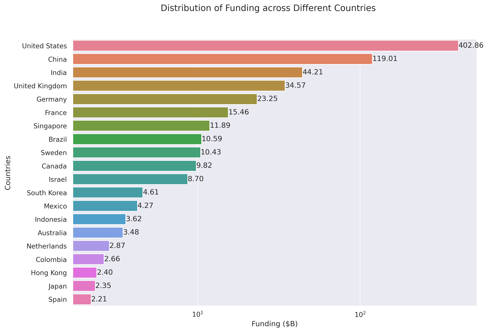


<a id="orgcb52ae0"></a>

#### Mean Distribution of Funding across Different Countries

```jupyter-python
fig, ax = plt.subplots(figsize=(12,8), dpi=300)
sns.boxplot(df[df['Country'].isin(country_funding_df['Country'])], y='Country', x='Funding ($M)', hue='Country', showfliers=False)
plt.suptitle('Distribution of Funding across Different Countries')
ax.set(xlabel='Funding ($M)',
       ylabel='Country')
plt.grid(axis='x', alpha=0.7)
plt.show()
```

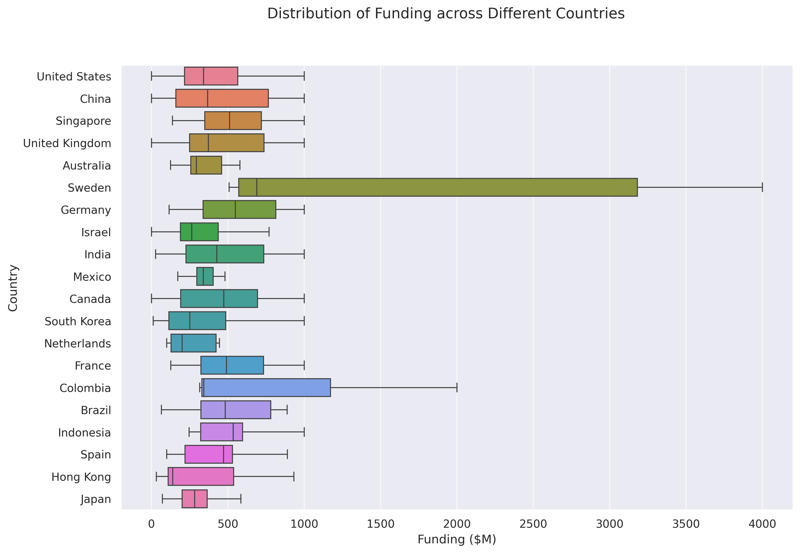

```jupyter-python
mean_country_funding_df = df[df['Country'].isin(country_funding_df['Country'])].groupby('Country')['Funding ($M)'].mean().reset_index().sort_values('Funding ($M)', ascending=False).head(20)
mean_country_funding_df
```

<div>
<style scoped>
    .dataframe tbody tr th:only-of-type {
        vertical-align: middle;
    }

    .dataframe tbody tr th {
        vertical-align: top;
    }

    .dataframe thead th {
        text-align: right;
    }
</style>
<table border="1" class="dataframe">
  <thead>
    <tr style="text-align: right;">
      <th></th>
      <th>Country</th>
      <th>Funding ($M)</th>
    </tr>
  </thead>
  <tbody>
    <tr>
      <th>17</th>
      <td>Sweden</td>
      <td>1738.833333</td>
    </tr>
    <tr>
      <th>4</th>
      <td>Colombia</td>
      <td>886.333333</td>
    </tr>
    <tr>
      <th>3</th>
      <td>China</td>
      <td>777.843137</td>
    </tr>
    <tr>
      <th>6</th>
      <td>Germany</td>
      <td>749.967742</td>
    </tr>
    <tr>
      <th>14</th>
      <td>Singapore</td>
      <td>743.312500</td>
    </tr>
    <tr>
      <th>8</th>
      <td>India</td>
      <td>650.102941</td>
    </tr>
    <tr>
      <th>18</th>
      <td>United Kingdom</td>
      <td>628.472727</td>
    </tr>
    <tr>
      <th>19</th>
      <td>United States</td>
      <td>588.973684</td>
    </tr>
    <tr>
      <th>1</th>
      <td>Brazil</td>
      <td>588.388889</td>
    </tr>
    <tr>
      <th>5</th>
      <td>France</td>
      <td>552.071429</td>
    </tr>
    <tr>
      <th>12</th>
      <td>Mexico</td>
      <td>533.500000</td>
    </tr>
    <tr>
      <th>9</th>
      <td>Indonesia</td>
      <td>516.714286</td>
    </tr>
    <tr>
      <th>2</th>
      <td>Canada</td>
      <td>467.476190</td>
    </tr>
    <tr>
      <th>16</th>
      <td>Spain</td>
      <td>442.400000</td>
    </tr>
    <tr>
      <th>0</th>
      <td>Australia</td>
      <td>386.111111</td>
    </tr>
    <tr>
      <th>10</th>
      <td>Israel</td>
      <td>378.043497</td>
    </tr>
    <tr>
      <th>15</th>
      <td>South Korea</td>
      <td>354.384615</td>
    </tr>
    <tr>
      <th>7</th>
      <td>Hong Kong</td>
      <td>342.714286</td>
    </tr>
    <tr>
      <th>13</th>
      <td>Netherlands</td>
      <td>318.333333</td>
    </tr>
    <tr>
      <th>11</th>
      <td>Japan</td>
      <td>293.375000</td>
    </tr>
  </tbody>
</table>
</div>

```jupyter-python
plt.figure(figsize=(12, 8), dpi=300)
ax = sns.barplot(mean_country_funding_df,
                 y='Country',
                 x='Funding ($M)',
                 hue='Country')
for i in ax.containers:
    ax.bar_label(i, fmt='%.2f')
plt.suptitle('Mean Distribution of Funding across Different Countries')
plt.xlabel('Mean Funding ($M)')
plt.ylabel('Countries')
plt.grid(axis='x', alpha=0.75)
plt.show()
```

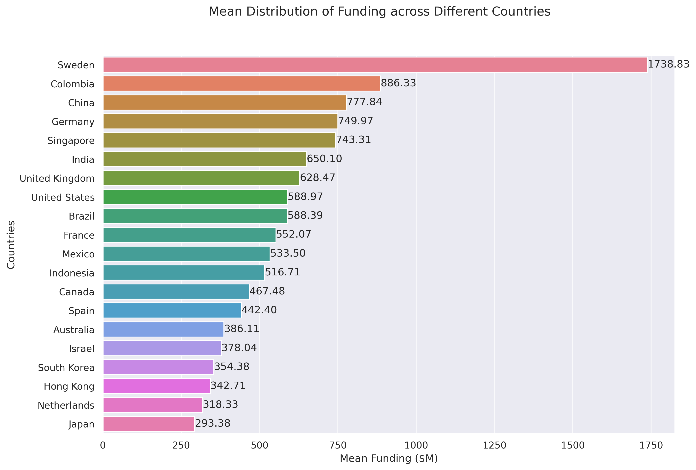


<a id="org6752bb3"></a>

#### Distribution of Funding by Number of Companies

```jupyter-python
# Define the bins for funding ranges
# bins = [0, 0.2, 0.3, 0.5, 0.8, 1, 2, 4, 6, 8, 10, 12, 15, 20]
# labels =  [f'{a}-{b}' for a, b in zip(bins[:-1], bins[1:])]
bins = [0,50,100,150,200,250,300,350,400,450,500,550,600,650,700,750,800,850,900,950,1000,1500,2000,4000,6000,8000,10000,15000,20000]
labels =  [f'{a}-{b}' for a, b in zip(bins[:-1], bins[1:])]
cuts = pd.cut(df['Funding ($M)'], bins=bins, labels=labels)

# Count the number of companies in each bin
funding_distribution = cuts.value_counts().sort_index()

# Plot the Bar Chart
plt.figure(figsize=(12, 6), dpi=300)
ax = sns.barplot(x=funding_distribution.index,
                 y=funding_distribution.values, hue=funding_distribution.values)
for i in ax.containers:
    ax.bar_label(i)
plt.suptitle('Distribution of Funding by Number of Companies')
plt.xlabel('Funding ($M)')
plt.ylabel('Number of Companies')
plt.xticks(rotation=90)
plt.grid(axis='y', alpha=0.75)
# plt.yscale('log')
plt.show()
```

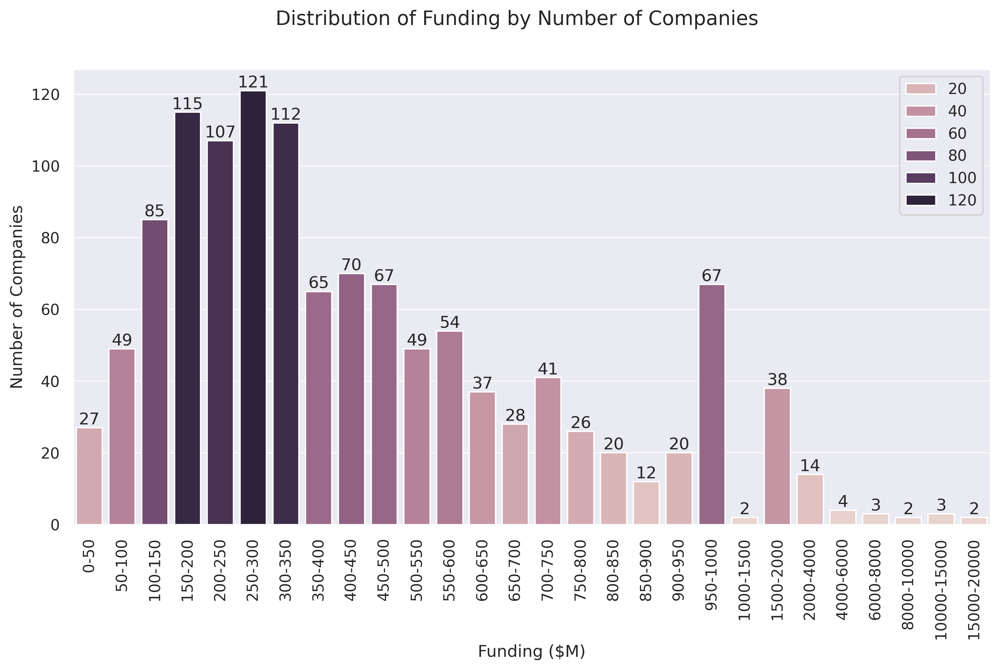


<a id="org7d69ead"></a>

# Comparative Analysis


<a id="orgd019a49"></a>

## By Company


<a id="orgc8cd9bc"></a>

### Top Companies by Valuation

```jupyter-python
top_companies = df.sort_values(by='Latest Valuation ($B)', ascending=False).head(20)
print(top_companies)
```

```
                     Company  Valuation ($B)  Total Equity Funding ($) Unicorn Date  Date Founded Years to Unicorn                    Industry         Country           City  \
0                     SpaceX          350.00                9000000000   2012-12-01          2002            10y3m             Enterprise Tech   United States      Hawthorne
1                  ByteDance          300.00                8000000000   2017-04-07          2011             6y3m             Enterprise Tech           China        Beijing
2                     OpenAI          157.00               18000000000   2019-07-22          2015             4y6m                 Industrials   United States  San Francisco
3                  Ant Group          150.00               19000000000   2017-01-01          2014              3y           Financial Services           China       Hangzhou
7                        xAI           50.00               12000000000   2024-05-26          2006            18y4m           Consumer & Retail   United States     Burlingame
4                     Stripe           70.00                9000000000   2014-01-23          2009               5y           Consumer & Retail   United States  San Francisco
5                      SHEIN           66.00                4000000000   2018-07-03          2008            10y6m          Financial Services       Singapore      Singapore
6                 Databricks           62.00               14000000000   2019-02-05          2013             6y1m                 Industrials   United States  San Francisco
16                 Anthropic           16.05                8000000000   2023-02-03          2021             2y2m             Enterprise Tech   United States  San Francisco
150   Safe Superintelligence            5.00                1000000000   2024-09-04          1995            29y8m           Consumer & Retail   United States  San Francisco
9                      Canva           32.00                 580000000   2018-01-08          2012               6y  Healthcare & Life Sciences       Australia    Surry Hills
13                Epic Games           22.50                8000000000   2018-10-26          1991            27y9m          Financial Services   United States           Cary
26                  Scale AI           13.80                2000000000   2019-08-05          2016             3y7m          Financial Services   United States  San Francisco
10                  Fanatics           31.00                5000000000   2012-06-06          2011             1y5m          Financial Services   United States   Jacksonville
11                     Chime           25.00                2000000000   2019-03-05          2012             7y2m             Enterprise Tech   United States  San Francisco
12                 CoreWeave           23.00                2000000000   2023-04-20          2019             4y3m  Healthcare & Life Sciences   United States       Roseland
8                    Revolut           45.00                2000000000   2018-04-26          2015             3y3m                   Insurance  United Kingdom         London
14                      Miro           17.50                 476000000   2022-01-05          2012             1y0m  Healthcare & Life Sciences   United States  San Francisco
1119           Nature's Fynd            1.00                 463000000   2021-07-19          2009            12y6m       Media & Entertainment   United States        Chicago
17                 Yuanfudao           15.50                4000000000   2017-05-31          2012             5y4m             Enterprise Tech           China        Beijing

                                       Select Investors  Unicorn Year  Funding ($B)  Funding ($M)                                          Investors  Latest Valuation ($B)  \
0            Opus Capital, RRE Ventures, Relay Ventures          2012         9.000        9000.0       [Opus Capital, RRE Ventures, Relay Ventures]                 350.00
1             Breyer Capital, Parkway VC, TIME Ventures          2017         8.000        8000.0        [Breyer Capital, Parkway VC, TIME Ventures]                 315.00
2               Dynamo VC, Susa Ventures, Founders Fund          2019        18.000       18000.0          [Dynamo VC, Susa Ventures, Founders Fund]                 300.00
3     Alibaba Group, CPP Investments, The Carlyle Group          2017        19.000       19000.0  [Alibaba Group, CPP Investments, The Carlyle G...                 150.00
7     Prysm Capital, Baillie Gifford & Co., TDM Grow...          2024        12.000       12000.0  [Prysm Capital, Baillie Gifford & Co., TDM Gro...                 113.00
4          Sequoia Capital China, ZhenFund, K2 Ventures          2014         9.000        9000.0     [Sequoia Capital China, ZhenFund, K2 Ventures]                  91.50
5     369 Growth Partners, GTM Capital, Berkeley Hil...          2018         4.000        4000.0  [369 Growth Partners, GTM Capital, Berkeley Hi...                  66.00
6     Holtzbrinck Ventures, Unternehmertum Venture C...          2019        14.000       14000.0  [Holtzbrinck Ventures, Unternehmertum Venture ...                  62.00
16    New Enterprise Associates, Institutional Ventu...          2023         8.000        8000.0  [New Enterprise Associates, Institutional Vent...                  61.50
150   General Catalyst, Inspired Capital, Flybridge ...          2024         1.000        1000.0  [General Catalyst, Inspired Capital, Flybridge...                  32.00
9             Index Ventures, Temasek, Portag3 Ventures          2018         0.580         580.0        [Index Ventures, Temasek, Portag3 Ventures]                  32.00
13    Warburg Pincus, The Rise Fund, HarbourVest Par...          2018         8.000        8000.0  [Warburg Pincus, The Rise Fund, HarbourVest Pa...                  31.50
26    Accel,Y Combinator, Index Ventures, Founders Fund          2019         2.000        2000.0  [Accel,Y Combinator, Index Ventures, Founders ...                  29.00
10    Liberty City Ventures, RRE Ventures, Mithril C...          2012         5.000        5000.0  [Liberty City Ventures, RRE Ventures, Mithril ...                  27.00
11          Blackstone, ICONIQ Growth, General Atlantic          2019         2.000        2000.0      [Blackstone, ICONIQ Growth, General Atlantic]                  25.00
12    The Column Group, Foresite Capital, Foresite C...          2023         2.000        2000.0  [The Column Group, Foresite Capital, Foresite ...                  23.00
8           CMFG Ventures, Accomplice, Moderne Ventures          2018         2.000        2000.0      [CMFG Ventures, Accomplice, Moderne Ventures]                  17.75
14    Sequoia Capital China, China Life Investment H...          2022         0.476         476.0  [Sequoia Capital China, China Life Investment ...                  17.50
1119  Lightspeed Venture Partners, Access Industries...          2021         0.463         463.0  [Lightspeed Venture Partners, Access Industrie...                  17.00
17      Craft Ventures, F-Prime Capital, Sound Ventures          2017         4.000        4000.0  [Craft Ventures, F-Prime Capital, Sound Ventures]                  15.50

                                             Founder(s)
0                                           [Elon Musk]
1                            [Zhang Yiming, Liang Rubo]
2           [Sam Altman, Greg Brockman, Ilya Sutskever]
3                                                   NaN
7                                           [Elon Musk]
4                              [Patrick, John Collison]
5                                                   NaN
6                                          [Ali Ghodsi]
16                                       [Dario Amodei]
150         [Ilya Sutskever, Daniel Gross, Daniel Levy]
9     [Melanie Perkins, Clifford Obrecht, Cameron Ad...
13                                        [Tim Sweeney]
26                            [Alexandr Wang, Lucy Guo]
10       [Alan Trager, Mitch Trager, Michael Rubin[34]]
11                             [Chris Britt, Ryan King]
12                                                  NaN
8                    [Nikolay Storonsky, Vlad Yatsenko]
14                                      [Andrey Khusid]
1119  [Thomas Jonas, Mark Kozubal, Yuval Avniel, Ric...
17                                            [Yong Li]
```

```jupyter-python
# Set the positions and width for the bars
N = len(top_companies)
ind = np.arange(N)  # the x locations for the groups
width = 0.35  # the width of the bars

# Create the bars for valuation and funding
fig, ax = plt.subplots(figsize=(12, 6), dpi=300)
bars1 = ax.bar(ind, top_companies['Valuation ($B)'], width, label='2024')
bars2 = ax.bar(ind + width, top_companies['Latest Valuation ($B)'], width, label='2025')

# Add labels and title
ax.set(xlabel='Companies',
       ylabel='Valuation ($B)')
ax.set_xticks(ind+width/2, top_companies['Company'], rotation=45, ha='right')
ax.legend()
ax.grid(axis='y', alpha=0.75)
plt.suptitle('Top Companies by Valuation')
plt.show()
```


<a id="org2b8971e"></a>

### Companies Received Most Funding

```jupyter-python
top_companies = df[df['Funding ($M)']>2000].sort_values(by='Funding ($M)', ascending=False).head(30)
top_companies
```

<div>
<style scoped>
    .dataframe tbody tr th:only-of-type {
        vertical-align: middle;
    }

    .dataframe tbody tr th {
        vertical-align: top;
    }

    .dataframe thead th {
        text-align: right;
    }
</style>
<table border="1" class="dataframe">
  <thead>
    <tr style="text-align: right;">
      <th></th>
      <th>Company</th>
      <th>Valuation ($B)</th>
      <th>Total Equity Funding ($)</th>
      <th>Unicorn Date</th>
      <th>Date Founded</th>
      <th>Years to Unicorn</th>
      <th>Industry</th>
      <th>Country</th>
      <th>City</th>
      <th>Select Investors</th>
      <th>Unicorn Year</th>
      <th>Funding ($B)</th>
      <th>Funding ($M)</th>
      <th>Latest Valuation ($B)</th>
    </tr>
  </thead>
  <tbody>
    <tr>
      <th>3</th>
      <td>Ant Group</td>
      <td>150.00</td>
      <td>19000000000</td>
      <td>2017-01-01</td>
      <td>2014</td>
      <td>3y</td>
      <td>Financial Services</td>
      <td>China</td>
      <td>Hangzhou</td>
      <td>Alibaba Group, CPP Investments, The Carlyle Group</td>
      <td>2017</td>
      <td>19.0</td>
      <td>19000.0</td>
      <td>150.00</td>
    </tr>
    <tr>
      <th>2</th>
      <td>OpenAI</td>
      <td>157.00</td>
      <td>18000000000</td>
      <td>2019-07-22</td>
      <td>2015</td>
      <td>4y6m</td>
      <td>Industrials</td>
      <td>United States</td>
      <td>San Francisco</td>
      <td>Dynamo VC, Susa Ventures, Founders Fund</td>
      <td>2019</td>
      <td>18.0</td>
      <td>18000.0</td>
      <td>300.00</td>
    </tr>
    <tr>
      <th>38</th>
      <td>JUUL Labs</td>
      <td>12.00</td>
      <td>15000000000</td>
      <td>2017-12-20</td>
      <td>2011</td>
      <td>6y11m</td>
      <td>Enterprise Tech</td>
      <td>United States</td>
      <td>San Francisco</td>
      <td>Boxin Capital, DT Capital Partners, IDG Capital</td>
      <td>2017</td>
      <td>15.0</td>
      <td>15000.0</td>
      <td>5.00</td>
    </tr>
    <tr>
      <th>6</th>
      <td>Databricks</td>
      <td>62.00</td>
      <td>14000000000</td>
      <td>2019-02-05</td>
      <td>2013</td>
      <td>6y1m</td>
      <td>Industrials</td>
      <td>United States</td>
      <td>San Francisco</td>
      <td>Holtzbrinck Ventures, Unternehmertum Venture C...</td>
      <td>2019</td>
      <td>14.0</td>
      <td>14000.0</td>
      <td>62.00</td>
    </tr>
    <tr>
      <th>7</th>
      <td>xAI</td>
      <td>50.00</td>
      <td>12000000000</td>
      <td>2024-05-26</td>
      <td>2006</td>
      <td>18y4m</td>
      <td>Consumer &amp; Retail</td>
      <td>United States</td>
      <td>Burlingame</td>
      <td>Prysm Capital, Baillie Gifford &amp; Co., TDM Grow...</td>
      <td>2024</td>
      <td>12.0</td>
      <td>12000.0</td>
      <td>113.00</td>
    </tr>
    <tr>
      <th>0</th>
      <td>SpaceX</td>
      <td>350.00</td>
      <td>9000000000</td>
      <td>2012-12-01</td>
      <td>2002</td>
      <td>10y3m</td>
      <td>Enterprise Tech</td>
      <td>United States</td>
      <td>Hawthorne</td>
      <td>Opus Capital, RRE Ventures, Relay Ventures</td>
      <td>2012</td>
      <td>9.0</td>
      <td>9000.0</td>
      <td>350.00</td>
    </tr>
    <tr>
      <th>4</th>
      <td>Stripe</td>
      <td>70.00</td>
      <td>9000000000</td>
      <td>2014-01-23</td>
      <td>2009</td>
      <td>5y</td>
      <td>Consumer &amp; Retail</td>
      <td>United States</td>
      <td>San Francisco</td>
      <td>Sequoia Capital China, ZhenFund, K2 Ventures</td>
      <td>2014</td>
      <td>9.0</td>
      <td>9000.0</td>
      <td>91.50</td>
    </tr>
    <tr>
      <th>1</th>
      <td>ByteDance</td>
      <td>300.00</td>
      <td>8000000000</td>
      <td>2017-04-07</td>
      <td>2011</td>
      <td>6y3m</td>
      <td>Enterprise Tech</td>
      <td>China</td>
      <td>Beijing</td>
      <td>Breyer Capital, Parkway VC, TIME Ventures</td>
      <td>2017</td>
      <td>8.0</td>
      <td>8000.0</td>
      <td>315.00</td>
    </tr>
    <tr>
      <th>13</th>
      <td>Epic Games</td>
      <td>22.50</td>
      <td>8000000000</td>
      <td>2018-10-26</td>
      <td>1991</td>
      <td>27y9m</td>
      <td>Financial Services</td>
      <td>United States</td>
      <td>Cary</td>
      <td>Warburg Pincus, The Rise Fund, HarbourVest Par...</td>
      <td>2018</td>
      <td>8.0</td>
      <td>8000.0</td>
      <td>31.50</td>
    </tr>
    <tr>
      <th>16</th>
      <td>Anthropic</td>
      <td>16.05</td>
      <td>8000000000</td>
      <td>2023-02-03</td>
      <td>2021</td>
      <td>2y2m</td>
      <td>Enterprise Tech</td>
      <td>United States</td>
      <td>San Francisco</td>
      <td>New Enterprise Associates, Institutional Ventu...</td>
      <td>2023</td>
      <td>8.0</td>
      <td>8000.0</td>
      <td>61.50</td>
    </tr>
    <tr>
      <th>44</th>
      <td>Global Switch</td>
      <td>11.10</td>
      <td>5000000000</td>
      <td>2016-12-22</td>
      <td>1998</td>
      <td>19y2m</td>
      <td>Enterprise Tech</td>
      <td>United Kingdom</td>
      <td>London</td>
      <td>Jiangsu Shagang Group, IDC, Barclays, Credit S...</td>
      <td>2016</td>
      <td>5.0</td>
      <td>5000.0</td>
      <td>11.10</td>
    </tr>
    <tr>
      <th>10</th>
      <td>Fanatics</td>
      <td>31.00</td>
      <td>5000000000</td>
      <td>2012-06-06</td>
      <td>2011</td>
      <td>1y5m</td>
      <td>Financial Services</td>
      <td>United States</td>
      <td>Jacksonville</td>
      <td>Liberty City Ventures, RRE Ventures, Mithril C...</td>
      <td>2012</td>
      <td>5.0</td>
      <td>5000.0</td>
      <td>27.00</td>
    </tr>
    <tr>
      <th>42</th>
      <td>BYJU's</td>
      <td>11.50</td>
      <td>5000000000</td>
      <td>2017-07-25</td>
      <td>2011</td>
      <td>7y8m</td>
      <td>Healthcare &amp; Life Sciences</td>
      <td>India</td>
      <td>Bengaluru</td>
      <td>Greylock Partners, Venrock, Providence Ventures</td>
      <td>2017</td>
      <td>5.0</td>
      <td>5000.0</td>
      <td>11.50</td>
    </tr>
    <tr>
      <th>40</th>
      <td>Xingsheng Selected</td>
      <td>12.00</td>
      <td>5000000000</td>
      <td>2020-07-22</td>
      <td>2009</td>
      <td>11y6m</td>
      <td>Media &amp; Entertainment</td>
      <td>China</td>
      <td>Changsha</td>
      <td>Temasek, Guggenheim Investments, Qatar Investm...</td>
      <td>2020</td>
      <td>5.0</td>
      <td>5000.0</td>
      <td>12.00</td>
    </tr>
    <tr>
      <th>48</th>
      <td>Chehaoduo</td>
      <td>10.00</td>
      <td>4000000000</td>
      <td>2016-03-12</td>
      <td>2014</td>
      <td>2y2m</td>
      <td>Healthcare &amp; Life Sciences</td>
      <td>China</td>
      <td>Beijing</td>
      <td>China Health Industry Investment Fund, China R...</td>
      <td>2016</td>
      <td>4.0</td>
      <td>4000.0</td>
      <td>10.00</td>
    </tr>
    <tr>
      <th>60</th>
      <td>Northvolt</td>
      <td>9.08</td>
      <td>4000000000</td>
      <td>2019-06-12</td>
      <td>2016</td>
      <td>3y5m</td>
      <td>Industrials</td>
      <td>Sweden</td>
      <td>Stockholm</td>
      <td>Aqua-Spark, Wavemaker Partners, Peak XV Partners</td>
      <td>2019</td>
      <td>4.0</td>
      <td>4000.0</td>
      <td>11.75</td>
    </tr>
    <tr>
      <th>213</th>
      <td>Hozon Auto</td>
      <td>3.95</td>
      <td>4000000000</td>
      <td>2022-02-22</td>
      <td>2009</td>
      <td>12y1m</td>
      <td>Media &amp; Entertainment</td>
      <td>China</td>
      <td>Shanghai</td>
      <td>Yichun Jinheng Equity Investments, Nanning Min...</td>
      <td>2022</td>
      <td>4.0</td>
      <td>4000.0</td>
      <td>3.95</td>
    </tr>
    <tr>
      <th>24</th>
      <td>Anduril</td>
      <td>14.00</td>
      <td>4000000000</td>
      <td>2019-09-11</td>
      <td>2017</td>
      <td>2y8m</td>
      <td>Enterprise Tech</td>
      <td>United States</td>
      <td>Irvine</td>
      <td>Norwest Venture Partners, Goldman Sachs, Dell ...</td>
      <td>2019</td>
      <td>4.0</td>
      <td>4000.0</td>
      <td>14.00</td>
    </tr>
    <tr>
      <th>23</th>
      <td>Klarna</td>
      <td>14.50</td>
      <td>4000000000</td>
      <td>2011-12-12</td>
      <td>2005</td>
      <td>9y2m</td>
      <td>Enterprise Tech</td>
      <td>Sweden</td>
      <td>Stockholm</td>
      <td>OneVentures, AirTree Ventures, AMP New Ventures</td>
      <td>2011</td>
      <td>4.0</td>
      <td>4000.0</td>
      <td>6.50</td>
    </tr>
    <tr>
      <th>17</th>
      <td>Yuanfudao</td>
      <td>15.50</td>
      <td>4000000000</td>
      <td>2017-05-31</td>
      <td>2012</td>
      <td>5y4m</td>
      <td>Enterprise Tech</td>
      <td>China</td>
      <td>Beijing</td>
      <td>Craft Ventures, F-Prime Capital, Sound Ventures</td>
      <td>2017</td>
      <td>4.0</td>
      <td>4000.0</td>
      <td>15.50</td>
    </tr>
    <tr>
      <th>5</th>
      <td>SHEIN</td>
      <td>66.00</td>
      <td>4000000000</td>
      <td>2018-07-03</td>
      <td>2008</td>
      <td>10y6m</td>
      <td>Financial Services</td>
      <td>Singapore</td>
      <td>Singapore</td>
      <td>369 Growth Partners, GTM Capital, Berkeley Hil...</td>
      <td>2018</td>
      <td>4.0</td>
      <td>4000.0</td>
      <td>66.00</td>
    </tr>
    <tr>
      <th>20</th>
      <td>Gopuff</td>
      <td>15.00</td>
      <td>3000000000</td>
      <td>2020-10-08</td>
      <td>2013</td>
      <td>7y9m</td>
      <td>Financial Services</td>
      <td>United States</td>
      <td>Philadelphia</td>
      <td>RRE Ventures, Tiger Global, August Capital</td>
      <td>2020</td>
      <td>3.0</td>
      <td>3000.0</td>
      <td>15.00</td>
    </tr>
    <tr>
      <th>62</th>
      <td>OYO Rooms</td>
      <td>9.00</td>
      <td>3000000000</td>
      <td>2018-09-25</td>
      <td>2012</td>
      <td>6y8m</td>
      <td>Consumer &amp; Retail</td>
      <td>India</td>
      <td>Gurugram</td>
      <td>Tencent Holdings, Tiger Global Management, Glo...</td>
      <td>2018</td>
      <td>3.0</td>
      <td>3000.0</td>
      <td>9.00</td>
    </tr>
    <tr>
      <th>95</th>
      <td>SVOLT</td>
      <td>6.51</td>
      <td>3000000000</td>
      <td>2020-06-08</td>
      <td>2010</td>
      <td>10y5m</td>
      <td>Consumer &amp; Retail</td>
      <td>China</td>
      <td>Changzhou</td>
      <td>QiMing Venture Partners, Temasek Holdings, Sil...</td>
      <td>2020</td>
      <td>3.0</td>
      <td>3000.0</td>
      <td>6.51</td>
    </tr>
    <tr>
      <th>294</th>
      <td>FlixMobility</td>
      <td>3.00</td>
      <td>3000000000</td>
      <td>2019-07-18</td>
      <td>2013</td>
      <td>6y6m</td>
      <td>Consumer &amp; Retail</td>
      <td>Germany</td>
      <td>Munich</td>
      <td>Knox Lane, Ainge Advisory, Carlson Private Cap...</td>
      <td>2019</td>
      <td>3.0</td>
      <td>3000.0</td>
      <td>2.00</td>
    </tr>
    <tr>
      <th>322</th>
      <td>Zuoyebang</td>
      <td>3.00</td>
      <td>3000000000</td>
      <td>2018-07-18</td>
      <td>2015</td>
      <td>5y8m</td>
      <td>Enterprise Tech</td>
      <td>China</td>
      <td>Beijing</td>
      <td>Google Ventures, Accel, Data Collective</td>
      <td>2018</td>
      <td>3.0</td>
      <td>3000.0</td>
      <td>1.00</td>
    </tr>
    <tr>
      <th>491</th>
      <td>Magic Leap</td>
      <td>2.00</td>
      <td>3000000000</td>
      <td>2014-10-21</td>
      <td>2011</td>
      <td>3y9m</td>
      <td>Enterprise Tech</td>
      <td>United States</td>
      <td>Plantation</td>
      <td>Scale Venture Partners, Sapphire Ventures, Bat...</td>
      <td>2014</td>
      <td>3.0</td>
      <td>3000.0</td>
      <td>4.50</td>
    </tr>
    <tr>
      <th>51</th>
      <td>Huolala</td>
      <td>10.00</td>
      <td>2400000000</td>
      <td>2019-02-21</td>
      <td>2016</td>
      <td>3y1m</td>
      <td>Industrials</td>
      <td>China</td>
      <td>Guangzhou</td>
      <td>Fifty Years Fund, Refactor Capital, Temasek</td>
      <td>2019</td>
      <td>2.4</td>
      <td>2400.0</td>
      <td>10.00</td>
    </tr>
  </tbody>
</table>
</div>

```jupyter-python
plt.subplots(figsize=(12, 8), dpi=300)
ax = sns.barplot(top_companies, y='Company', x='Funding ($M)', hue='Company')
for i in ax.containers:
    ax.bar_label(i)
plt.suptitle('Companies Received Most Funding')
plt.xlabel('Amount ($M)')
plt.grid(axis='x', alpha=0.75)
plt.show()
```

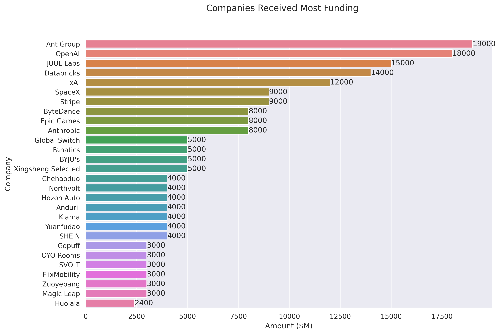


<a id="orgad32b10"></a>

## By Country

```jupyter-python
top_countries = df['Country'].value_counts().nlargest(8).index
top_countries
```

    Index(['United States', 'China', 'India', 'United Kingdom', 'Germany', 'France', 'Israel', 'Canada'], dtype='object', name='Country')


<a id="orgdc1c4d8"></a>

### Top Countries by Number of Companies

```jupyter-python
plt.subplots(figsize=(12, 6), dpi=300)
ax = sns.countplot(x=df['Country'],
                   order=df['Country'].value_counts().nlargest(20).index,
                   hue=df['Country'])
for i in ax.containers:
    ax.bar_label(i)
plt.suptitle('Top Countries by Number of Companies')
plt.ylabel('Number of Companies')
plt.xticks(rotation=45, ha='right')
plt.grid(axis='y', alpha=0.75)
plt.yscale('log')
plt.show()
```

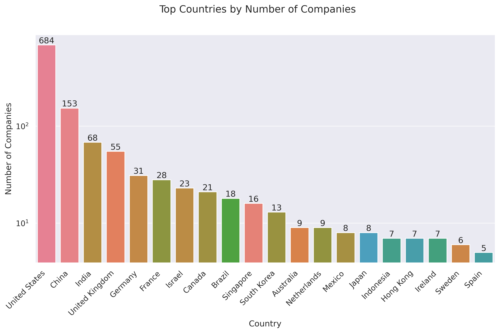


<a id="orgf81b874"></a>

### Top Countries by Number of Companies across Different Industries

```jupyter-python
grouped_df = df[df['Country'].isin(top_countries)].groupby(['Country', 'Industry']).size().unstack(fill_value=0)
grouped_df
```

<div>
<style scoped>
    .dataframe tbody tr th:only-of-type {
        vertical-align: middle;
    }

    .dataframe tbody tr th {
        vertical-align: top;
    }

    .dataframe thead th {
        text-align: right;
    }
</style>
<table border="1" class="dataframe">
  <thead>
    <tr style="text-align: right;">
      <th>Industry</th>
      <th>Consumer &amp; Retail</th>
      <th>Enterprise Tech</th>
      <th>Financial Services</th>
      <th>Healthcare &amp; Life Sciences</th>
      <th>Industrials</th>
      <th>Insurance</th>
      <th>Media &amp; Entertainment</th>
    </tr>
    <tr>
      <th>Country</th>
      <th></th>
      <th></th>
      <th></th>
      <th></th>
      <th></th>
      <th></th>
      <th></th>
    </tr>
  </thead>
  <tbody>
    <tr>
      <th>Canada</th>
      <td>1</td>
      <td>7</td>
      <td>9</td>
      <td>0</td>
      <td>2</td>
      <td>0</td>
      <td>2</td>
    </tr>
    <tr>
      <th>China</th>
      <td>19</td>
      <td>59</td>
      <td>27</td>
      <td>14</td>
      <td>22</td>
      <td>2</td>
      <td>10</td>
    </tr>
    <tr>
      <th>France</th>
      <td>2</td>
      <td>12</td>
      <td>5</td>
      <td>2</td>
      <td>6</td>
      <td>0</td>
      <td>1</td>
    </tr>
    <tr>
      <th>Germany</th>
      <td>7</td>
      <td>10</td>
      <td>2</td>
      <td>3</td>
      <td>8</td>
      <td>0</td>
      <td>1</td>
    </tr>
    <tr>
      <th>India</th>
      <td>10</td>
      <td>22</td>
      <td>12</td>
      <td>7</td>
      <td>8</td>
      <td>1</td>
      <td>8</td>
    </tr>
    <tr>
      <th>Israel</th>
      <td>6</td>
      <td>7</td>
      <td>1</td>
      <td>2</td>
      <td>5</td>
      <td>2</td>
      <td>0</td>
    </tr>
    <tr>
      <th>United Kingdom</th>
      <td>9</td>
      <td>16</td>
      <td>12</td>
      <td>6</td>
      <td>5</td>
      <td>2</td>
      <td>5</td>
    </tr>
    <tr>
      <th>United States</th>
      <td>116</td>
      <td>214</td>
      <td>128</td>
      <td>68</td>
      <td>94</td>
      <td>15</td>
      <td>49</td>
    </tr>
  </tbody>
</table>
</div>

```jupyter-python
grouped_df.plot(kind='bar', figsize=(12, 8), width=0.8)
plt.suptitle('Number of Companies accross Different Industries')
plt.xlabel('Country')
plt.ylabel('Number of Companies')
plt.xticks(rotation=0)  # Keep x-axis labels horizontal
plt.legend(ncol=4, loc="upper center", bbox_to_anchor=(0.5,-0.08))
plt.grid(True)
plt.tight_layout()
# plt.yscale('log')
plt.show()
```

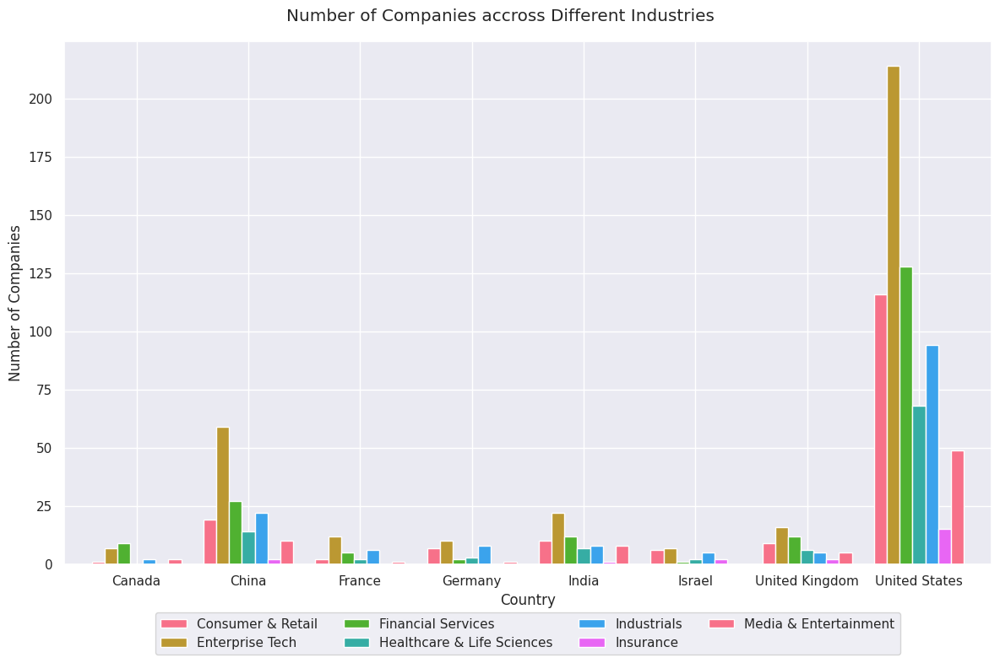


<a id="org93f1ecd"></a>

### Top Countries by Company Valuations across Different Industries

```jupyter-python
grouped_df = df[df['Country'].isin(top_countries)].groupby(['Country', 'Industry'])['Valuation ($B)'].sum().unstack(fill_value=0)
grouped_df
```

<div>
<style scoped>
    .dataframe tbody tr th:only-of-type {
        vertical-align: middle;
    }

    .dataframe tbody tr th {
        vertical-align: top;
    }

    .dataframe thead th {
        text-align: right;
    }
</style>
<table border="1" class="dataframe">
  <thead>
    <tr style="text-align: right;">
      <th>Industry</th>
      <th>Consumer &amp; Retail</th>
      <th>Enterprise Tech</th>
      <th>Financial Services</th>
      <th>Healthcare &amp; Life Sciences</th>
      <th>Industrials</th>
      <th>Insurance</th>
      <th>Media &amp; Entertainment</th>
    </tr>
    <tr>
      <th>Country</th>
      <th></th>
      <th></th>
      <th></th>
      <th></th>
      <th></th>
      <th></th>
      <th></th>
    </tr>
  </thead>
  <tbody>
    <tr>
      <th>Canada</th>
      <td>4.00</td>
      <td>15.65</td>
      <td>25.35</td>
      <td>0.00</td>
      <td>4.00</td>
      <td>0.00</td>
      <td>7.00</td>
    </tr>
    <tr>
      <th>China</th>
      <td>47.84</td>
      <td>452.44</td>
      <td>207.12</td>
      <td>33.94</td>
      <td>49.77</td>
      <td>4.93</td>
      <td>39.61</td>
    </tr>
    <tr>
      <th>France</th>
      <td>2.00</td>
      <td>30.88</td>
      <td>16.87</td>
      <td>4.38</td>
      <td>15.63</td>
      <td>0.00</td>
      <td>1.10</td>
    </tr>
    <tr>
      <th>Germany</th>
      <td>22.54</td>
      <td>27.92</td>
      <td>2.07</td>
      <td>17.87</td>
      <td>14.50</td>
      <td>0.00</td>
      <td>1.00</td>
    </tr>
    <tr>
      <th>India</th>
      <td>34.44</td>
      <td>60.65</td>
      <td>19.85</td>
      <td>20.00</td>
      <td>13.01</td>
      <td>3.40</td>
      <td>20.72</td>
    </tr>
    <tr>
      <th>Israel</th>
      <td>20.85</td>
      <td>21.80</td>
      <td>1.00</td>
      <td>2.40</td>
      <td>7.57</td>
      <td>2.60</td>
      <td>0.00</td>
    </tr>
    <tr>
      <th>United Kingdom</th>
      <td>25.09</td>
      <td>50.58</td>
      <td>27.97</td>
      <td>26.05</td>
      <td>13.56</td>
      <td>46.00</td>
      <td>8.10</td>
    </tr>
    <tr>
      <th>United States</th>
      <td>386.06</td>
      <td>962.37</td>
      <td>343.05</td>
      <td>233.18</td>
      <td>478.08</td>
      <td>55.40</td>
      <td>106.00</td>
    </tr>
  </tbody>
</table>
</div>

```jupyter-python
grouped_df.plot(kind='bar', figsize=(12, 8), width=0.8)
plt.suptitle('Company Valuations accross Different Industries')
plt.xlabel('Country')
plt.ylabel('Valuation ($B)')
plt.xticks(rotation=0)  # Keep x-axis labels horizontal
plt.legend(ncol=4, loc="upper center", bbox_to_anchor=(0.5,-0.08))
plt.grid(True)
plt.tight_layout()
plt.show()
```

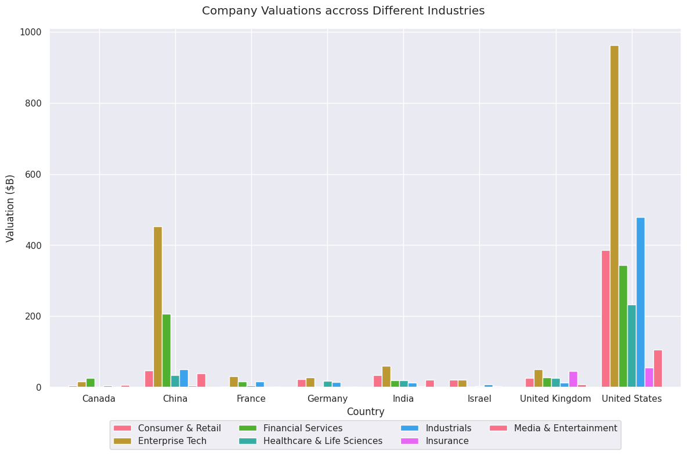


<a id="org8783cc9"></a>

# Time-Based Analysis


<a id="org47f5a3b"></a>

## Unicorn Growth Over Time

```jupyter-python
_df = df.groupby('Unicorn Year').size().reset_index(name='Count')
_df['Accumulated Count'] = _df['Count'].cumsum()
_df
```

<div>
<style scoped>
    .dataframe tbody tr th:only-of-type {
        vertical-align: middle;
    }

    .dataframe tbody tr th {
        vertical-align: top;
    }

    .dataframe thead th {
        text-align: right;
    }
</style>
<table border="1" class="dataframe">
  <thead>
    <tr style="text-align: right;">
      <th></th>
      <th>Unicorn Year</th>
      <th>Count</th>
      <th>Accumulated Count</th>
    </tr>
  </thead>
  <tbody>
    <tr>
      <th>0</th>
      <td>2007</td>
      <td>1</td>
      <td>1</td>
    </tr>
    <tr>
      <th>1</th>
      <td>2011</td>
      <td>1</td>
      <td>2</td>
    </tr>
    <tr>
      <th>2</th>
      <td>2012</td>
      <td>4</td>
      <td>6</td>
    </tr>
    <tr>
      <th>3</th>
      <td>2013</td>
      <td>4</td>
      <td>10</td>
    </tr>
    <tr>
      <th>4</th>
      <td>2014</td>
      <td>9</td>
      <td>19</td>
    </tr>
    <tr>
      <th>5</th>
      <td>2015</td>
      <td>32</td>
      <td>51</td>
    </tr>
    <tr>
      <th>6</th>
      <td>2016</td>
      <td>17</td>
      <td>68</td>
    </tr>
    <tr>
      <th>7</th>
      <td>2017</td>
      <td>35</td>
      <td>103</td>
    </tr>
    <tr>
      <th>8</th>
      <td>2018</td>
      <td>83</td>
      <td>186</td>
    </tr>
    <tr>
      <th>9</th>
      <td>2019</td>
      <td>85</td>
      <td>271</td>
    </tr>
    <tr>
      <th>10</th>
      <td>2020</td>
      <td>91</td>
      <td>362</td>
    </tr>
    <tr>
      <th>11</th>
      <td>2021</td>
      <td>484</td>
      <td>846</td>
    </tr>
    <tr>
      <th>12</th>
      <td>2022</td>
      <td>252</td>
      <td>1098</td>
    </tr>
    <tr>
      <th>13</th>
      <td>2023</td>
      <td>68</td>
      <td>1166</td>
    </tr>
    <tr>
      <th>14</th>
      <td>2024</td>
      <td>78</td>
      <td>1244</td>
    </tr>
  </tbody>
</table>
</div>

```jupyter-python
plt.subplots(figsize=(12, 6), dpi=300)
sns.barplot(_df, x='Unicorn Year', y='Count', hue='Count')
plt.plot(_df['Accumulated Count'], marker='o', linestyle='dashed')
plt.suptitle('Unicorn Growth Over Time')
plt.xlabel('Year')
plt.ylabel('Number of Unicorns')
plt.grid(axis='y', alpha=0.7)
plt.show()
```


The surge of unicorns was reported as [&ldquo;meteoric&rdquo;](https://pitchbook.com/news/articles/us-unicorns-2021-venture-capital-valuations) for 2021, with $71 billion invested in 340 new companies, a banner year for startups and for the US venture capital industry; the unprecedented number of companies valued at more than $1 billion during 2021 exceeded the sum total of the five previous years.


<a id="org58bad77"></a>

## Time to Unicorn

```jupyter-python
# Function to convert "Years to Unicorn" into total months
def convert_years_to_months(years_str):
    if 'y' in years_str and 'm' in years_str:
        years, months = years_str.split('y')
        months = months.replace('m', '').strip()
        return int(years.strip()) * 12 + int(months)
    elif 'y' in years_str:
        years = years_str.replace('y', '').strip()
        return int(years) * 12
    elif 'm' in years_str:
        months = years_str.replace('mo', '').replace('m', '').strip()
        return int(months)
    else:
        return None

df['Years to Unicorn (Months)'] = df['Years to Unicorn'].apply(convert_years_to_months)
df['Years to Unicorn (Converted)'] = df['Years to Unicorn (Months)'] / 12
```

```jupyter-python
fig, ax = plt.subplots(2, 1, figsize=(12, 8), dpi=300)
sns.boxplot(df, x='Years to Unicorn (Converted)', y='Industry', hue='Industry', ax=ax[0], showfliers=False)
ax[0].set(xlabel=None)
sns.histplot(df['Years to Unicorn (Converted)'].dropna(), bins=300, ax=ax[1])
ax[1].set(xlabel='Years', ylabel='Number of Companies')
plt.suptitle('Distribution of Time to Unicorn')
plt.grid(alpha=0.75)
plt.show()
```

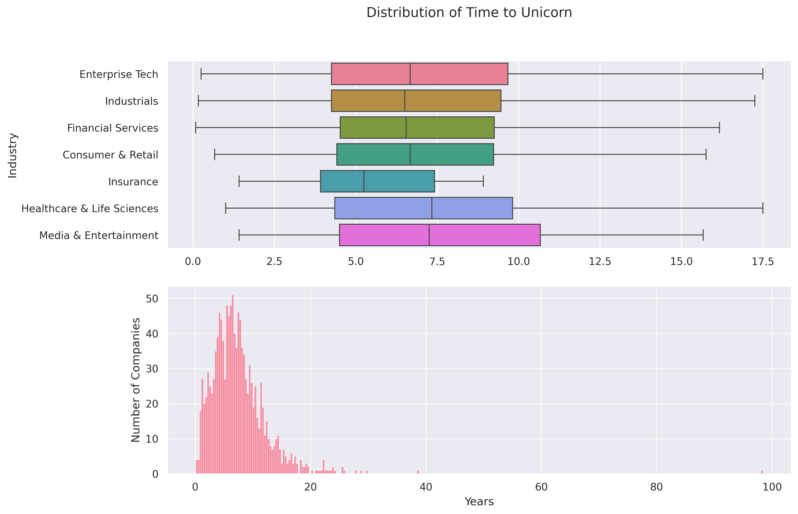


<a id="orgab76e30"></a>

## Distribution of Valuations Over Time

```jupyter-python
plt.subplots(figsize=(12, 6), dpi=300)
sns.scatterplot(df, x='Unicorn Date', y='Valuation ($B)', alpha=.6, hue='Industry')
plt.suptitle('Distribution of Valuations Over Time')
plt.xlabel('Date')
plt.ylabel('Amount ($B)')
# plt.xticks(df['Unicorn Year'].unique(), rotation=45)
plt.grid(axis='y', alpha=0.5)
plt.yscale('log')
plt.show()
```

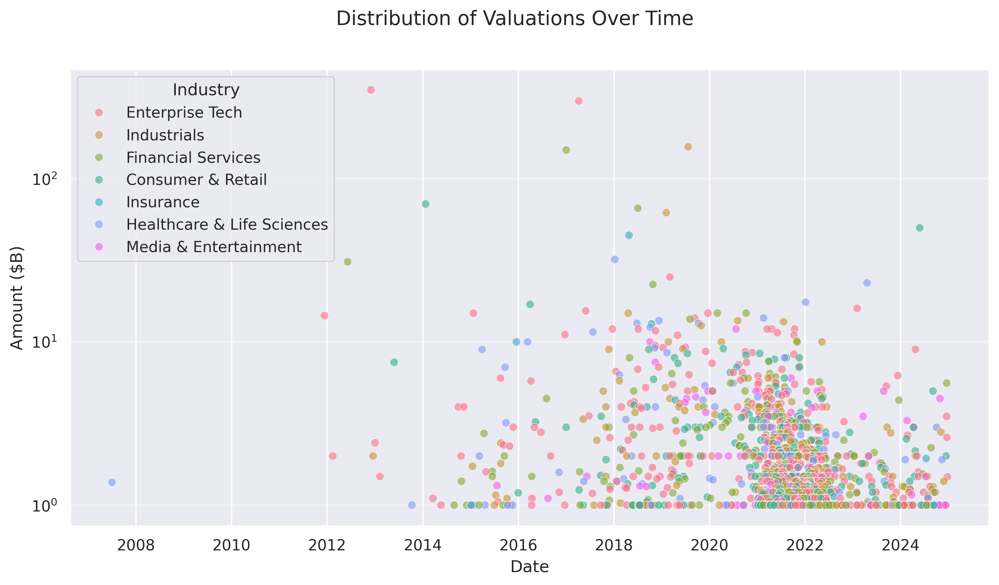


<a id="org8ac7b79"></a>

## Distribution of Funding Over Time

```jupyter-python
plt.subplots(figsize=(12, 6), dpi=300)
sns.scatterplot(df, x='Unicorn Date', y=df['Funding ($M)'], alpha=0.6, hue='Industry')
plt.suptitle('Distribution of Funding Over Time')
plt.xlabel('Date')
plt.ylabel('Amount ($M)')
# plt.xticks(df['Unicorn Year'].unique(), rotation=45)
plt.grid(axis='y', alpha=0.5)
# plt.yscale('log')
plt.show()
```

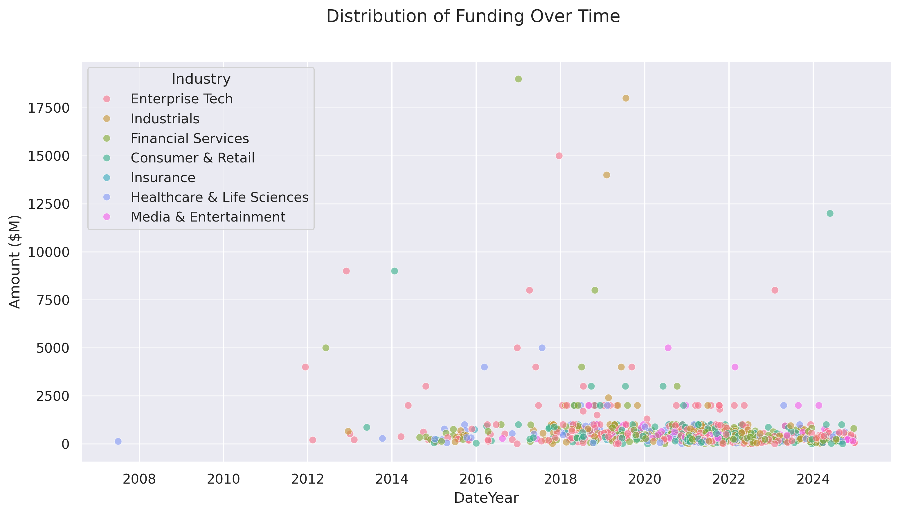


<a id="org62542e3"></a>

# Correlation Analysis


<a id="org2e2821a"></a>

## Relationship between Funding and Valuation

```jupyter-python
plt.subplots(figsize=(12, 6), dpi=300)
sns.scatterplot(df, x=df['Total Equity Funding ($)'], y=df['Valuation ($B)']*1e9, alpha=0.6, hue='Industry')
plt.suptitle('Relationship between Funding and Valuation')
plt.xlabel('Funding ($M)')
plt.ylabel('Valuation ($)')
plt.grid(True)
plt.xscale('log')
plt.yscale('log')
plt.show()
```

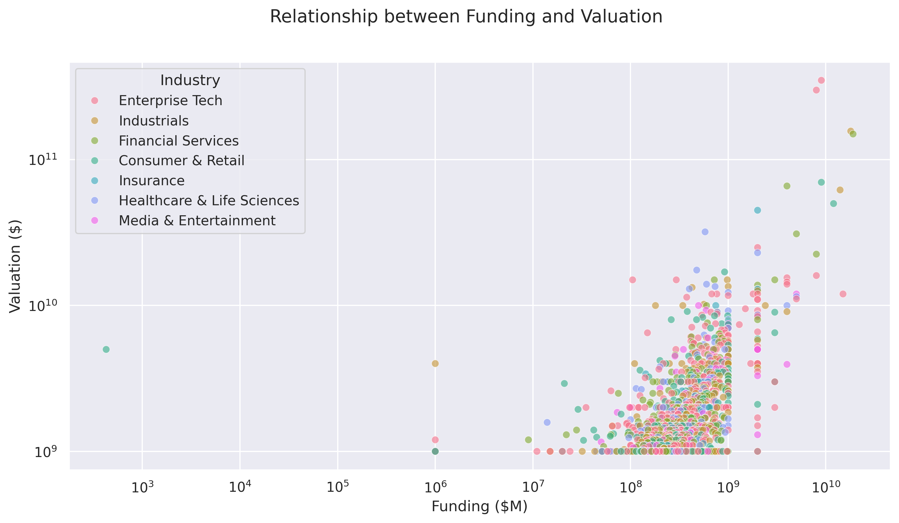


<a id="orga554cae"></a>

# Investor Analysis


<a id="org78e77e4"></a>

## Top Investors

```jupyter-python
top_investors = df.explode('Investors')\
                  .groupby('Investors')['Latest Valuation ($B)']\
                  .agg(['count', 'sum'])\
                  .sort_values(by=['sum', 'count'], ascending=False)\
                  .head(50)
print(top_investors)
```

```
                                count     sum
Investors
RRE Ventures                        5  397.60
Founders Fund                      24  363.01
Relay Ventures                      2  358.00
Opus Capital                        2  355.70
Breyer Capital                      5  320.16
Parkway VC                          2  316.00
TIME Ventures                       1  315.00
Susa Ventures                       2  304.90
Dynamo VC                           1  300.00
Andreessen Horowitz                72  184.51
Sequoia Capital China              40  183.61
Sequoia Capital                    59  177.57
Alibaba Group                       9  163.39
Accel                              65  163.21
New Enterprise Associates          26  158.00
The Carlyle Group                   5  154.55
CPP Investments                     1  150.00
Tiger Global Management            56  144.53
Index Ventures                     38  139.65
General Atlantic                   30  138.95
Lightspeed Venture Partners        42  121.19
TDM Growth Partners                 2  121.00
Insight Partners                   49  120.07
Baillie Gifford & Co.               3  117.40
Prysm Capital                       2  115.10
General Catalyst                   41  113.46
ZhenFund                            7  108.20
K2 Ventures                         1   91.50
Institutional Venture Partners     13   85.74
Temasek                            10   74.58
IDG Capital                        27   72.08
Bessemer Venture Partners          32   71.36
Tencent Holdings                   29   69.03
Google Ventures                    28   68.81
369 Growth Partners                 1   66.00
Berkeley Hills Capital              1   66.00
GTM Capital                         1   66.00
Holtzbrinck Ventures                2   64.00
Unternehmertum Venture Capital      1   62.00
NVentures                           1   61.50
SoftBank Group                     29   59.68
Sequoia Capital India              23   57.97
Coatue Management                  21   53.79
Norwest Venture Partners           18   53.43
Bain Capital Ventures              17   52.66
Thrive Capital                     20   49.68
Foresite Capital                    4   49.20
CRV                                17   48.18
Battery Ventures                   20   48.07
Warburg Pincus                     10   46.37
```

```jupyter-python
fig, ax = plt.subplots(2, 1, figsize=(12, 8), dpi=300, sharex=True)

sns.barplot(top_investors, ax=ax[0], y='sum', x=top_investors.index, hue=top_investors.index, legend=False)
ax[0].set(ylabel='Valuations ($B)', title='Valuations of Invested Companies ($B)')

sns.barplot(top_investors, ax=ax[1], y='count', x=top_investors.index, hue=top_investors.index, legend=False)
ax[1].set(ylabel='Times Invested', title='Number of Companies Invested')

plt.xticks(rotation=90)
plt.suptitle('Top Investors')
plt.show()
```

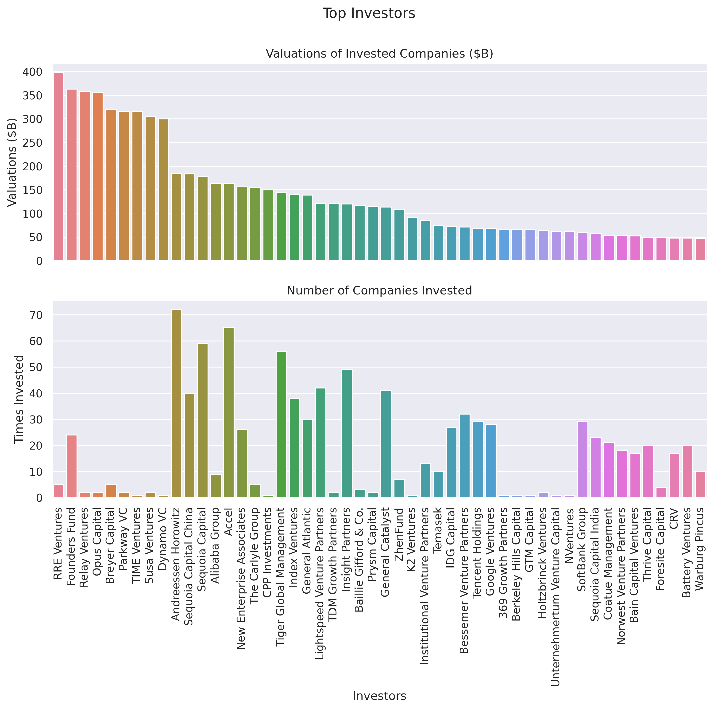


<a id="orgb3b678b"></a>

# Founder Analysis


<a id="orgc90e389"></a>

## Top Founders

```jupyter-python
top_founders = df.explode('Founder(s)')\
                  .groupby('Founder(s)')['Latest Valuation ($B)']\
                  .agg(['count', 'sum'])\
                  .sort_values(by=['sum', 'count'], ascending=False)\
                  .head(50)
print(top_founders)
```

```
                      count     sum
Founder(s)
Elon Musk                 3  468.70
Ilya Sutskever            2  332.00
Liang Rubo                1  315.00
Zhang Yiming              1  315.00
Greg Brockman             1  300.00
Sam Altman                1  300.00
John Collison             1   91.50
Patrick                   1   91.50
Ali Ghodsi                1   62.00
Dario Amodei              1   61.50
Cameron Adams             1   32.00
Clifford Obrecht          1   32.00
Daniel Gross              1   32.00
Daniel Levy               1   32.00
Melanie Perkins           1   32.00
Tim Sweeney               1   31.50
Alexandr Wang             1   29.00
Lucy Guo                  1   29.00
Alan Trager               1   27.00
Michael Rubin[34]         1   27.00
Mitch Trager              1   27.00
Chris Britt               1   25.00
Ryan King                 1   25.00
Nikolay Storonsky         1   17.75
Vlad Yatsenko             1   17.75
Andrey Khusid             1   17.50
Daniel Livny              1   17.00
Mark Kozubal              1   17.00
Matthew Strongin          1   17.00
Rich Macur                1   17.00
Thomas Jonas              1   17.00
Yuval Avniel              1   17.00
Markus Villig             2   16.80
Yong Li                   1   15.50
Jason Citron              1   15.00
Stanislav Vishnevsky      1   15.00
Charlwin Mao Wenchao      1   14.00
Miranda Qu Fang           1   14.00
William Hockey            1   13.40
Zach Perret               1   13.40
Alex Shevchenko           1   13.00
Dmytro Lider              1   13.00
Max Lytvyn,               1   13.00
Todd Park                 1   12.60
Max Rhodes                1   12.40
Henrique Dubugras         1   12.30
Pedro Franceschi          1   12.30
Hayes Barnard             1   12.00
Jason Walker              1   12.00
Matt Dawson               1   12.00
```

```jupyter-python
fig, ax = plt.subplots(figsize=(12, 8), dpi=300, sharex=True)

ax = sns.barplot(top_founders, y='sum', x=top_founders.index, hue='sum', legend=False)
ax.set(ylabel='Company Valuations ($B)', xlabel='Founder')

plt.xticks(rotation=90)
plt.suptitle('Top Founders by Company Valuations')
plt.show()
```

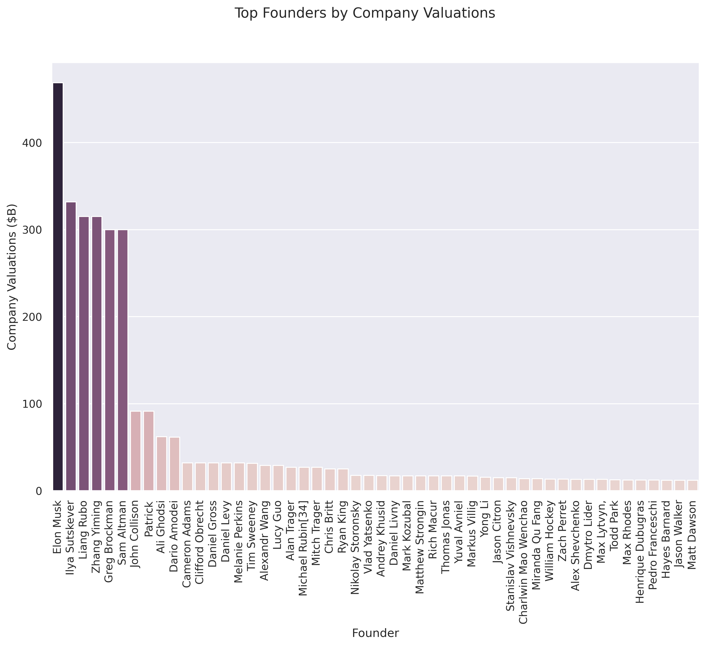


<a id="org080bf0d"></a>

# Historical Analysis


<a id="org9bc071b"></a>

## Survival and Acquisition

-   Find out companies no longer listed as unicorns in 2024
    
    ```jupyter-python
    df_2022 = pd.read_csv('input/datasets/Unicorn_Companies (March 2022).csv')
    df_2022['Valuation ($B)'] = pd.to_numeric(df_2022['Valuation ($B)'].str.replace('$', ''))
    df_exit = df_2022[~df_2022['Company'].str.lower().isin(df['Company'].str.lower())]
    ```
    
        178 companies no longer listed in 2024 unicorn list
    
    ```jupyter-python
    print(df_exit.head())
    ```
    
    ```
                       Company  Valuation ($B) Date Joined        Country           City                                Industry                                  Select Inverstors  Founded Year  \
    7                Instacart           39.00  12/30/2014  United States  San Francisco     Supply chain, logistics, & delivery  Khosla Ventures, Kleiner Perkins Caufield & By...        2012.0
    10                     FTX           32.00   7/20/2021        Bahamas        Fintech  Sequoia Capital, Thoma Bravo, Softbank                                                NaN        2018.0
    15             J&T Express           20.00    4/7/2021      Indonesia        Jakarta     Supply chain, logistics, & delivery  Hillhouse Capital Management, Boyu Capital, Se...        2015.0
    31  Biosplice Therapeutics           12.00    8/6/2018  United States      San Diego                                  Health           Vickers Venture Partners, IKEA GreenTech        2008.0
    39                 Weilong           10.88    5/8/2021          China          Luohe                       Consumer & retail  Tencent Holdings, Hillhouse Capital Management...           NaN
    
       Total Raised Financial Stage  Investors Count  Deal Terms  Portfolio Exits
    7       $2.686B             NaN             29.0        12.0              NaN
    10      $1.829B             Acq             40.0         3.0              1.0
    15      $4.653B             NaN              9.0         3.0              NaN
    31      $561.5M             NaN             10.0         1.0              NaN
    39     $559.74M             NaN              7.0         1.0              NaN
    ```

-   Financial Stage
    
    ```jupyter-python
    df_2022['Financial Stage'].value_counts()
    ```
    
    ```
    Financial Stage
    Acquired       22
    Divestiture     8
    IPO             7
    Acq             7
    Asset           1
    Take            1
    Management      1
    Reverse         1
    Corporate       1
    Name: count, dtype: int64
    ```


<a id="orgdec48ab"></a>

### Top Exited Unicorns as of March 2022

```jupyter-python
df_exit_top_companies = df_exit.sort_values('Valuation ($B)', ascending=False).head(20)
print(df_exit_top_companies)
```

```
                    Company  Valuation ($B) Date Joined         Country            City                                Industry                                  Select Inverstors  Founded Year  \
7                 Instacart           39.00  12/30/2014   United States   San Francisco     Supply chain, logistics, & delivery  Khosla Ventures, Kleiner Perkins Caufield & By...        2012.0
10                      FTX           32.00   7/20/2021         Bahamas         Fintech  Sequoia Capital, Thoma Bravo, Softbank                                                NaN        2018.0
15              J&T Express           20.00    4/7/2021       Indonesia         Jakarta     Supply chain, logistics, & delivery  Hillhouse Capital Management, Boyu Capital, Se...        2015.0
31   Biosplice Therapeutics           12.00    8/6/2018   United States       San Diego                                  Health           Vickers Venture Partners, IKEA GreenTech        2008.0
39                  Weilong           10.88    5/8/2021           China           Luohe                       Consumer & retail  Tencent Holdings, Hillhouse Capital Management...           NaN
40                   Swiggy           10.70   6/21/2018           India       Bengaluru     Supply chain, logistics, & delivery  Accel India, SAIF Partners, Norwest Venture Pa...        2014.0
44                   reddit           10.00   7/31/2017   United States   San Francisco            Internet software & services   Y Combinator, Sequoia Capital, Coatue Management        2005.0
46              Notion Labs           10.00    4/1/2020   United States   San Francisco            Internet software & services   Index Ventures, Draft Ventures, Felicis Ventures        2016.0
47                  Thrasio           10.00   7/15/2020   United States         Walpole                                   Other  Upper90, RiverPark Ventures, Advent International        2018.0
42                    Figma           10.00   4/30/2020   United States   San Francisco            Internet software & services  Index Ventures, Greylock Partners, Kleiner Per...        2012.0
41                 Lalamove           10.00   2/21/2019       Hong Kong  Cheung Sha Wan     Supply chain, logistics, & delivery  MindWorks Ventures, Shunwei Capital Partners, ...        2013.0
53                  Klaviyo            9.20  11/17/2020   United States          Boston            Internet software & services             Summit Partners, Accel, Astral Capital        2012.0
64                 Lacework            8.30    1/7/2021   United States        San Jose                           Cybersecurity  Sutter Hill Ventures, Liberty Global Ventures,...        2015.0
66                   Tempus            8.10   3/21/2018   United States         Chicago                                  Health  New Enterprise Associates, T. Rowe Associates,...        2015.0
74                    Hopin            7.75  11/10/2020  United Kingdom          London            Internet software & services  Accel, Northzone Ventures, Institutional Ventu...           NaN
75                    Getir            7.50   3/26/2021          Turkey        Istanbul         E-commerce & direct-to-consumer  Tiger Global Management, Sequoia Capital, Revo...        2015.0
94                 Ola Cabs            7.50  10/27/2014           India       Bengaluru                   Auto & transportation    Accel Partners, SoftBank Group, Sequoia Capital           NaN
81                  Argo AI            7.25   7/12/2019   United States      Pittsburgh                 Artificial intelligence         Volkswagen Group, Ford Autonomous Vehicles           NaN
83              TripActions            7.25   11/8/2018   United States       Palo Alto                                  Travel  Andreessen Horowitz, Lightspeed Venture Partne...        2015.0
102              Better.com            6.00  11/10/2020   United States        New York                                 Fintech  Pine Brook, American Express Ventures, Kleiner...        2018.0

    Total Raised Financial Stage  Investors Count  Deal Terms  Portfolio Exits
7        $2.686B             NaN             29.0        12.0              NaN
10       $1.829B             Acq             40.0         3.0              1.0
15       $4.653B             NaN              9.0         3.0              NaN
31       $561.5M             NaN             10.0         1.0              NaN
39      $559.74M             NaN              7.0         1.0              NaN
40       $3.571B        Acquired             36.0        12.0              1.0
44       $1.326B        Acquired             33.0         5.0              1.0
46         $342M             NaN             17.0         3.0              NaN
47       $3.396B        Acquired             22.0         5.0              1.0
42       $333.5M             NaN             20.0         6.0              NaN
41       $2.475B             NaN             15.0         5.0              NaN
53       $678.5M             NaN             15.0         3.0              NaN
64       $1.907B             NaN             19.0         4.0              NaN
66        $1.07B             NaN             10.0         6.0              NaN
74       $671.9M             NaN             85.0         3.0              NaN
75       $1.172B             NaN             15.0         3.0              NaN
94           NaN             NaN              8.0         NaN              NaN
81         $500M             NaN              2.0         1.0              NaN
83        $1.04B             NaN             13.0         6.0              NaN
102       $1.42M             NaN              2.0         NaN              NaN
```

```jupyter-python
plt.subplots(figsize=(12, 6), dpi=300)
ax = sns.barplot(df_exit_top_companies,
                 x='Company',
                 y='Valuation ($B)',
                 hue='Company')
for i in ax.containers:
    ax.bar_label(i)
plt.suptitle('Top Exited Unicorns as of March 2022')
plt.ylabel('Valuation ($B)')
plt.xlabel('Company')
plt.xticks(rotation=45, ha='right')
plt.grid(axis='y', alpha=0.75)
plt.show()
```


<a id="org6880287"></a>

### Exit Reasons of Former Unicorns

```jupyter-python
_df = pd.read_csv('input/raw_data/list-of-unicorn-former-startups_20250619 (wikipedia).csv')
_df['Company'] = _df['Company'].str.strip()
def correct_exit_reasons(s):
    s = re.sub(r'\[.*\]', '', s)
    s= s.strip()
    if 'merge' in s.lower():
        return 'Merged'
    if 'acquire' in s.lower() or 'acquisition' in s.lower() or 'takeover' in s.lower():
        return 'Acquired'
    if 'devaluation' == s.lower():
        return 'Devalued'
    if 'direct listing' == s.lower():
        return 'IPO'
    return s
_df['Exit reason'] = _df['Exit reason'].dropna().apply(correct_exit_reasons)
# _df = _df[_df['Company'].str.lower().isin(df_exit['Company'].str.lower())]
_df['Exit reason'].value_counts()
```

    Exit reason
    IPO           128
    Acquired       53
    Merged         14
    Defunct         3
    Devalued        3
    Bankruptcy      2
    Name: count, dtype: int64

```jupyter-python
exit_reasons = _df['Exit reason'].value_counts().reset_index(name='Count')
# print(exit_reasons.index)
plt.subplots(figsize=(12, 6), dpi=300)
ax = sns.barplot(exit_reasons, x='Exit reason', y='Count', hue='Exit reason')
for i in ax.containers:
    ax.bar_label(i)
plt.suptitle('Exit Reasons of Former Unicorns')
plt.show()
```

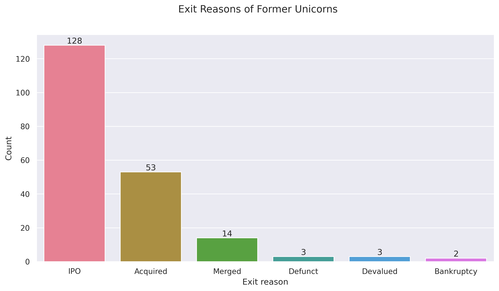


<a id="org19b120c"></a>

# Funded by Y-Combinator

Y Combinator, founded in 2005 by Paul Graham and others, is a prestigious startup accelerator based in Silicon Valley that provides early-stage companies with seed funding, mentorship, and resources over a three-month program held twice a year. Startups receive initial funding in exchange for equity and culminate in a Demo Day where they pitch to investors. Y Combinator has launched successful companies like Airbnb, Dropbox, and Stripe, significantly impacting the startup ecosystem and inspiring numerous other accelerators globally.

-   **Datasets**
    -   **YC Campanies**
        
        ```jupyter-python
        df_yc_companies = pd.read_csv('input/datasets/2024 YCombinator All Companies Dataset/companies.csv')
        
        df_yc_industries = pd.read_csv('input/datasets/2024 YCombinator All Companies Dataset/industries.csv')
        df_yc_tags = pd.read_csv('input/datasets/2024 YCombinator All Companies Dataset/tags.csv')
        # print(df_yc_tags.groupby('id')['tag'].agg(list).reset_index())
        df_yc_companies = df_yc_companies.merge(df_yc_industries[['id', 'industry']].groupby('id')['industry'].agg(list).reset_index(), on='id', how='left')
        df_yc_companies = df_yc_companies.merge(df_yc_tags.groupby('id')['tag'].agg(list).reset_index(), on='id', how='left')
        df_yc_companies = df_yc_companies[['name', 'slug', 'oneLiner', 'website', 'smallLogoUrl', 'teamSize', 'tag', 'industry', 'batch']].rename(columns={
            'name': 'Company',
            'slug': 'Slug',
            'oneLiner': 'Short Description',
            'website': 'Website',
            'smallLogoUrl': 'Logo',
            'teamSize': 'Team Size',
            'tag': 'Tags',
            'industry': 'Industries',
            'batch': 'Batch'
        })
        print(df_yc_companies.info())
        ```
        
        ```
        <class 'pandas.core.frame.DataFrame'>
        RangeIndex: 4844 entries, 0 to 4843
        Data columns (total 9 columns):
         #   Column             Non-Null Count  Dtype
        ---  ------             --------------  -----
         0   Company            4844 non-null   object
         1   Slug               4841 non-null   object
         2   Short Description  4692 non-null   object
         3   Website            4817 non-null   object
         4   Logo               4197 non-null   object
         5   Team Size          4766 non-null   float64
         6   Tags               4463 non-null   object
         7   Industries         4825 non-null   object
         8   Batch              4844 non-null   object
        dtypes: float64(1), object(8)
        memory usage: 340.7+ KB
        None
        ```
        
        ```jupyter-python
        df2_yc_companies = pd.read_json('input/datasets/yc_startups.json')
        print(df2_yc_companies.info())
        ```
        
        ```
        <class 'pandas.core.frame.DataFrame'>
        RangeIndex: 1000 entries, 0 to 999
        Data columns (total 12 columns):
         #   Column       Non-Null Count  Dtype
        ---  ------       --------------  -----
         0   name         1000 non-null   object
         1   description  1000 non-null   object
         2   location     1000 non-null   object
         3   url          1000 non-null   object
         4   tags         1000 non-null   object
         5   site_url     999 non-null    object
         6   tag_line     999 non-null    object
         7   long_desc    999 non-null    object
         8   thumbnail    975 non-null    object
         9   founders     999 non-null    object
         10  meta         999 non-null    object
         11  socials      999 non-null    object
        dtypes: object(12)
        memory usage: 93.9+ KB
        None
        ```
    
    -   **YC Founders**
        
        ```jupyter-python
        df_yc_founders = pd.read_csv('input/datasets/2024 YCombinator All Companies Dataset/founders.csv')
        print(df_yc_founders.info())
        ```
        
        ```
        <class 'pandas.core.frame.DataFrame'>
        RangeIndex: 8465 entries, 0 to 8464
        Data columns (total 8 columns):
         #   Column           Non-Null Count  Dtype
        ---  ------           --------------  -----
         0   first_name       8461 non-null   object
         1   last_name        8456 non-null   object
         2   hnid             8465 non-null   object
         3   avatar_thumb     8465 non-null   object
         4   current_company  7624 non-null   object
         5   current_title    2201 non-null   object
         6   company_slug     8465 non-null   object
         7   top_company      8465 non-null   bool
        dtypes: bool(1), object(7)
        memory usage: 471.3+ KB
        None
        ```


<a id="org8191f10"></a>

## How many YC companies are in unicorn status currently?

```jupyter-python
df_yc_unicorns = df.assign(tmp_col=df.Company.str.lower()).merge(
    df_yc_companies[['Company', 'Slug', 'Short Description', 'Website', 'Logo', 'Team Size', 'Tags', 'Industries', 'Batch']].assign(tmp_col=lambda x: x.Company.str.lower()),
    on='tmp_col', how='inner').drop(['tmp_col', 'Company_y'], axis=1).rename(columns={'Company_x': 'Company'})
df_yc_unicorns['Batch Season'] = df_yc_unicorns['Batch'].apply(lambda x: 'Summer' if x[0]=='S' else 'Winter')
df_yc_unicorns['Batch Year'] = pd.to_numeric(df_yc_unicorns['Batch'].apply(lambda x: f'20{x[1:]}'))
print(df_yc_unicorns.info())
```

```
<class 'pandas.core.frame.DataFrame'>
RangeIndex: 98 entries, 0 to 97
Data columns (total 25 columns):
 #   Column                     Non-Null Count  Dtype
---  ------                     --------------  -----
 0   Company                    98 non-null     object
 1   Valuation ($B)             98 non-null     float64
 2   Total Equity Funding ($)   98 non-null     int64
 3   Unicorn Date               98 non-null     datetime64[ns]
 4   Date Founded               98 non-null     int64
 5   Years to Unicorn           98 non-null     object
 6   Industry                   98 non-null     object
 7   Country                    98 non-null     object
 8   City                       98 non-null     object
 9   Select Investors           98 non-null     object
 10  Unicorn Year               98 non-null     int32
 11  Funding ($B)               98 non-null     float64
 12  Funding ($M)               98 non-null     float64
 13  Latest Valuation ($B)      98 non-null     float64
 14  Years to Unicorn (Months)  98 non-null     int64
 15  Slug                       98 non-null     object
 16  Short Description          97 non-null     object
 17  Website                    98 non-null     object
 18  Logo                       95 non-null     object
 19  Team Size                  96 non-null     float64
 20  Tags                       92 non-null     object
 21  Industries                 98 non-null     object
 22  Batch                      98 non-null     object
 23  Batch Season               98 non-null     object
 24  Batch Year                 98 non-null     int64
dtypes: datetime64[ns](1), float64(5), int32(1), int64(4), object(14)
memory usage: 18.9+ KB
None
```


<a id="orgd48b991"></a>

## Top Companies by Valuation

```jupyter-python
df_top_yc_unicorns = df_yc_unicorns.sort_values(by='Latest Valuation ($B)', ascending=False).head(20)
fig, ax = plt.subplots(figsize=(12,6), dpi=200)
ax = sns.barplot(data=df_top_yc_unicorns, x='Company', y='Latest Valuation ($B)', hue='Company')
for i in ax.containers:
    ax.bar_label(i, fmt='%.1f')
plt.xticks(rotation=45, ha='right')
plt.suptitle('Top YC unicorns by Valuation')
plt.show()
```


<a id="org1d73d5b"></a>

## YC Batch Distribution

```jupyter-python
_df = df_yc_unicorns.groupby(['Batch Year', 'Batch Season']).size().reset_index(name='count').sort_values(by='Batch Year')
print(_df)
```

```
    Batch Year Batch Season  count
0         2009       Summer      2
1         2011       Summer      3
2         2011       Winter      1
3         2012       Summer      3
4         2012       Winter      2
5         2013       Summer      1
6         2013       Winter      1
7         2014       Summer      6
8         2014       Winter      3
9         2015       Summer      7
10        2015       Winter      3
11        2016       Summer      6
12        2016       Winter     11
14        2017       Winter      7
13        2017       Summer      5
15        2018       Summer      3
16        2018       Winter      8
17        2019       Summer      1
18        2019       Winter      4
19        2020       Summer      5
20        2020       Winter      3
21        2021       Summer      1
22        2021       Winter      3
23        2022       Summer      1
24        2022       Winter      1
25        2023       Summer      1
26        2023       Winter      1
27        2024       Summer      3
28        2024       Winter      2
```

```jupyter-python
plt.subplots(figsize=(12,6),dpi=300)
sns.barplot(_df, x='Batch Year', y='count', hue='Batch Season')
plt.xticks(rotation=45, ha='right')
plt.suptitle('Batch Distribution of YC Unicorns')
plt.show()
```


<a id="orgebc20e0"></a>

## Top Countires

```jupyter-python
top_countries = df_yc_unicorns['Country'].value_counts().nlargest(20).index
top_countries
```

    Index(['United States', 'India', 'United Kingdom', 'Canada', 'Mexico', 'Indonesia', 'Colombia', 'Australia', 'Senegal', 'Estonia', 'Spain'], dtype='object', name='Country')


<a id="org04e3bcf"></a>

## Top Industries

```jupyter-python
top_industries = df_yc_unicorns['Tags'].explode().value_counts().head(20).reset_index(name='Count')
print(top_industries)
```

```
                       Tags  Count
0                      SaaS     25
1                   Fintech     22
2                       B2B     17
3           Developer Tools     10
4   Artificial Intelligence      9
5          Machine Learning      7
6               Marketplace      7
7                   HR Tech      6
8                E-commerce      5
9                        AI      5
10                 Payments      4
11                Logistics      4
12                  Climate      4
13                Analytics      4
14               Enterprise      4
15               Automation      3
16         Data Engineering      3
17            Generative AI      3
18            Manufacturing      3
19                Education      3
```

```jupyter-python
plt.subplots(figsize=(12,6), dpi=200)
ax = sns.barplot(data=top_industries, x='Tags', y='Count', hue='Tags')
ax.set(ylabel='Number of Companies',
       xlabel='Industry')
for i in ax.containers:
    ax.bar_label(i)
plt.xticks(rotation=45, ha='right')
plt.suptitle('Top Industries')
plt.show()
```

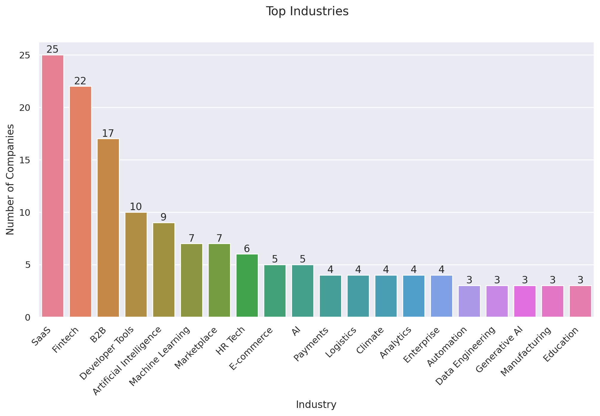


<a id="orgd7e4e14"></a>

### Team Size Distribution across Different Industries

```jupyter-python
_df = df_yc_unicorns.explode('Tags')
_df = _df[_df['Tags'].isin(top_industries['Tags'])]
_df = _df.dropna().sort_values(by='Latest Valuation ($B)', ascending=False).head(50)

plt.subplots(figsize=(12,6), dpi=300)
ax = sns.scatterplot(_df, x='Tags', y='Team Size', hue='Company')
sns.move_legend(ax, "upper left", bbox_to_anchor=(1, 1))
ax.set(ylabel='Team Size',
       xlabel='Industry')
plt.xticks(rotation=45, ha='right')
plt.suptitle('Team Size Distribution across Different Industries')
plt.show()
```

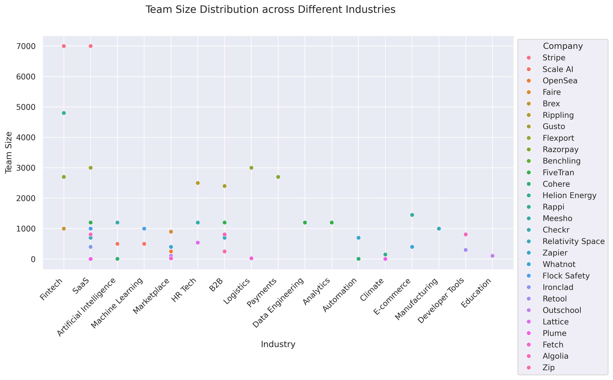


<a id="org729281a"></a>

# Predictive Analysis

-   **Valuation Predictions:** Use regression models to predict future valuations based on funding and industry factors.
-   **Time to Unicorn**: Model the factors influencing the time taken to reach unicorn status.


<a id="org4a64a05"></a>

# Case Study


<a id="org0a7ca19"></a>

## Scale AI

Scale AI, Inc. is an American data annotation company based in San Francisco, California. It provides data labeling and model evaluation services to develop applications for artificial intelligence.


<a id="org6712b62"></a>

## FTX

FTX Trading Ltd., trading as FTX, is a bankrupt company that formerly operated a cryptocurrency exchange and crypto hedge fund.


<a id="orgdb8109a"></a>

## Lalamove

Lalamove is a delivery and logistics company which operates primarily in Asia and parts of Latin America. Lalamove services are currently available in Hong Kong, Taipei, Singapore, Kuala Lumpur, Manila, Cebu, Bangkok, Pattaya, Ho Chi Minh City, Hanoi, Jakarta, Dhaka, São Paulo, Rio de Janeiro, and Mexico City.


<a id="orgb02b5b2"></a>

# References

-   [Unicorn (finance) [wikipedia]​](https://en.wikipedia.org/wiki/Unicorn_(finance))
-   [The YC Startup Directory](https://www.ycombinator.com/companies)
