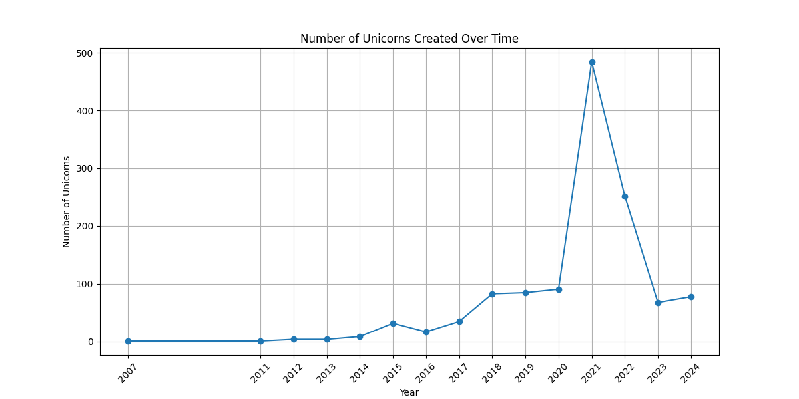

- [Import Packages](#org6aab433)
- [Data Preparation](#org05dd132)
  - [Load data](#orgcff6382)
  - [Prepare data](#org80ee9f7)
  - [Preview data](#org1ef276a)
- [Time-Based Analysis](#orgd0781f3)
  - [Number of Unicorns Created Over Time](#orga07188d)


<a id="org6aab433"></a>

# Import Packages

```python
import pandas as pd
import numpy as np
import matplotlib.pyplot as plt
from matplotlib.ticker import FuncFormatter
import seaborn as sns
```


<a id="org05dd132"></a>

# Data Preparation


<a id="orgcff6382"></a>

## Load data

```python
pd.set_option('display.max_columns', 50, 'display.width', 200)
df = pd.read_csv('input/Unicorns_Completed.csv')
```


<a id="org80ee9f7"></a>

## Prepare data

```python
df['Unicorn Date'] = pd.to_datetime(df['Unicorn Date'])
```


<a id="org1ef276a"></a>

## Preview data

```python
df.head()
```

```text
|   | Company   | Valuation ($B) | Total Equity Funding ($) | Unicorn Date | Date Founded          | Years to Unicorn | Industry | Country            | City          | Select Investors |                                                   |
|---+-----------+----------------+--------------------------+--------------+-----------------------+------------------+----------+--------------------+---------------+------------------+---------------------------------------------------|
| 0 | SpaceX    |          350.0 |               9000000000 | Timestamp    | (2012-12-01 00:00:00) |             2002 | 10y 3m   | Enterprise Tech    | United States | Hawthorne        | Opus Capital, RRE Ventures, Relay Ventures        |
| 1 | ByteDance |          300.0 |               8000000000 | Timestamp    | (2017-04-07 00:00:00) |             2011 | 6y 3m    | Enterprise Tech    | China         | Beijing          | Breyer Capital, Parkway VC, TIME Ventures         |
| 2 | OpenAI    |          157.0 |              18000000000 | Timestamp    | (2019-07-22 00:00:00) |             2015 | 4y 6m    | Industrials        | United States | San Francisco    | Dynamo VC, Susa Ventures, Founders Fund           |
| 3 | Ant Group |          150.0 |              19000000000 | Timestamp    | (2017-01-01 00:00:00) |             2014 | 3y       | Financial Services | China         | Hangzhou         | Alibaba Group, CPP Investments, The Carlyle Group |
| 4 | Stripe    |           70.0 |               9000000000 | Timestamp    | (2014-01-23 00:00:00) |             2009 | 5y       | Consumer & Retail  | United States | San Francisco    | Sequoia Capital China, ZhenFund, K2 Ventures      |
```


<a id="orgd0781f3"></a>

# Time-Based Analysis


<a id="orga07188d"></a>

## Number of Unicorns Created Over Time

1.  Count Unicorns by Year
    
    ```python
    unicorn_count = df.groupby(df['Unicorn Date'].dt.year).size()
    unicorn_count
    ```
    
    | 2007 | 1   |
    | 2011 | 1   |
    | 2012 | 4   |
    | 2013 | 4   |
    | 2014 | 9   |
    | 2015 | 32  |
    | 2016 | 17  |
    | 2017 | 35  |
    | 2018 | 83  |
    | 2019 | 85  |
    | 2020 | 91  |
    | 2021 | 484 |
    | 2022 | 252 |
    | 2023 | 68  |
    | 2024 | 78  |

2.  Visualize the Trend
    
    ```python
    plt.figure(figsize=(12, 6))
    plt.plot(unicorn_count.index, unicorn_count.values, marker='o')
    plt.title('Number of Unicorns Created Over Time')
    plt.xlabel('Year')
    plt.ylabel('Number of Unicorns')
    plt.xticks(unicorn_count.index, rotation=45)
    plt.grid()
    plt.show()
    ```
    
    
