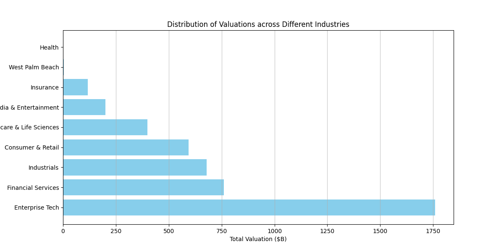
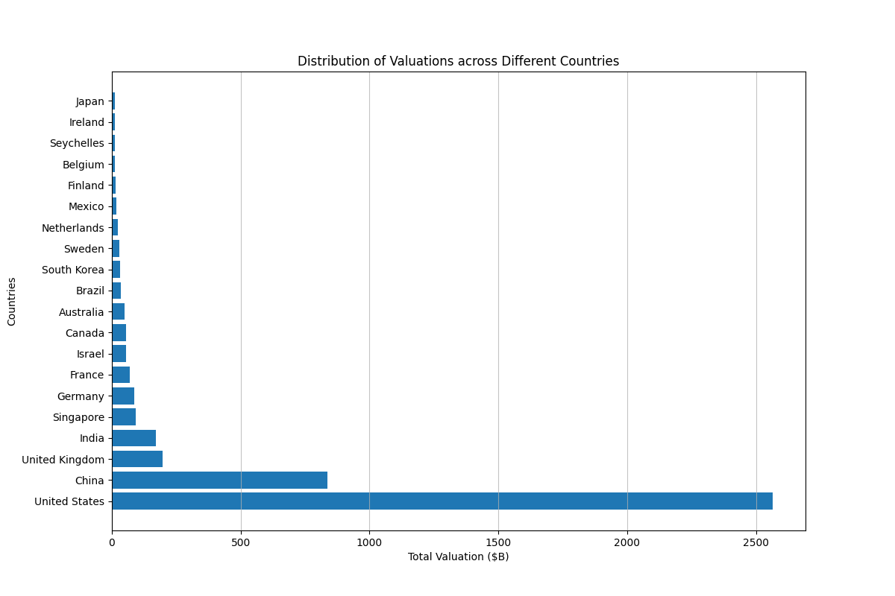
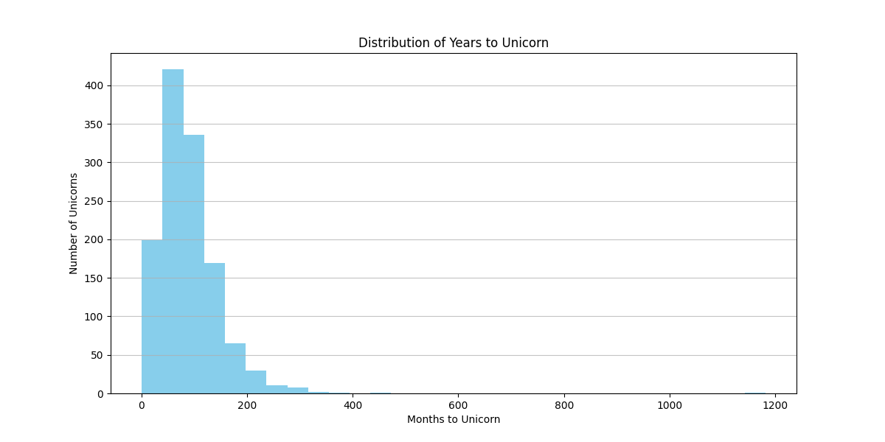

- [Setup](#orgddfa449)
  - [Import Packages](#orgfc5a5b6)
- [Data Preparation](#org78798e4)
  - [Load Data](#orgf21dd31)
  - [Data Cleaning](#org86744d0)
  - [Prepare data](#orgddca84c)
  - [Preview data](#org8fe7a54)
- [Descriptive Analysis](#org336d7a4)
  - [Distribution of Valuations across Different Industries](#orgb5fb712)
  - [Distribution of Valuations across Different Countries](#org13bfa2b)
- [Time-Based Analysis](#orgac9166b)
  - [Unicorn Growth Over Time](#orgba19ff6)
  - [Years to Unicorn](#org12a2ac7)


<a id="orgddfa449"></a>

# Setup


<a id="orgfc5a5b6"></a>

## Import Packages

```python
import pandas as pd
import numpy as np
import matplotlib.pyplot as plt
from matplotlib.ticker import FuncFormatter
import seaborn as sns
import re
```


<a id="org78798e4"></a>

# Data Preparation


<a id="orgf21dd31"></a>

## Load Data

```python
pd.set_option('display.max_columns', 50, 'display.width', 200)
df = pd.read_csv('input/Unicorns_Completed.csv')
```


<a id="org86744d0"></a>

## Data Cleaning

```python
def convert_years_months(s):
    m = re.match(r'(\d+)y?\s?(\d+)m?o?', s)
    return f'{m[1]}y{m[2]}m' if m else s

df['Years to Unicorn'] = df['Years to Unicorn'].apply(convert_years_months)
```


<a id="orgddca84c"></a>

## Prepare data

```python
df['Unicorn Date'] = pd.to_datetime(df['Unicorn Date'])
df['Valuation ($B)'] = pd.to_numeric(df['Valuation ($B)'])
```


<a id="org8fe7a54"></a>

## Preview data

```python
df.head()
```

```text
|   | Company   | Valuation ($B) | Total Equity Funding ($) | Unicorn Date | Date Founded          | Years to Unicorn | Industry | Country            | City          | Select Investors | Years to Unicorn (Months)                         |     |
|---+-----------+----------------+--------------------------+--------------+-----------------------+------------------+----------+--------------------+---------------+------------------+---------------------------------------------------+-----|
| 0 | SpaceX    |          350.0 |               9000000000 | Timestamp    | (2012-12-01 00:00:00) |             2002 | 10y3m    | Enterprise Tech    | United States | Hawthorne        | Opus Capital, RRE Ventures, Relay Ventures        | 123 |
| 1 | ByteDance |          300.0 |               8000000000 | Timestamp    | (2017-04-07 00:00:00) |             2011 | 6y3m     | Enterprise Tech    | China         | Beijing          | Breyer Capital, Parkway VC, TIME Ventures         |  75 |
| 2 | OpenAI    |          157.0 |              18000000000 | Timestamp    | (2019-07-22 00:00:00) |             2015 | 4y6m     | Industrials        | United States | San Francisco    | Dynamo VC, Susa Ventures, Founders Fund           |  54 |
| 3 | Ant Group |          150.0 |              19000000000 | Timestamp    | (2017-01-01 00:00:00) |             2014 | 3y       | Financial Services | China         | Hangzhou         | Alibaba Group, CPP Investments, The Carlyle Group |  36 |
| 4 | Stripe    |           70.0 |               9000000000 | Timestamp    | (2014-01-23 00:00:00) |             2009 | 5y       | Consumer & Retail  | United States | San Francisco    | Sequoia Capital China, ZhenFund, K2 Ventures      |  60 |
```


<a id="org336d7a4"></a>

# Descriptive Analysis


<a id="orgb5fb712"></a>

## Distribution of Valuations across Different Industries

```python
# Group by industry and sum valuations
industry_valuation_df = df.groupby('Industry')['Valuation ($B)'].sum().reset_index().sort_values('Valuation ($B)', ascending=False)
industry_valuation_df
```

|   | Industry                   | Valuation ($B) |
|--- |-------------------------- |-------------- |
| 1 | Enterprise Tech            | 1759.04        |
| 2 | Financial Services         | 760.16         |
| 5 | Industrials                | 678.55         |
| 0 | Consumer & Retail          | 593.3          |
| 4 | Healthcare & Life Sciences | 398.45         |
| 7 | Media & Entertainment      | 200.29         |
| 6 | Insurance                  | 117.06         |
| 8 | West Palm Beach            | 3.0            |
| 3 | Health                     | 1.5            |

```python
plt.figure(figsize=(12, 6))
plt.barh(industry_valuation_df['Industry'], industry_valuation_df['Valuation ($B)'], color='skyblue')
plt.title('Distribution of Valuations across Different Industries')
plt.xlabel('Total Valuation ($B)')
plt.ylabel('Industry')
plt.grid(axis='x', alpha=0.75)
plt.show()
```




<a id="org13bfa2b"></a>

## Distribution of Valuations across Different Countries

```python
# Group by Country and sum valuations
country_valuation_df = df.groupby('Country')['Valuation ($B)'].sum().reset_index().sort_values('Valuation ($B)', ascending=False)[:20]
country_valuation_df
```

|    | Country        | Valuation ($B) |
|--- |-------------- |-------------- |
| 53 | United States  | 2564.14        |
| 10 | China          | 835.65         |
| 52 | United Kingdom | 197.35         |
| 24 | India          | 172.07         |
| 43 | Singapore      | 92.06          |
| 21 | Germany        | 85.9           |
| 20 | France         | 70.86          |
| 27 | Israel         | 56.22          |
| 6  | Canada         | 56.0           |
| 1  | Australia      | 48.84          |
| 5  | Brazil         | 34.13          |
| 45 | South Korea    | 31.34          |
| 47 | Sweden         | 29.42          |
| 36 | Netherlands    | 24.46          |
| 35 | Mexico         | 18.7           |
| 19 | Finland        | 14.91          |
| 3  | Belgium        | 11.95          |
| 42 | Seychelles     | 11.8           |
| 26 | Ireland        | 11.05          |
| 29 | Japan          | 10.82          |

```python
plt.figure(figsize=(12, 8))
plt.barh(country_valuation_df['Country'], country_valuation_df['Valuation ($B)'])
plt.title('Distribution of Valuations across Different Countries')
plt.xlabel('Total Valuation ($B)')
plt.ylabel('Countries')
plt.grid(axis='x', alpha=0.75)
plt.show()
```




<a id="orgac9166b"></a>

# Time-Based Analysis


<a id="orgba19ff6"></a>

## Unicorn Growth Over Time

```python
unicorn_count = df.groupby(df['Unicorn Date'].dt.year).size()
plt.figure(figsize=(12, 6))
plt.plot(unicorn_count.index, unicorn_count.values, marker='o')
plt.title('Number of Unicorns Created Each Year')
plt.xlabel('Year')
plt.ylabel('Number of Unicorns')
plt.xticks(unicorn_count.index, rotation=45)
plt.grid()
plt.show()
```


<a id="org12a2ac7"></a>

## Years to Unicorn

```python
# Function to convert "Years to Unicorn" into total months
def convert_years_to_months(years_str):
    if 'y' in years_str and 'm' in years_str:
        years, months = years_str.split('y')
        months = months.replace('m', '').strip()
        return int(years.strip()) * 12 + int(months)
    elif 'y' in years_str:
        years = years_str.replace('y', '').strip()
        return int(years) * 12
    elif 'm' in years_str:
        months = years_str.replace('mo', '').replace('m', '').strip()
        return int(months)
    else:
        return None

df['Years to Unicorn (Months)'] = df['Years to Unicorn'].apply(convert_years_to_months)
```

```python
plt.figure(figsize=(12, 6))
plt.hist(df['Years to Unicorn (Months)'].dropna(), bins=30, color='skyblue')
plt.title('Distribution of Years to Unicorn')
plt.xlabel('Months to Unicorn')
plt.ylabel('Number of Unicorns')
plt.grid(axis='y', alpha=0.75)
plt.show()
```


