- [Introduction](#orgfa9af53)
- [Setup](#orgefc2c82)
  - [Import Packages](#org1245388)
  - [Global Settings](#org1e7ed05)
- [Data Processing](#org7d1ef0d)
  - [Load Data](#org3e0b21e)
  - [Data Cleaning](#org6d84676)
  - [Data Preparation](#orgbe39333)
    - [Column Types](#orgf093a1f)
    - [Time to Unicorn](#org155f12b)
    - [Merge datasets](#org81c0972)
  - [Preview](#org485e46e)
- [Exploratory Data Analysis](#org4ff2ce1)
  - [Industry-Based Analysis](#org965b3e2)
    - [Distribution of Companies across Different Industries](#org78dab9e)
    - [Distribution of Valuation across Different Industries](#org0b5bef7)
    - [Distribution of Equity Funding across Different Industries](#org5eb1a4a)
  - [Geographical Analysis](#orgc7a4d4b)
    - [Top Countries by Valuation](#org338f790)
    - [Top Countries across Different Industries](#orgcc50aee)
    - [Mean Distribution of Valuations across Different Countries](#orgad5c102)
    - [Mean Distribution of Equity Funding across Different Countries](#org02ede4d)
  - [Sector-Based Analysis](#org3f5767f)
    - [Top Sectors](#org354a58b)
  - [Company-Based Analysis](#org650340d)
    - [Top Companies by Valuation](#orgde31626)
    - [Most-Funded Companies](#orgf7d073d)
    - [Distribution of Valuation by Companies](#org14460a7)
    - [Distribution of Equity Funding by Companies](#orge715c87)
  - [Investor Analysis](#orge8e4d3c)
    - [Top Investors](#org5fc39a3)
  - [Founder Analysis](#orgc7cc605)
    - [Top Founders](#org45d8712)
- [Time-Based Analysis](#orga1939bb)
  - [Unicorn Growth Over Time](#org3cbd30e)
  - [Time to Unicorn](#orgf376b3a)
  - [Distribution of Valuations Over Time](#org5341024)
  - [Distribution of Funding Over Time](#org0ca5c7c)
- [Correlation Analysis](#org89dd295)
  - [Relationship between Funding and Valuation](#org2a20a19)
  - [Relationship between Time to Unicorn and Valuation](#org5655900)
- [Historical Analysis](#org32ea2b0)
  - [Survival and Acquisition](#org4923025)
    - [Top Exited Unicorns as of March 2022](#org0b0b40c)
    - [Exit Reasons of Former Unicorns](#org324277e)
- [Funded by Y-Combinator](#orgd355972)
  - [How many YC companies are in unicorn status currently?](#orgcd5ce5b)
  - [Top Companies by Valuation](#orge7cb44a)
  - [YC Batch Distribution](#orgab40c2d)
  - [Top Countires](#orgf35c81d)
  - [Top Categories](#org2c020bc)
    - [Team Size Distribution across Different Categories](#org0553d8a)
- [Predictive Analysis](#org56ad878)
- [Case Study](#org6cf4b82)
  - [Scale AI](#orgcd99625)
  - [FTX](#orgd45820d)
  - [Lalamove](#orgf0e7bfc)
- [References](#org81b65fa)


<a id="orgfa9af53"></a>

# Introduction

-   **What is a Unicorn Company?**
    
    In business, a unicorn is a privately held startup company valued at over $1 billion. The term was first popularised in 2013 by venture capitalist Aileen Lee, choosing the mythical animal to represent the statistical rarity of such successful ventures.


<a id="orgefc2c82"></a>

# Setup


<a id="org1245388"></a>

## Import Packages

```jupyter-python
import pandas as pd
import numpy as np
import matplotlib.pyplot as plt
from matplotlib.ticker import FuncFormatter
import seaborn as sns
import re
```


<a id="org1e7ed05"></a>

## Global Settings

```jupyter-python
sns.set_theme(palette='husl', rc={"figure.dpi": 200})
```


<a id="org7d1ef0d"></a>

# Data Processing


<a id="org3e0b21e"></a>

## Load Data

```jupyter-python
pd.set_option('display.max_columns', 50, 'display.width', 200)
df = pd.read_csv('input/datasets/Unicorns_Completed (2024).csv')
df_wiki = pd.read_csv('input/raw_data/list-of-unicorn-startups_20250619 (wikipedia).csv')
```


<a id="org6d84676"></a>

## Data Cleaning

```jupyter-python
def clean_years_to_unicorn_labels(s):
    m = re.match(r'(\d+)y?\s?(\d+)m?o?', s)
    return f'{m[1]}y{m[2]}m' if m else s
df['Years to Unicorn'] = df['Years to Unicorn'].apply(clean_years_to_unicorn_labels)

def correct_industry_labels(s):
    if s == 'Health':
        return 'Healthcare & Life Sciences'
    if s == 'West Palm Beach':
        return 'Enterprise Tech'
    return s
df['Industry'] = df['Industry'].apply(correct_industry_labels)

def correct_company_names(s):
    if s == 'Scale':
        return 'Scale AI'
    return s
df['Company'] = df['Company'].apply(correct_company_names)
```


<a id="orgbe39333"></a>

## Data Preparation


<a id="orgf093a1f"></a>

### Column Types

```jupyter-python
df['Unicorn Date'] = pd.to_datetime(df['Unicorn Date'])
df['Valuation ($B)'] = pd.to_numeric(df['Valuation ($B)'])
df['Valuation ($)'] = df['Valuation ($B)'] * 1e9
df['Unicorn Year'] = df['Unicorn Date'].dt.year
df['Funding ($B)'] = df['Total Equity Funding ($)'] / 1e9
df['Funding ($M)'] = df['Total Equity Funding ($)'] / 1e6
df['Investors'] = df['Select Investors'].str.split(', ')
```


<a id="org155f12b"></a>

### Time to Unicorn

```jupyter-python
def convert_years_to_months(years_str):
    if 'y' in years_str and 'm' in years_str:
        years, months = years_str.split('y')
        months = months.replace('m', '').strip()
        return int(years.strip()) * 12 + int(months)
    elif 'y' in years_str:
        years = years_str.replace('y', '').strip()
        return int(years) * 12
    elif 'm' in years_str:
        months = years_str.replace('mo', '').replace('m', '').strip()
        return int(months)
    else:
        return None
df['Months to Unicorn'] = df['Years to Unicorn'].apply(convert_years_to_months)
df['Years to Unicorn'] = df['Months to Unicorn'] / 12
```


<a id="org81c0972"></a>

### Merge datasets

-   Scraped data from Wikepedia (Latest Valuations, Sectors and Founders)
    
    ```jupyter-python
    df_wiki.rename(columns={'Valuation (US$ billions)': 'Latest Valuation ($B)',
                            'Industry': 'Sector'},
                   inplace=True)
    df_wiki = df_wiki.drop_duplicates('Company')
    df_wiki['Company'] = df_wiki['Company'].str.strip()
    df_wiki['Founder(s)'] = df_wiki['Founder(s)'].str.replace(' and ', ', ').str.split(', ')
    def list_of_sectors(s):
        sectors = s.replace(' and ', ', ').split(', ')
        return list(map(lambda x: x.strip().title(), sectors))
    df_wiki['Sector'] = df_wiki['Sector'].dropna().apply(list_of_sectors)
    df_wiki = df_wiki.assign(tmp_col=lambda x: x.Company.str.lower()) # Create a tmp col for Company matching
    df = df.assign(tmp_col=lambda x: x.Company.str.lower())\
           .merge(df_wiki[['tmp_col', 'Latest Valuation ($B)', 'Sector', 'Founder(s)']], on='tmp_col', how='left')\
           .drop(['tmp_col'], axis=1)
    df['Latest Valuation ($B)'] = pd.to_numeric(df['Latest Valuation ($B)'].fillna(value=df['Valuation ($B)']))
    # Determine unicorn type based on latest valuations
    df['Unicorn Type'] = pd.cut(df['Latest Valuation ($B)'],
                                labels=['Unicorn', 'Decacorn', 'Centicorn'],
                                bins=[0, 10, 100, df['Latest Valuation ($B)'].max()])
    ```


<a id="org485e46e"></a>

## Preview

```jupyter-python
df.info()
```

```
<class 'pandas.core.frame.DataFrame'>
RangeIndex: 1244 entries, 0 to 1243
Data columns (total 20 columns):
 #   Column                    Non-Null Count  Dtype
---  ------                    --------------  -----
 0   Company                   1244 non-null   object
 1   Valuation ($B)            1244 non-null   float64
 2   Total Equity Funding ($)  1244 non-null   int64
 3   Unicorn Date              1244 non-null   datetime64[ns]
 4   Date Founded              1244 non-null   int64
 5   Years to Unicorn          1244 non-null   float64
 6   Industry                  1244 non-null   object
 7   Country                   1244 non-null   object
 8   City                      1244 non-null   object
 9   Select Investors          1244 non-null   object
 10  Valuation ($)             1244 non-null   float64
 11  Unicorn Year              1244 non-null   int32
 12  Funding ($B)              1244 non-null   float64
 13  Funding ($M)              1244 non-null   float64
 14  Investors                 1244 non-null   object
 15  Months to Unicorn         1244 non-null   int64
 16  Latest Valuation ($B)     1244 non-null   float64
 17  Sector                    429 non-null    object
 18  Founder(s)                139 non-null    object
 19  Unicorn Type              1244 non-null   category
dtypes: category(1), datetime64[ns](1), float64(6), int32(1), int64(3), object(8)
memory usage: 181.3+ KB
```


<a id="org4ff2ce1"></a>

# Exploratory Data Analysis


<a id="org965b3e2"></a>

## Industry-Based Analysis


<a id="org78dab9e"></a>

### Distribution of Companies across Different Industries

```jupyter-python
_df = df.groupby('Industry').size()
_df
```

    Industry
    Consumer & Retail             202
    Enterprise Tech               405
    Financial Services            226
    Healthcare & Life Sciences    118
    Industrials                   183
    Insurance                      25
    Media & Entertainment          85
    dtype: int64

```jupyter-python
fig, ax = plt.subplots(figsize=(12,8), constrained_layout=True)
total = _df.sum()
_df.plot.pie(legend=True, labels=None,
             autopct=lambda pct:f"{round(total*pct/100)}\n({pct:.1f}%)",
             wedgeprops=dict(width=0.7, edgecolor='w'))
plt.suptitle('Distribution of Companies across Different Industries')
plt.show()
```

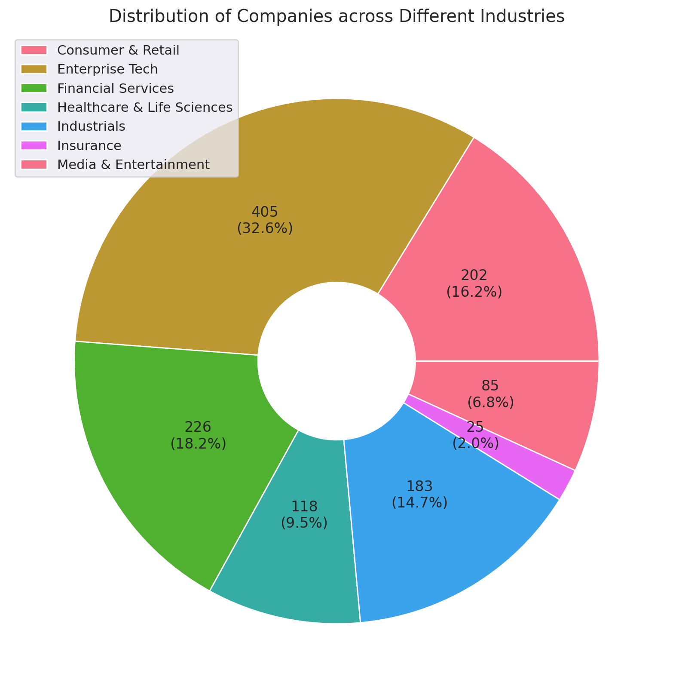


<a id="org0b5bef7"></a>

### Distribution of Valuation across Different Industries

```jupyter-python
_df = df.groupby('Industry')['Latest Valuation ($B)'].sum().sort_values(ascending=False)

fig = plt.figure(figsize=(12, 6))
gs = fig.add_gridspec(nrows=2, ncols=2)

ax1 = fig.add_subplot(gs[0, 0])
ax2 = fig.add_subplot(gs[0, 1])
ax1.sharey(ax2)
# ax3 = fig.add_subplot(gs[1, :])

g = sns.barplot(y=_df.index, x=_df.values, hue=_df.index, ax=ax1)
for i in ax1.containers:
    ax1.bar_label(i, fmt='%.2f')
ax1.set_xlabel('Total Valuation ($B)')
ax1.set_ylabel(None)
sns.boxplot(df, y='Industry', x='Latest Valuation ($B)', hue='Industry', showfliers=False, ax=ax2)
ax2.get_yaxis().set_visible(False)
ax2.set_xlabel('Mean Valuation ($B)')

plt.grid(axis='x', alpha=0.75)
plt.suptitle('Distribution of Valuation across Different Industries')

plt.ylabel(None)
plt.show()
```

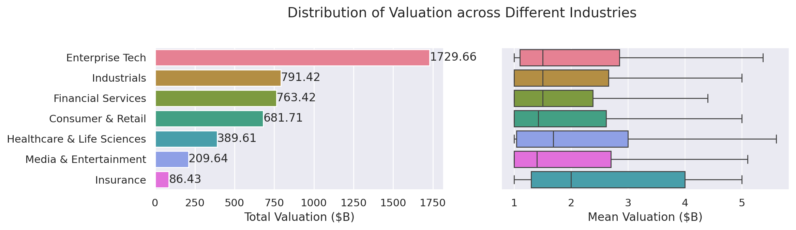


<a id="org5eb1a4a"></a>

### Distribution of Equity Funding across Different Industries

```jupyter-python
_df = df.groupby('Industry')['Funding ($B)'].sum().sort_values(ascending=False)

fig = plt.figure(figsize=(12, 6))
gs = fig.add_gridspec(nrows=2, ncols=2)

ax1 = fig.add_subplot(gs[0, 0])
ax2 = fig.add_subplot(gs[0, 1])
ax1.sharey(ax2)

g = sns.barplot(y=_df.index, x=_df.values, hue=_df.index, ax=ax1)
for i in ax1.containers:
    ax1.bar_label(i, fmt='%.2f')
ax1.set_xlabel('Total Equity Funding ($B)')
ax1.set_ylabel(None)
sns.boxplot(df, y='Industry', x='Funding ($M)', hue='Industry', showfliers=False, ax=ax2)
ax2.get_yaxis().set_visible(False)
ax2.set_xlabel('Mean Equity Funding ($M)')

plt.grid(axis='x', alpha=0.75)
plt.suptitle('Distribution of Equity Funding across Different Industries')

plt.ylabel(None)
plt.show()
```

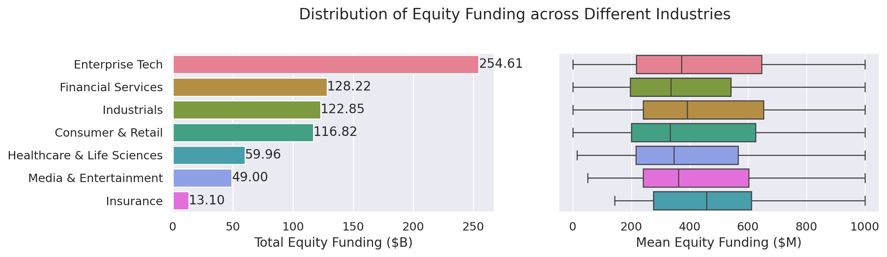


<a id="orgc7a4d4b"></a>

## Geographical Analysis

```jupyter-python
top_countries = df.groupby('Country')['Latest Valuation ($B)'].sum().sort_values(ascending=False).head(30)
```


<a id="org338f790"></a>

### Top Countries by Valuation

```jupyter-python
_df = df.groupby('Country')['Latest Valuation ($B)']\
        .agg(['count', 'sum'])\
        .sort_values(by='sum', ascending=False)\
        .head(30)
fig, ax = plt.subplots(2, 1, figsize=(12, 8), sharex=True, gridspec_kw={'height_ratios': [2, 1]})
g = sns.barplot(_df, x=_df.index, y='sum', hue=_df.index, ax=ax[0])
g.set(ylabel='Latest Valuation ($B)',
      yscale='log')
for i in ax[0].containers:
    ax[0].bar_label(i, rotation=45, fontsize=8)
g = sns.barplot(_df, x=_df.index, y='count', hue=_df.index, ax=ax[1])
g.set(ylabel='Number of Companies',
      yscale='log')
for i in ax[1].containers:
    ax[1].bar_label(i, rotation=45, fontsize=8)
plt.suptitle('Top Countries')
plt.grid(axis='y', alpha=0.75)
plt.xticks(rotation=45, ha='right')
plt.xlabel(None)
plt.show()
```

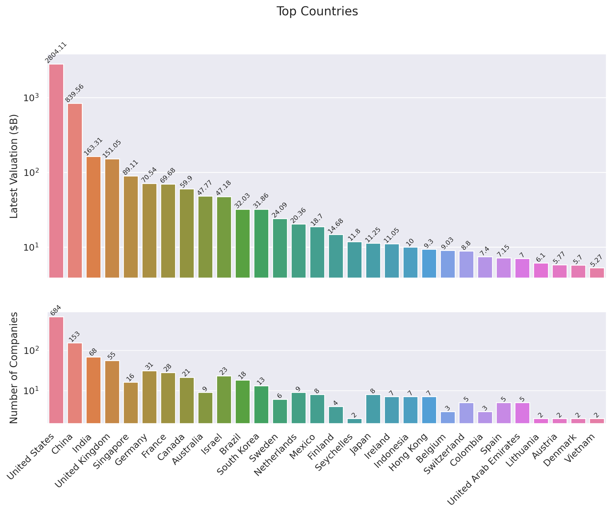


<a id="orgcc50aee"></a>

### Top Countries across Different Industries

```jupyter-python
df_filtered =  df[df['Country'].isin(top_countries.head(10).index)]\
    .groupby(['Country', 'Industry'])['Latest Valuation ($B)']\
    .agg(['count', 'sum'])\
    .reset_index()
```

```jupyter-python
fig, ax = plt.subplots(2, 1, figsize=(12, 8), sharex=True)
g = sns.barplot(df_filtered, x='Country', y='sum', hue='Industry', ax=ax[0])
sns.move_legend(ax[0], 'upper left', bbox_to_anchor=(1, .55), frameon=False)
g.set(ylabel='Valuation ($B)',
      yscale='log')
for i in ax[0].containers:
    ax[0].bar_label(i, rotation=45, fontsize=8, fmt='%d')
g = sns.barplot(df_filtered, x='Country', y='count', hue='Industry', ax=ax[1], legend=False)
g.set(ylabel='Number of Companies',
      yscale='log')
for i in ax[1].containers:
    ax[1].bar_label(i, rotation=45, fontsize=8)
plt.suptitle('Top Countries across Different Industries')
plt.grid(axis='y', alpha=0.75)
plt.xticks(rotation=45, ha='right')
plt.xlabel(None)
plt.show()
```

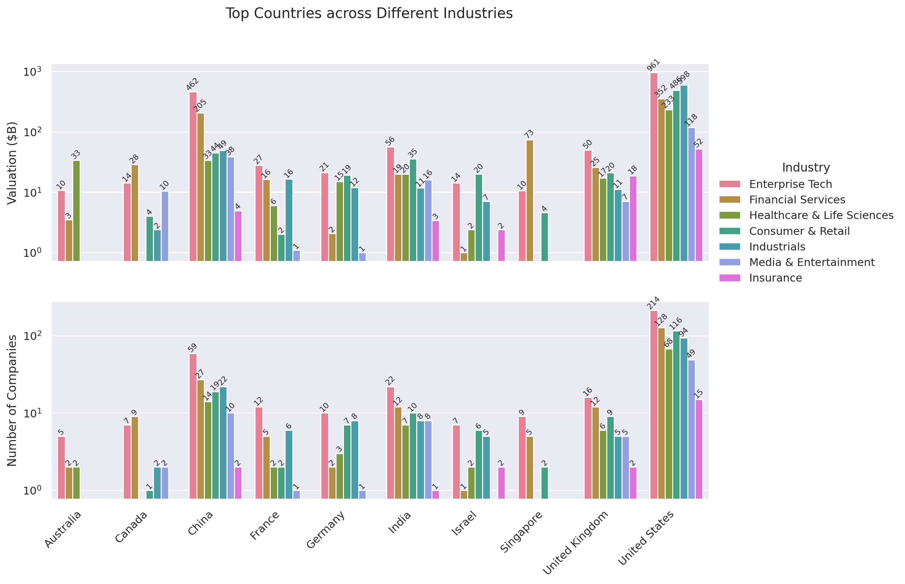


<a id="orgad5c102"></a>

### Mean Distribution of Valuations across Different Countries

```jupyter-python
fig, ax = plt.subplots(figsize=(12, 8))
sns.boxplot(df[df['Country'].isin(top_countries.index)],
            y='Country',
            x='Latest Valuation ($B)',
            hue='Country',
            showfliers=False)
plt.suptitle('Distribution of Valuations across Different Countries')
ax.set(xlabel='Total Valuation ($B)',
       ylabel='Country')
plt.grid(axis='x', alpha=0.7)
plt.show()
```

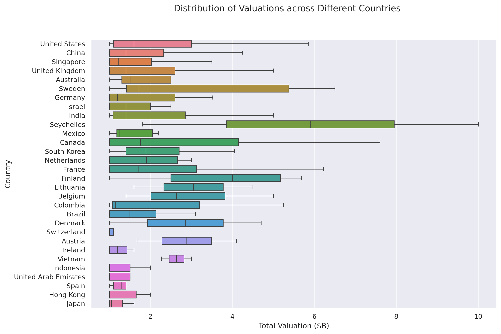


<a id="org02ede4d"></a>

### Mean Distribution of Equity Funding across Different Countries

```jupyter-python
fig, ax = plt.subplots(figsize=(12,8), dpi=300)
sns.boxplot(df[df['Country'].isin(top_countries.index)], y='Country', x='Funding ($M)', hue='Country', showfliers=False)
plt.suptitle('Distribution of Funding across Different Countries')
ax.set(xlabel='Funding ($M)',
       ylabel='Country')
plt.grid(axis='x', alpha=0.7)
plt.show()
```

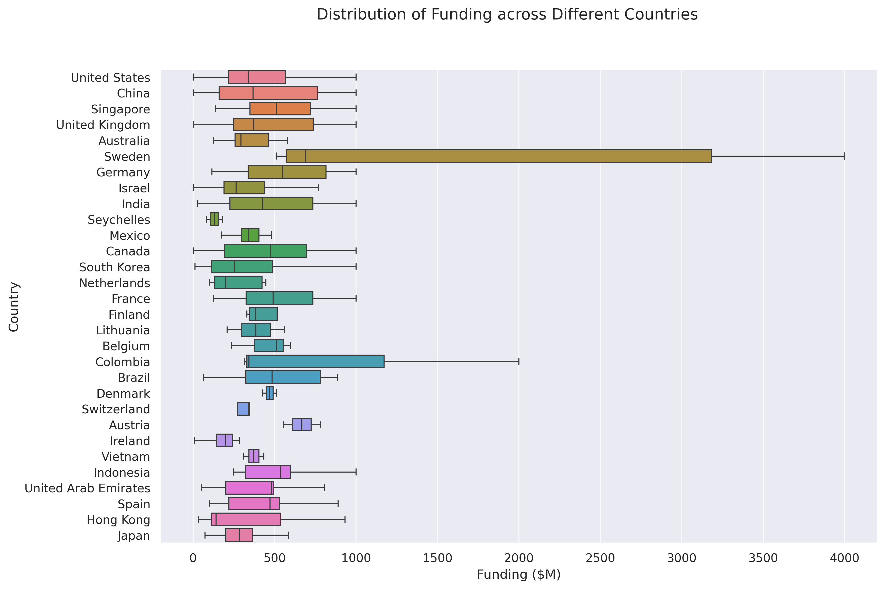


<a id="org3f5767f"></a>

## Sector-Based Analysis


<a id="org354a58b"></a>

### Top Sectors

```jupyter-python
_df = df.explode('Sector')[['Sector', 'Latest Valuation ($B)', 'Funding ($B)']]\
        .groupby('Sector')[['Latest Valuation ($B)', 'Funding ($B)']]\
        .agg({'Latest Valuation ($B)': ['sum', 'count'], 'Funding ($B)': 'sum'})
_df.columns = ['Valuation ($B)', 'Number of Companies', 'Funding ($B)']
_df = _df.sort_values(by='Valuation ($B)', ascending=False).head(20)
print(_df)
```

```
                         Valuation ($B)  Number of Companies  Funding ($B)
Sector
Artificial Intelligence          591.48                   23        49.843
Aerospace                        354.20                    2        10.000
Internet                         320.00                    4         9.373
Software                         214.06                   44        35.165
Financial Technology             185.27                   53        34.698
E-Commerce                       169.11                   22        23.460
Financial Services               142.55                   14        21.798
Cybersecurity                     54.08                   21        12.301
Marketplace                       48.03                   14        13.480
Cryptocurrency                    41.90                   11         4.204
Video Games                       39.70                    4         9.375
Educational Technology            33.47                    9         9.586
Transportation                    33.45                    8        12.480
Graphic Design                    33.00                    2         0.775
Software As A Service             32.70                   11         4.542
Healthcare                        31.30                   11         6.196
Collaborative Software            24.00                    2         1.400
Finance                           21.30                    4         2.359
Blockchain                        20.80                    4         2.060
Logistics                         18.02                    9         6.418
```

```jupyter-python
fig, ax = plt.subplots(2, 1, figsize=(12, 8), dpi=DPI, sharex=True, gridspec_kw={'height_ratios': [2, 1]})
g = sns.barplot(_df, x=_df.index, y='Valuation ($B)', ax=ax[0], hue=_df.index)
for i in ax[0].containers:
    g.bar_label(i, fmt='%d', fontsize=10)
# g = sns.barplot(_df, x=_df.index, y='Funding ($B)', ax=ax[1], hue=_df.index)
# for i in ax[1].containers:
#     g.bar_label(i, fmt='%.1f', fontsize=10)
g = sns.barplot(_df, x=_df.index, y='Number of Companies', ax=ax[1], hue=_df.index)
ax[1].set(ylabel='Companies')
for i in ax[1].containers:
    g.bar_label(i, fmt='%d', fontsize=10)
plt.xticks(rotation=45, ha='right')
plt.xlabel(None)
plt.suptitle('Top Sectors')
plt.show()
```

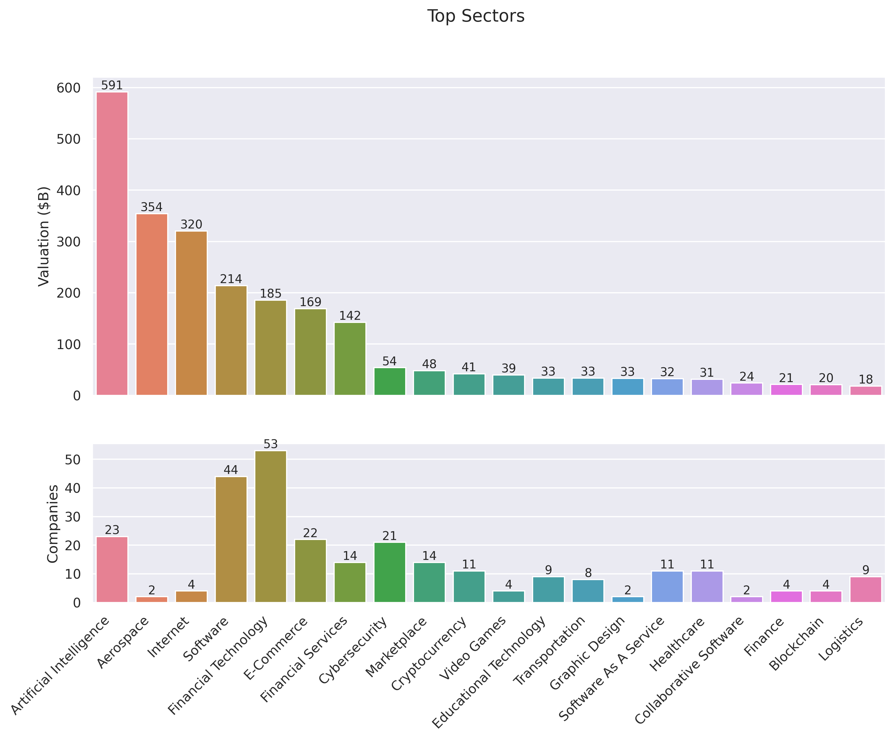


<a id="org650340d"></a>

## Company-Based Analysis


<a id="orgde31626"></a>

### Top Companies by Valuation

```jupyter-python
top_companies = df.sort_values(by='Latest Valuation ($B)', ascending=False).head(20)
top_companies['Growth Rate'] = (top_companies['Latest Valuation ($B)'] - top_companies['Valuation ($B)']) / top_companies['Valuation ($B)'] * 100
```

```jupyter-python
# Set the positions and width for the bars
N = len(top_companies)
ind = np.arange(N)  # the x locations for the groups
width = 0.35  # the width of the bars

# Create the bars for valuation and funding
fig, ax = plt.subplots(2, 1, figsize=(12, 6), dpi=DPI, gridspec_kw={'height_ratios': [3, 1]}, sharex=True)
ax[0].bar(ind, top_companies['Valuation ($B)'], width, label='2024')
ax[0].bar(ind + width, top_companies['Latest Valuation ($B)'], width, label='2025')

ax[0].set(ylabel='Valuation ($B)')
ax[0].legend()
ax[0].grid(axis='y', alpha=0.75)

ax[1].bar(ind, top_companies['Growth Rate'], color=np.where(top_companies['Growth Rate']>0,'g','r'))
ax[1].set(title='Growth Rate (%)')
for i in ax[1].containers:
    ax[1].bar_label(i, fmt='%d%%', fontsize=8)
ax[1].set(ylim=(-100,1600))
plt.xticks(ind+width/2, top_companies['Company'], rotation=45, ha='right')
plt.suptitle('Top Companies by Valuation')
plt.show()
```

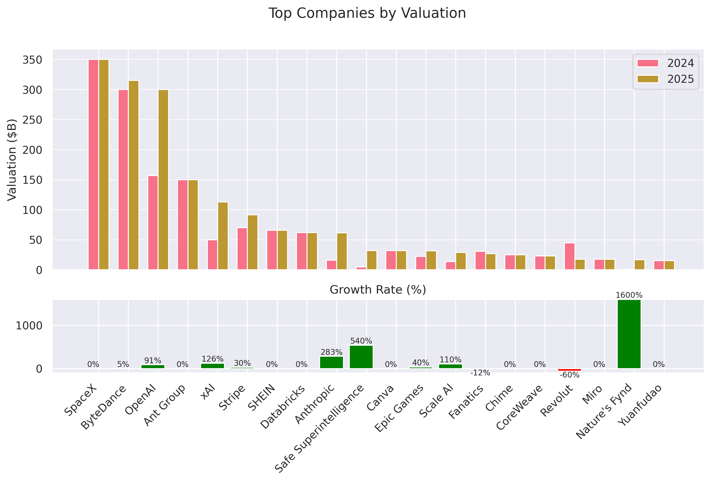


<a id="orgf7d073d"></a>

### Most-Funded Companies

```jupyter-python
df_filtered = df[df['Funding ($M)']>2000].sort_values(by='Funding ($M)', ascending=False).head(30)
```

```jupyter-python
plt.subplots(figsize=(12, 8), dpi=300)
ax = sns.barplot(df_filtered, y='Company', x='Funding ($M)', hue='Company')
for i in ax.containers:
    ax.bar_label(i)
plt.suptitle('Companies Received Most Funding')
plt.xlabel('Amount ($M)')
plt.grid(axis='x', alpha=0.75)
plt.show()
```


<a id="org14460a7"></a>

### Distribution of Valuation by Companies

```jupyter-python
# Define the bins for valuation ranges
# bins = [0, 1, 1.5, 2, 3, 4, 5, 6, 8, 10, 20, 30, 50, 100, 200, 300, 400]
# labels =  [f'{a}-{b}' for a, b in zip(bins[:-1], bins[1:])]
# cuts = pd.cut(df['Valuation ($B)'], bins=bins, labels=labels)

cuts = pd.qcut(df['Latest Valuation ($B)'], 50, duplicates='drop')

# Count the number of companies in each bin
distribution = cuts.value_counts().sort_index()

# Plot the Bar Chart
plt.figure(figsize=(12, 6))
ax = sns.barplot(x=distribution.index,
                 y=distribution.values, hue=distribution.values)
for i in ax.containers:
    ax.bar_label(i)
plt.suptitle('Distribution of Valuations by Companies')
plt.xlabel('Valuation ($B)')
plt.ylabel('Number of Companies')
plt.xticks(rotation=45, ha='right')
plt.grid(axis='y', alpha=0.75)
plt.show()
```

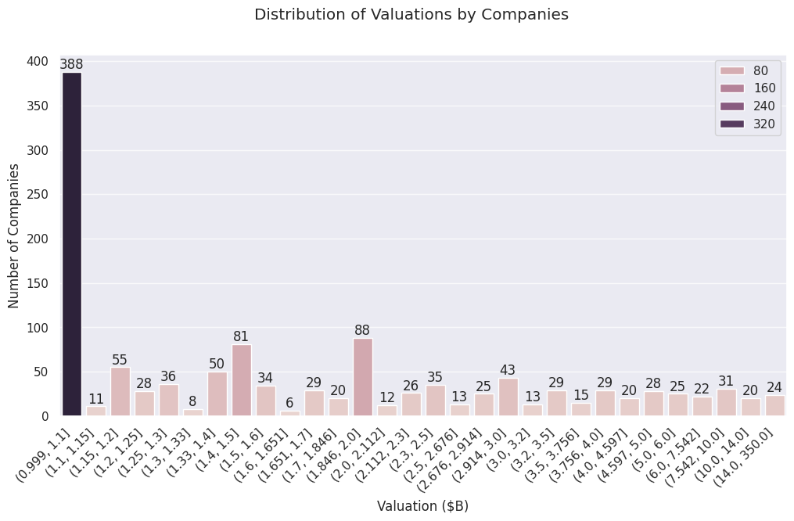


<a id="orge715c87"></a>

### Distribution of Equity Funding by Companies

```jupyter-python
cuts = pd.qcut(df['Funding ($M)'], 30, duplicates='drop')

# Count the number of companies in each bin
distribution = cuts.value_counts().sort_index()

# Plot the Bar Chart
plt.figure(figsize=(12, 6))
ax = sns.barplot(x=distribution.index,
                 y=distribution.values, hue=distribution.values)
for i in ax.containers:
    ax.bar_label(i)
plt.suptitle('Distribution of Equity Funding by Companies')
plt.xlabel('Equity Funding ($M)')
plt.ylabel('Number of Companies')
plt.xticks(rotation=45, ha='right')
plt.grid(axis='y', alpha=0.75)
plt.show()
```

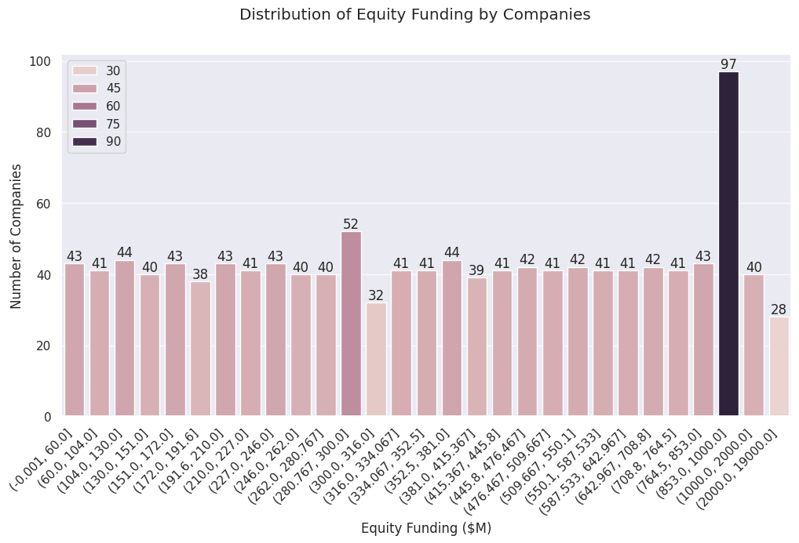


<a id="orge8e4d3c"></a>

## Investor Analysis


<a id="org5fc39a3"></a>

### Top Investors

```jupyter-python
top_investors = df.explode('Investors')\
                  .groupby('Investors')['Latest Valuation ($B)']\
                  .agg(['count', 'sum'])\
                  .sort_values(by=['sum', 'count'], ascending=False)\
                  .head(50)
print(top_investors)
```

```
                                count     sum
Investors
RRE Ventures                        5  397.60
Founders Fund                      24  363.01
Relay Ventures                      2  358.00
Opus Capital                        2  355.70
Breyer Capital                      5  320.16
Parkway VC                          2  316.00
TIME Ventures                       1  315.00
Susa Ventures                       2  304.90
Dynamo VC                           1  300.00
Andreessen Horowitz                72  184.51
Sequoia Capital China              40  183.61
Sequoia Capital                    59  177.57
Alibaba Group                       9  163.39
Accel                              65  163.21
New Enterprise Associates          26  158.00
The Carlyle Group                   5  154.55
CPP Investments                     1  150.00
Tiger Global Management            56  144.53
Index Ventures                     38  139.65
General Atlantic                   30  138.95
Lightspeed Venture Partners        42  121.19
TDM Growth Partners                 2  121.00
Insight Partners                   49  120.07
Baillie Gifford & Co.               3  117.40
Prysm Capital                       2  115.10
General Catalyst                   41  113.46
ZhenFund                            7  108.20
K2 Ventures                         1   91.50
Institutional Venture Partners     13   85.74
Temasek                            10   74.58
IDG Capital                        27   72.08
Bessemer Venture Partners          32   71.36
Tencent Holdings                   29   69.03
Google Ventures                    28   68.81
369 Growth Partners                 1   66.00
Berkeley Hills Capital              1   66.00
GTM Capital                         1   66.00
Holtzbrinck Ventures                2   64.00
Unternehmertum Venture Capital      1   62.00
NVentures                           1   61.50
SoftBank Group                     29   59.68
Sequoia Capital India              23   57.97
Coatue Management                  21   53.79
Norwest Venture Partners           18   53.43
Bain Capital Ventures              17   52.66
Thrive Capital                     20   49.68
Foresite Capital                    4   49.20
CRV                                17   48.18
Battery Ventures                   20   48.07
Warburg Pincus                     10   46.37
```

```jupyter-python
fig, ax = plt.subplots(2, 1, figsize=(12, 8), dpi=300, sharex=True)

sns.barplot(top_investors, ax=ax[0], y='sum', x=top_investors.index, hue=top_investors.index, legend=False)
ax[0].set(ylabel='Valuations ($B)', title='Valuations of Invested Companies ($B)')

sns.barplot(top_investors, ax=ax[1], y='count', x=top_investors.index, hue=top_investors.index, legend=False)
ax[1].set(ylabel='Times Invested', title='Number of Companies Invested')

plt.xticks(rotation=90)
plt.suptitle('Top Investors')
plt.show()
```


<a id="orgc7cc605"></a>

## Founder Analysis


<a id="org45d8712"></a>

### Top Founders

```jupyter-python
top_founders = df.explode('Founder(s)')\
                  .groupby('Founder(s)')['Latest Valuation ($B)']\
                  .agg(['count', 'sum'])\
                  .sort_values(by=['sum', 'count'], ascending=False)\
                  .head(50)
print(top_founders)
```

```
                      count     sum
Founder(s)
Elon Musk                 3  468.70
Ilya Sutskever            2  332.00
Liang Rubo                1  315.00
Zhang Yiming              1  315.00
Greg Brockman             1  300.00
Sam Altman                1  300.00
John Collison             1   91.50
Patrick                   1   91.50
Ali Ghodsi                1   62.00
Dario Amodei              1   61.50
Cameron Adams             1   32.00
Clifford Obrecht          1   32.00
Daniel Gross              1   32.00
Daniel Levy               1   32.00
Melanie Perkins           1   32.00
Tim Sweeney               1   31.50
Alexandr Wang             1   29.00
Lucy Guo                  1   29.00
Alan Trager               1   27.00
Michael Rubin[34]         1   27.00
Mitch Trager              1   27.00
Chris Britt               1   25.00
Ryan King                 1   25.00
Nikolay Storonsky         1   17.75
Vlad Yatsenko             1   17.75
Andrey Khusid             1   17.50
Daniel Livny              1   17.00
Mark Kozubal              1   17.00
Matthew Strongin          1   17.00
Rich Macur                1   17.00
Thomas Jonas              1   17.00
Yuval Avniel              1   17.00
Markus Villig             2   16.80
Yong Li                   1   15.50
Jason Citron              1   15.00
Stanislav Vishnevsky      1   15.00
Charlwin Mao Wenchao      1   14.00
Miranda Qu Fang           1   14.00
William Hockey            1   13.40
Zach Perret               1   13.40
Alex Shevchenko           1   13.00
Dmytro Lider              1   13.00
Max Lytvyn,               1   13.00
Todd Park                 1   12.60
Max Rhodes                1   12.40
Henrique Dubugras         1   12.30
Pedro Franceschi          1   12.30
Hayes Barnard             1   12.00
Jason Walker              1   12.00
Matt Dawson               1   12.00
```

```jupyter-python
fig, ax = plt.subplots(figsize=(12, 8), dpi=300, sharex=True)

ax = sns.barplot(top_founders, y='sum', x=top_founders.index, hue='sum', legend=False)
ax.set(ylabel='Company Valuations ($B)', xlabel='Founder')

plt.xticks(rotation=90)
plt.suptitle('Top Founders by Company Valuations')
plt.show()
```


<a id="orga1939bb"></a>

# Time-Based Analysis


<a id="org3cbd30e"></a>

## Unicorn Growth Over Time

```jupyter-python
_df = df.groupby('Unicorn Year').size().reset_index(name='Count')
_df['Accumulated Count'] = _df['Count'].cumsum()
_df
```

<div>
<style scoped>
    .dataframe tbody tr th:only-of-type {
        vertical-align: middle;
    }

    .dataframe tbody tr th {
        vertical-align: top;
    }

    .dataframe thead th {
        text-align: right;
    }
</style>
<table border="1" class="dataframe">
  <thead>
    <tr style="text-align: right;">
      <th></th>
      <th>Unicorn Year</th>
      <th>Count</th>
      <th>Accumulated Count</th>
    </tr>
  </thead>
  <tbody>
    <tr>
      <th>0</th>
      <td>2007</td>
      <td>1</td>
      <td>1</td>
    </tr>
    <tr>
      <th>1</th>
      <td>2011</td>
      <td>1</td>
      <td>2</td>
    </tr>
    <tr>
      <th>2</th>
      <td>2012</td>
      <td>4</td>
      <td>6</td>
    </tr>
    <tr>
      <th>3</th>
      <td>2013</td>
      <td>4</td>
      <td>10</td>
    </tr>
    <tr>
      <th>4</th>
      <td>2014</td>
      <td>9</td>
      <td>19</td>
    </tr>
    <tr>
      <th>5</th>
      <td>2015</td>
      <td>32</td>
      <td>51</td>
    </tr>
    <tr>
      <th>6</th>
      <td>2016</td>
      <td>17</td>
      <td>68</td>
    </tr>
    <tr>
      <th>7</th>
      <td>2017</td>
      <td>35</td>
      <td>103</td>
    </tr>
    <tr>
      <th>8</th>
      <td>2018</td>
      <td>83</td>
      <td>186</td>
    </tr>
    <tr>
      <th>9</th>
      <td>2019</td>
      <td>85</td>
      <td>271</td>
    </tr>
    <tr>
      <th>10</th>
      <td>2020</td>
      <td>91</td>
      <td>362</td>
    </tr>
    <tr>
      <th>11</th>
      <td>2021</td>
      <td>484</td>
      <td>846</td>
    </tr>
    <tr>
      <th>12</th>
      <td>2022</td>
      <td>252</td>
      <td>1098</td>
    </tr>
    <tr>
      <th>13</th>
      <td>2023</td>
      <td>68</td>
      <td>1166</td>
    </tr>
    <tr>
      <th>14</th>
      <td>2024</td>
      <td>78</td>
      <td>1244</td>
    </tr>
  </tbody>
</table>
</div>

```jupyter-python
plt.subplots(figsize=(12, 6), dpi=300)
sns.barplot(_df, x='Unicorn Year', y='Count', hue='Count')
plt.plot(_df['Accumulated Count'], marker='o', linestyle='dashed')
plt.suptitle('Unicorn Growth Over Time')
plt.xlabel('Year')
plt.ylabel('Number of Unicorns')
plt.grid(axis='y', alpha=0.7)
plt.show()
```


The surge of unicorns was reported as [&ldquo;meteoric&rdquo;](https://pitchbook.com/news/articles/us-unicorns-2021-venture-capital-valuations) for 2021, with $71 billion invested in 340 new companies, a banner year for startups and for the US venture capital industry; the unprecedented number of companies valued at more than $1 billion during 2021 exceeded the sum total of the five previous years.


<a id="orgf376b3a"></a>

## Time to Unicorn

```jupyter-python
# Calculate 5th and 95th percentiles
lower_bound = df['Years to Unicorn (Converted)'].quantile(0.05)
upper_bound = df['Years to Unicorn (Converted)'].quantile(0.95)
# Filter out values outside the 5th and 95th percentiles
df_filtered = df[(df['Years to Unicorn (Converted)'] >= lower_bound) & (df['Years to Unicorn (Converted)'] <= upper_bound)]

fig, ax = plt.subplots(2, 1, figsize=(12, 8), dpi=300)
sns.boxplot(df_filtered, x='Years to Unicorn (Converted)', y='Industry', hue='Industry', ax=ax[0], showfliers=False)
ax[0].set(xlabel=None)
sns.histplot(df_filtered['Years to Unicorn (Converted)'].dropna(), bins=300, ax=ax[1])
ax[1].set(xlabel='Years', ylabel='Number of Companies')
plt.suptitle('Distribution of Time to Unicorn')
plt.grid(alpha=0.75)
plt.show()
```

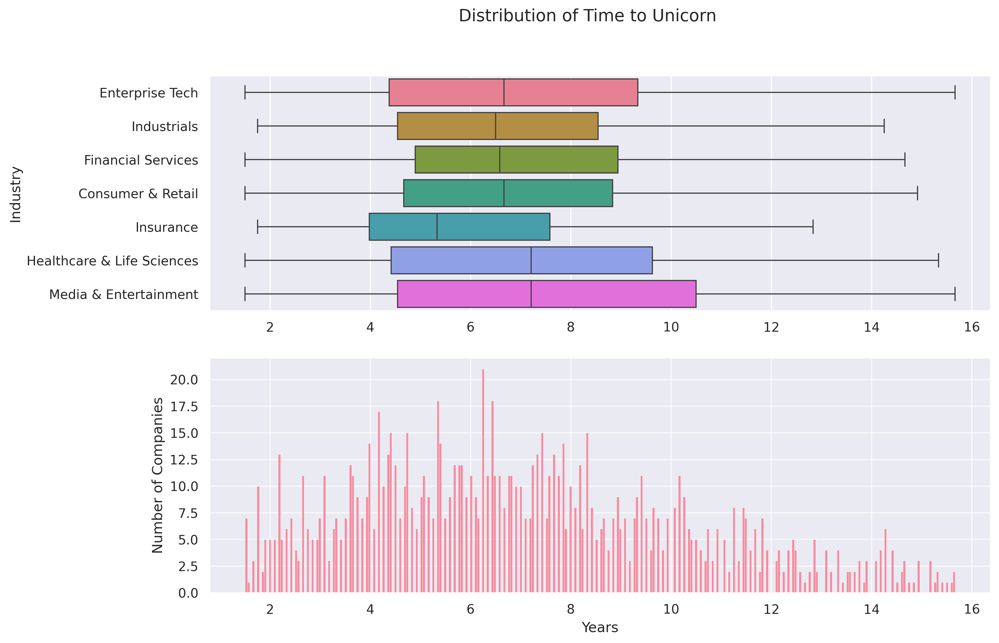


<a id="org5341024"></a>

## Distribution of Valuations Over Time

```jupyter-python
plt.subplots(figsize=(12, 6), dpi=300)
sns.scatterplot(df, x='Unicorn Date', y='Valuation ($B)', alpha=.6, hue='Industry')
plt.suptitle('Distribution of Valuations Over Time')
plt.xlabel('Date')
plt.ylabel('Amount ($B)')
# plt.xticks(df['Unicorn Year'].unique(), rotation=45)
plt.grid(axis='y', alpha=0.5)
plt.yscale('log')
plt.show()
```


<a id="org0ca5c7c"></a>

## Distribution of Funding Over Time

```jupyter-python
plt.subplots(figsize=(12, 6), dpi=300)
sns.scatterplot(df, x='Unicorn Date', y=df['Funding ($M)'], alpha=0.6, hue='Industry')
plt.suptitle('Distribution of Funding Over Time')
plt.xlabel('Date')
plt.ylabel('Amount ($M)')
# plt.xticks(df['Unicorn Year'].unique(), rotation=45)
plt.grid(axis='y', alpha=0.5)
# plt.yscale('log')
plt.show()
```


<a id="org89dd295"></a>

# Correlation Analysis


<a id="org2a20a19"></a>

## Relationship between Funding and Valuation

```jupyter-python
df_filtered = df[(df['Total Equity Funding ($)'] >= df['Total Equity Funding ($)'].quantile(0.05)) &
                 (df['Total Equity Funding ($)'] <= df['Total Equity Funding ($)'].quantile(0.95)) &
                 (df['Valuation ($)'] >= df['Valuation ($)'].quantile(0.05)) &
                 (df['Valuation ($)'] <= df['Valuation ($)'].quantile(0.95))]

# plt.subplots(figsize=(12, 8), dpi=300)
# sns.relplot(df, x='Total Equity Funding ($)', y='Valuation ($)', alpha=0.6, hue='Industry', row='Unicorn Type')
# print(df[df['Unicorn Type']=='Centicorn'][['Valuation ($B)', 'Funding ($B)']].corr())
sns.relplot(df, x='Funding ($M)', y='Latest Valuation ($B)',
            alpha=0.6, hue='Industry', col='Unicorn Type',
            facet_kws={'sharey':False, 'sharex':False})
# sns.jointplot(df_filtered, x='Total Equity Funding ($)', y='Valuation ($)', kind='reg', truncate=False, height=7)
# plt.suptitle('Relationship between Funding and Valuation')
plt.xlabel('Funding ($)')
plt.ylabel('Valuation ($)')
plt.grid(True)
plt.xscale('log')
# plt.yscale('log')
plt.show()
```

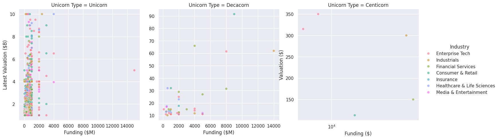


<a id="org5655900"></a>

## Relationship between Time to Unicorn and Valuation

```jupyter-python
# Filter out values outside the 5th and 95th percentiles
df_filtered = df[(df['Years to Unicorn'] >= df['Years to Unicorn'].quantile(0.05)) &
                 (df['Years to Unicorn'] <= df['Years to Unicorn'].quantile(0.95)) &
                 (df['Valuation ($)'] >= df['Valuation ($)'].quantile(0.05)) &
                 (df['Valuation ($)'] <= df['Valuation ($)'].quantile(0.95))]

plt.subplots(figsize=(12, 8), dpi=300)
sns.scatterplot(df, x=df_filtered['Years to Unicorn'], y=df['Valuation ($)'], alpha=0.6, hue='Industry')
plt.suptitle('Relationship between Time to Unicorn and Valuation')
plt.xlabel('Years')
plt.ylabel('Valuation ($)')
plt.grid(True)
plt.yscale('log')
plt.show()
```

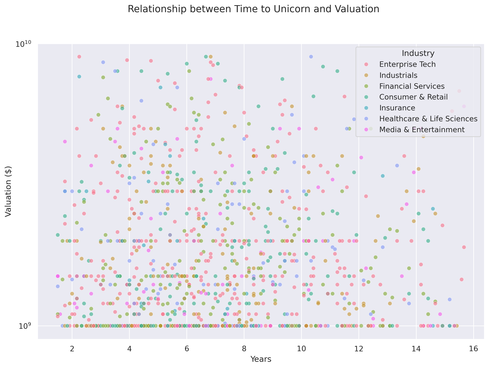


<a id="org32ea2b0"></a>

# Historical Analysis


<a id="org4923025"></a>

## Survival and Acquisition

-   Find out companies no longer listed as unicorns in 2024
    
    ```jupyter-python
    df_2022 = pd.read_csv('input/datasets/Unicorn_Companies (March 2022).csv')
    df_2022['Valuation ($B)'] = pd.to_numeric(df_2022['Valuation ($B)'].str.replace('$', ''))
    df_exit = df_2022[~df_2022['Company'].str.lower().isin(df['Company'].str.lower())]
    ```
    
        178 companies no longer listed in 2024 unicorn list
    
    ```jupyter-python
    print(df_exit.head())
    ```
    
    ```
                       Company  Valuation ($B) Date Joined        Country           City                                Industry                                  Select Inverstors  Founded Year  \
    7                Instacart           39.00  12/30/2014  United States  San Francisco     Supply chain, logistics, & delivery  Khosla Ventures, Kleiner Perkins Caufield & By...        2012.0
    10                     FTX           32.00   7/20/2021        Bahamas        Fintech  Sequoia Capital, Thoma Bravo, Softbank                                                NaN        2018.0
    15             J&T Express           20.00    4/7/2021      Indonesia        Jakarta     Supply chain, logistics, & delivery  Hillhouse Capital Management, Boyu Capital, Se...        2015.0
    31  Biosplice Therapeutics           12.00    8/6/2018  United States      San Diego                                  Health           Vickers Venture Partners, IKEA GreenTech        2008.0
    39                 Weilong           10.88    5/8/2021          China          Luohe                       Consumer & retail  Tencent Holdings, Hillhouse Capital Management...           NaN
    
       Total Raised Financial Stage  Investors Count  Deal Terms  Portfolio Exits
    7       $2.686B             NaN             29.0        12.0              NaN
    10      $1.829B             Acq             40.0         3.0              1.0
    15      $4.653B             NaN              9.0         3.0              NaN
    31      $561.5M             NaN             10.0         1.0              NaN
    39     $559.74M             NaN              7.0         1.0              NaN
    ```

-   Financial Stage
    
    ```jupyter-python
    df_2022['Financial Stage'].value_counts()
    ```
    
    ```
    Financial Stage
    Acquired       22
    Divestiture     8
    IPO             7
    Acq             7
    Asset           1
    Take            1
    Management      1
    Reverse         1
    Corporate       1
    Name: count, dtype: int64
    ```


<a id="org0b0b40c"></a>

### Top Exited Unicorns as of March 2022

```jupyter-python
df_exit_top_companies = df_exit.sort_values('Valuation ($B)', ascending=False).head(20)
# print(df_exit_top_companies)
```

```jupyter-python
plt.subplots(figsize=(12, 6), dpi=300)
ax = sns.barplot(df_exit_top_companies,
                 x='Company',
                 y='Valuation ($B)',
                 hue='Company')
for i in ax.containers:
    ax.bar_label(i)
plt.suptitle('Top Exited Unicorns as of March 2022')
plt.ylabel('Valuation ($B)')
plt.xlabel('Company')
plt.xticks(rotation=45, ha='right')
plt.grid(axis='y', alpha=0.75)
plt.show()
```


<a id="org324277e"></a>

### Exit Reasons of Former Unicorns

```jupyter-python
_df = pd.read_csv('input/raw_data/list-of-unicorn-former-startups_20250619 (wikipedia).csv')
_df['Company'] = _df['Company'].str.strip()
def correct_exit_reasons(s):
    s = re.sub(r'\[.*\]', '', s)
    s= s.strip()
    if 'merge' in s.lower():
        return 'Merged'
    if 'acquire' in s.lower() or 'acquisition' in s.lower() or 'takeover' in s.lower():
        return 'Acquired'
    if 'devaluation' == s.lower():
        return 'Devalued'
    if 'direct listing' == s.lower():
        return 'IPO'
    return s
_df['Exit reason'] = _df['Exit reason'].dropna().apply(correct_exit_reasons)
# _df = _df[_df['Company'].str.lower().isin(df_exit['Company'].str.lower())]
_df['Exit reason'].value_counts()
```

    Exit reason
    IPO           128
    Acquired       53
    Merged         14
    Defunct         3
    Devalued        3
    Bankruptcy      2
    Name: count, dtype: int64

```jupyter-python
exit_reasons = _df['Exit reason'].value_counts().reset_index(name='Count')
# print(exit_reasons.index)
plt.subplots(figsize=(12, 6), dpi=300)
ax = sns.barplot(exit_reasons, x='Exit reason', y='Count', hue='Exit reason')
for i in ax.containers:
    ax.bar_label(i)
plt.suptitle('Exit Reasons of Former Unicorns')
plt.show()
```


<a id="orgd355972"></a>

# Funded by Y-Combinator

Y Combinator, founded in 2005 by Paul Graham and others, is a prestigious startup accelerator based in Silicon Valley that provides early-stage companies with seed funding, mentorship, and resources over a three-month program held twice a year. Startups receive initial funding in exchange for equity and culminate in a Demo Day where they pitch to investors. Y Combinator has launched successful companies like Airbnb, Dropbox, and Stripe, significantly impacting the startup ecosystem and inspiring numerous other accelerators globally.

-   **Datasets**
    -   **YC Campanies**
        
        ```jupyter-python
        df_yc_companies = pd.read_csv('input/datasets/2024 YCombinator All Companies Dataset/companies.csv')
        
        df_yc_industries = pd.read_csv('input/datasets/2024 YCombinator All Companies Dataset/industries.csv')
        df_yc_tags = pd.read_csv('input/datasets/2024 YCombinator All Companies Dataset/tags.csv')
        # print(df_yc_tags.groupby('id')['tag'].agg(list).reset_index())
        df_yc_companies = df_yc_companies.merge(df_yc_industries[['id', 'industry']].groupby('id')['industry'].agg(list).reset_index(), on='id', how='left')
        df_yc_companies = df_yc_companies.merge(df_yc_tags.groupby('id')['tag'].agg(list).reset_index(), on='id', how='left')
        df_yc_companies = df_yc_companies[['name', 'slug', 'oneLiner', 'website', 'smallLogoUrl', 'teamSize', 'tag', 'industry', 'batch']].rename(columns={
            'name': 'Company',
            'slug': 'Slug',
            'oneLiner': 'Short Description',
            'website': 'Website',
            'smallLogoUrl': 'Logo',
            'teamSize': 'Team Size',
            'tag': 'Tags',
            'industry': 'Industries',
            'batch': 'Batch'
        })
        print(df_yc_companies.info())
        ```
        
        ```
        <class 'pandas.core.frame.DataFrame'>
        RangeIndex: 4844 entries, 0 to 4843
        Data columns (total 9 columns):
         #   Column             Non-Null Count  Dtype
        ---  ------             --------------  -----
         0   Company            4844 non-null   object
         1   Slug               4841 non-null   object
         2   Short Description  4692 non-null   object
         3   Website            4817 non-null   object
         4   Logo               4197 non-null   object
         5   Team Size          4766 non-null   float64
         6   Tags               4463 non-null   object
         7   Industries         4825 non-null   object
         8   Batch              4844 non-null   object
        dtypes: float64(1), object(8)
        memory usage: 340.7+ KB
        None
        ```
        
        ```jupyter-python
        df2_yc_companies = pd.read_json('input/datasets/yc_startups.json')
        print(df2_yc_companies.info())
        ```
        
        ```
        <class 'pandas.core.frame.DataFrame'>
        RangeIndex: 1000 entries, 0 to 999
        Data columns (total 12 columns):
         #   Column       Non-Null Count  Dtype
        ---  ------       --------------  -----
         0   name         1000 non-null   object
         1   description  1000 non-null   object
         2   location     1000 non-null   object
         3   url          1000 non-null   object
         4   tags         1000 non-null   object
         5   site_url     999 non-null    object
         6   tag_line     999 non-null    object
         7   long_desc    999 non-null    object
         8   thumbnail    975 non-null    object
         9   founders     999 non-null    object
         10  meta         999 non-null    object
         11  socials      999 non-null    object
        dtypes: object(12)
        memory usage: 93.9+ KB
        None
        ```
    
    -   **YC Founders**
        
        ```jupyter-python
        df_yc_founders = pd.read_csv('input/datasets/2024 YCombinator All Companies Dataset/founders.csv')
        print(df_yc_founders.info())
        ```
        
        ```
        <class 'pandas.core.frame.DataFrame'>
        RangeIndex: 8465 entries, 0 to 8464
        Data columns (total 8 columns):
         #   Column           Non-Null Count  Dtype
        ---  ------           --------------  -----
         0   first_name       8461 non-null   object
         1   last_name        8456 non-null   object
         2   hnid             8465 non-null   object
         3   avatar_thumb     8465 non-null   object
         4   current_company  7624 non-null   object
         5   current_title    2201 non-null   object
         6   company_slug     8465 non-null   object
         7   top_company      8465 non-null   bool
        dtypes: bool(1), object(7)
        memory usage: 471.3+ KB
        None
        ```


<a id="orgcd5ce5b"></a>

## How many YC companies are in unicorn status currently?

```jupyter-python
df_yc_unicorns = df.assign(tmp_col=df.Company.str.lower()).merge(
    df_yc_companies[['Company', 'Slug', 'Short Description', 'Website', 'Logo', 'Team Size', 'Tags', 'Industries', 'Batch']].assign(tmp_col=lambda x: x.Company.str.lower()),
    on='tmp_col', how='inner').drop(['tmp_col', 'Company_y'], axis=1).rename(columns={'Company_x': 'Company'})
df_yc_unicorns['Batch Season'] = df_yc_unicorns['Batch'].apply(lambda x: 'Summer' if x[0]=='S' else 'Winter')
df_yc_unicorns['Batch Year'] = pd.to_numeric(df_yc_unicorns['Batch'].apply(lambda x: f'20{x[1:]}'))
print(df_yc_unicorns.info())
```

```
<class 'pandas.core.frame.DataFrame'>
RangeIndex: 98 entries, 0 to 97
Data columns (total 29 columns):
 #   Column                        Non-Null Count  Dtype
---  ------                        --------------  -----
 0   Company                       98 non-null     object
 1   Valuation ($B)                98 non-null     float64
 2   Total Equity Funding ($)      98 non-null     int64
 3   Unicorn Date                  98 non-null     datetime64[ns]
 4   Date Founded                  98 non-null     int64
 5   Years to Unicorn              98 non-null     object
 6   Industry                      98 non-null     object
 7   Country                       98 non-null     object
 8   City                          98 non-null     object
 9   Select Investors              98 non-null     object
 10  Valuation ($)                 98 non-null     float64
 11  Unicorn Year                  98 non-null     int32
 12  Funding ($B)                  98 non-null     float64
 13  Funding ($M)                  98 non-null     float64
 14  Investors                     98 non-null     object
 15  Years to Unicorn (Months)     98 non-null     int64
 16  Years to Unicorn (Converted)  98 non-null     float64
 17  Latest Valuation ($B)         98 non-null     float64
 18  Founder(s)                    16 non-null     object
 19  Slug                          98 non-null     object
 20  Short Description             97 non-null     object
 21  Website                       98 non-null     object
 22  Logo                          95 non-null     object
 23  Team Size                     96 non-null     float64
 24  Tags                          92 non-null     object
 25  Industries                    98 non-null     object
 26  Batch                         98 non-null     object
 27  Batch Season                  98 non-null     object
 28  Batch Year                    98 non-null     int64
dtypes: datetime64[ns](1), float64(7), int32(1), int64(4), object(16)
memory usage: 21.9+ KB
None
```


<a id="orge7cb44a"></a>

## Top Companies by Valuation

```jupyter-python
df_top_yc_unicorns = df_yc_unicorns.sort_values(by='Latest Valuation ($B)', ascending=False).head(20)
fig, ax = plt.subplots(figsize=(12,6), dpi=200)
ax = sns.barplot(data=df_top_yc_unicorns, x='Company', y='Latest Valuation ($B)', hue='Company')
for i in ax.containers:
    ax.bar_label(i, fmt='%.1f')
plt.xticks(rotation=45, ha='right')
plt.suptitle('Top YC unicorns by Valuation')
plt.show()
```


<a id="orgab40c2d"></a>

## YC Batch Distribution

```jupyter-python
_df = df_yc_unicorns.groupby(['Batch Year', 'Batch Season']).size().reset_index(name='count').sort_values(by='Batch Year')
print(_df)
```

```
    Batch Year Batch Season  count
0         2009       Summer      2
1         2011       Summer      3
2         2011       Winter      1
3         2012       Summer      3
4         2012       Winter      2
5         2013       Summer      1
6         2013       Winter      1
7         2014       Summer      6
8         2014       Winter      3
9         2015       Summer      7
10        2015       Winter      3
11        2016       Summer      6
12        2016       Winter     11
14        2017       Winter      7
13        2017       Summer      5
15        2018       Summer      3
16        2018       Winter      8
17        2019       Summer      1
18        2019       Winter      4
19        2020       Summer      5
20        2020       Winter      3
21        2021       Summer      1
22        2021       Winter      3
23        2022       Summer      1
24        2022       Winter      1
25        2023       Summer      1
26        2023       Winter      1
27        2024       Summer      3
28        2024       Winter      2
```

```jupyter-python
plt.subplots(figsize=(12,6),dpi=300)
sns.barplot(_df, x='Batch Year', y='count', hue='Batch Season')
plt.xticks(rotation=45, ha='right')
plt.suptitle('Batch Distribution of YC Unicorns')
plt.show()
```


<a id="orgf35c81d"></a>

## Top Countires

```jupyter-python
top_countries = df_yc_unicorns['Country'].value_counts().nlargest(20).index
top_countries
```

    Index(['United States', 'India', 'United Kingdom', 'Canada', 'Mexico', 'Indonesia', 'Colombia', 'Australia', 'Senegal', 'Estonia', 'Spain'], dtype='object', name='Country')


<a id="org2c020bc"></a>

## Top Categories

```jupyter-python
top_categories = df_yc_unicorns['Tags'].explode().value_counts().head(20).reset_index(name='Count')
print(top_categories)
```

```
                       Tags  Count
0                      SaaS     25
1                   Fintech     22
2                       B2B     17
3           Developer Tools     10
4   Artificial Intelligence      9
5          Machine Learning      7
6               Marketplace      7
7                   HR Tech      6
8                E-commerce      5
9                        AI      5
10                 Payments      4
11                Logistics      4
12                  Climate      4
13                Analytics      4
14               Enterprise      4
15               Automation      3
16         Data Engineering      3
17            Generative AI      3
18            Manufacturing      3
19                Education      3
```

```jupyter-python
plt.subplots(figsize=(12,6), dpi=200)
ax = sns.barplot(data=top_categories, x='Tags', y='Count', hue='Tags')
ax.set(ylabel='Number of Companies',
       xlabel='Category')
for i in ax.containers:
    ax.bar_label(i)
plt.xticks(rotation=45, ha='right')
plt.suptitle('Top Categories')
plt.show()
```

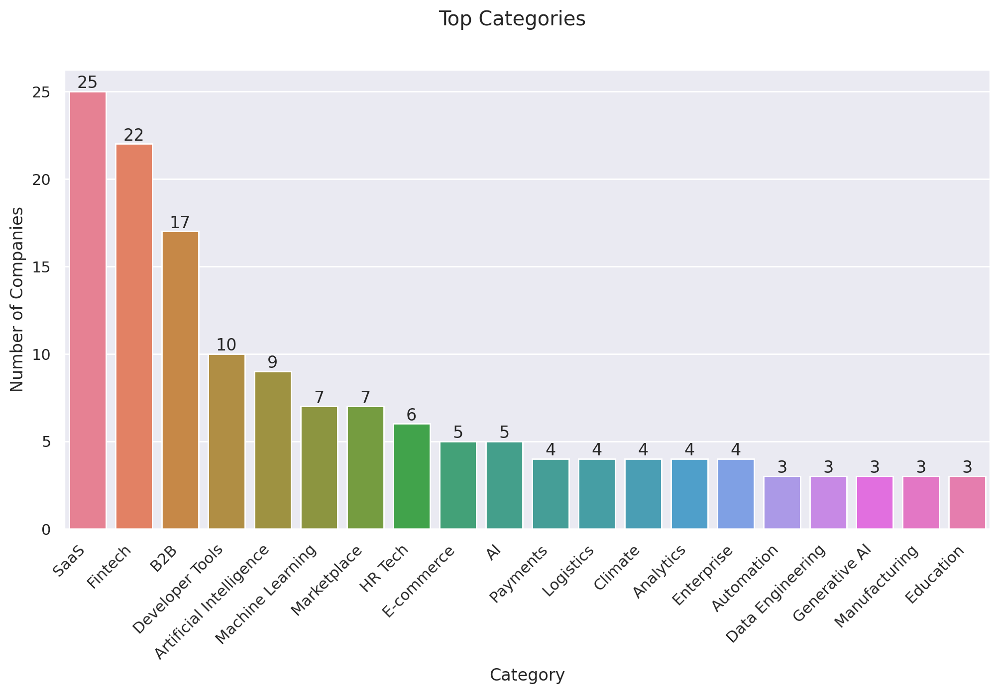


<a id="org0553d8a"></a>

### Team Size Distribution across Different Categories

```jupyter-python
_df = df_yc_unicorns.explode('Tags')
_df = _df[_df['Tags'].isin(top_categories['Tags'])]
_df = _df.sort_values(by='Latest Valuation ($B)', ascending=False).head(50)

plt.subplots(figsize=(12,6), dpi=300)
ax = sns.scatterplot(_df, x='Tags', y='Team Size', hue='Company')
sns.move_legend(ax, "upper left", bbox_to_anchor=(1, 1), frameon=False)
ax.set(ylabel='Team Size',
       xlabel='Category')
plt.xticks(rotation=45, ha='right')
plt.suptitle('Team Size Distribution across Different Categories')
plt.show()
```

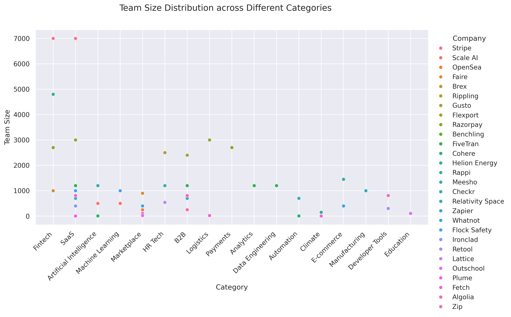


<a id="org56ad878"></a>

# Predictive Analysis

-   **Valuation Predictions:** Use regression models to predict future valuations based on funding and industry factors.
-   **Time to Unicorn**: Model the factors influencing the time taken to reach unicorn status.


<a id="org6cf4b82"></a>

# Case Study


<a id="orgcd99625"></a>

## Scale AI

Scale AI, Inc. is an American data annotation company based in San Francisco, California. It provides data labeling and model evaluation services to develop applications for artificial intelligence.


<a id="orgd45820d"></a>

## FTX

FTX Trading Ltd., trading as FTX, is a bankrupt company that formerly operated a cryptocurrency exchange and crypto hedge fund.


<a id="orgf0e7bfc"></a>

## Lalamove

Lalamove is a delivery and logistics company which operates primarily in Asia and parts of Latin America. Lalamove services are currently available in Hong Kong, Taipei, Singapore, Kuala Lumpur, Manila, Cebu, Bangkok, Pattaya, Ho Chi Minh City, Hanoi, Jakarta, Dhaka, São Paulo, Rio de Janeiro, and Mexico City.


<a id="org81b65fa"></a>

# References

-   [Unicorn (finance) [wikipedia]​](https://en.wikipedia.org/wiki/Unicorn_(finance))
-   [The YC Startup Directory](https://www.ycombinator.com/companies)
